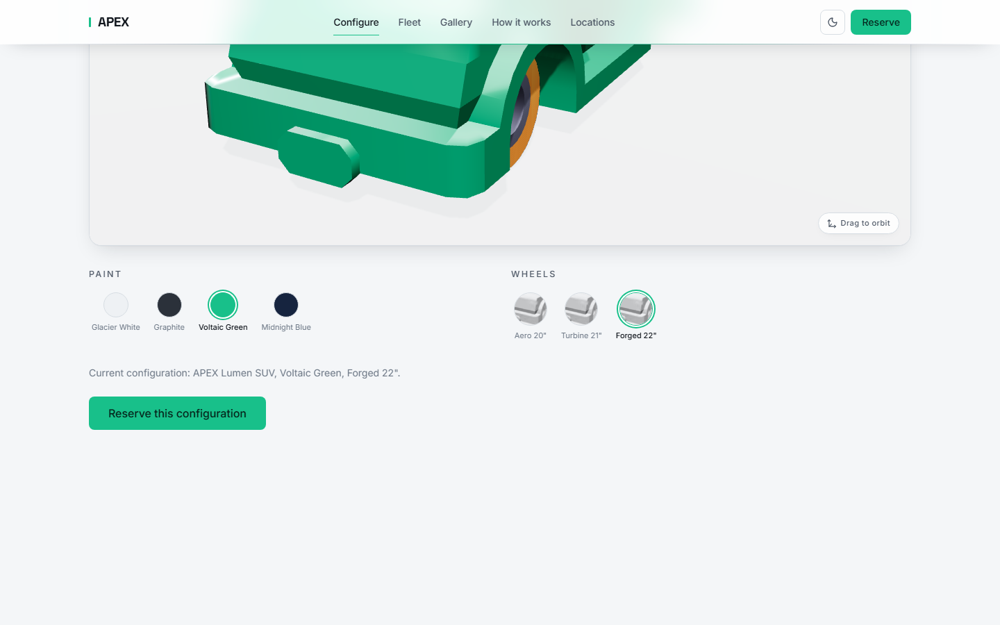
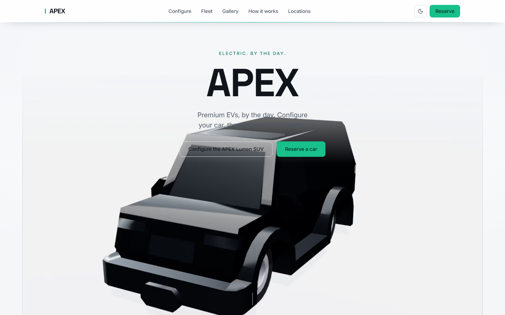
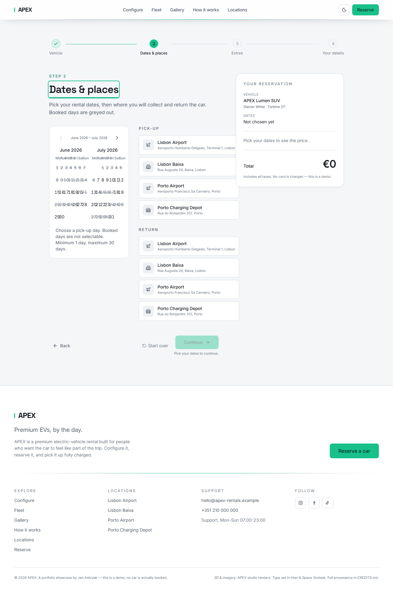
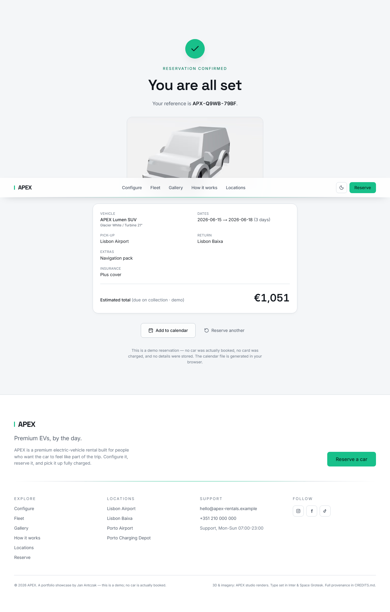
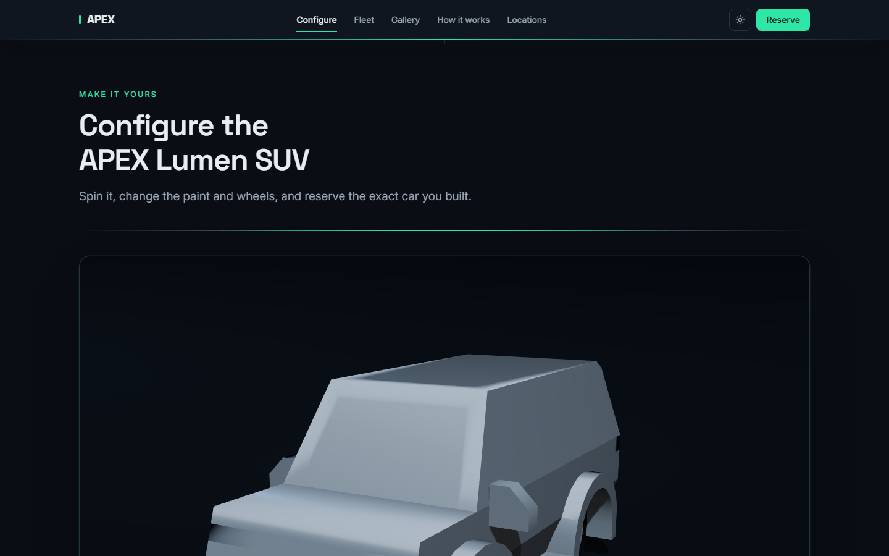
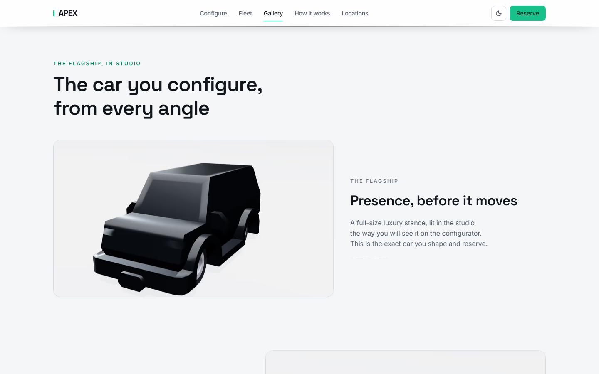
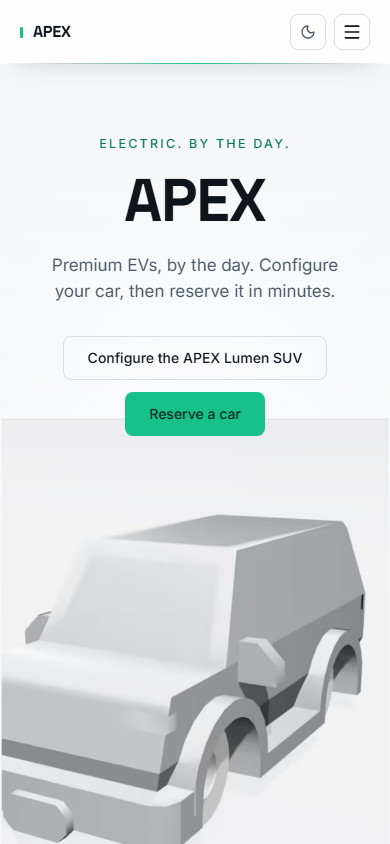
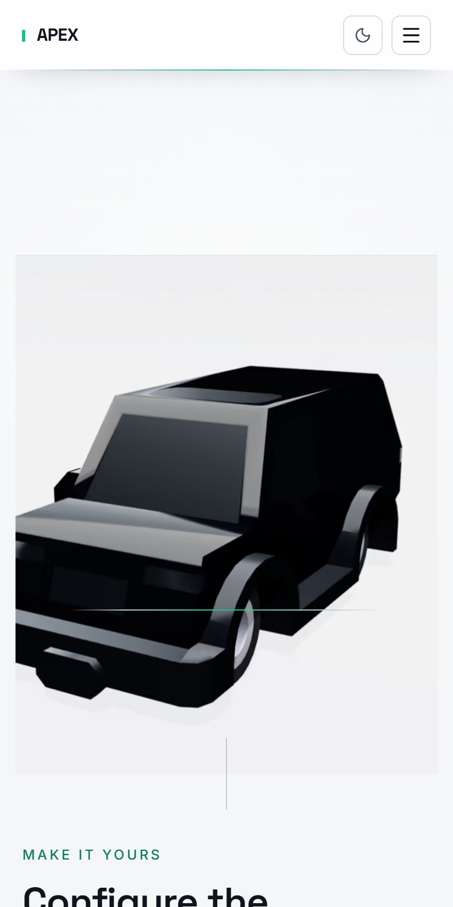

# APEX

> A premium-modern, EV-positioned car-**rental** marketing site, fronted by a real WebGL 3D configurator and a complete, mocked multi-step reservation flow.

Scroll the hero and a clean studio product shot of the car settles into place; below it, a live React Three Fiber scene lets you orbit the same car and swap paint and wheels in real time; a cinematic scroll-reveal gallery carries you through the fleet and the brand; and a five-step reservation wizard — vehicle, dates and locations, extras and insurance, driver, confirmation — feels like a real product even though nothing is persisted and no server holds a booking. The configured colour and wheels carry forward from the configurator into the wizard: configure the exact car, then reserve it.

Built to be judged on two fronts in the same five seconds: a recruiter or peer who will open DevTools to check whether the "3D car" is a genuine WebGL scene (it is), and the plausible real customer of a premium EV rental deciding whether to book — on mobile as often as desktop, which is why the heavy scene degrades honestly.

> Brand display: **APEX**. Repo directory: `apex`. Portfolio slot 5 (web-only, with a genuine 3D centrepiece).

## Demo

**Demo: [apex-rentals.fly.dev](https://apex-rentals.fly.dev)** — live on Fly.io (single Machine, Next.js 15 standalone, region `fra`, no backend, no secrets, warm floor so there is no cold start). The whole fleet runs on royalty-clear CC0 models ([Kenney Car Kit](https://kenney.nl/assets/car-kit)). The canonical origin is wired through `NEXT_PUBLIC_SITE_URL`, baked at build time, and backs the sitemap, canonical tags, the Open Graph image, and the `AutoRental` JSON-LD. You can also run the whole thing locally per [Run locally](#run-locally); the screenshots below are captured from the production build.

## Screenshots

The headline is the configurator wow moment: the live WebGL scene with the paint swapped to Voltaic Green and the Forged 22-inch wheels selected. The DOM swatch controls, the "Drag to orbit" affordance, the live configuration text, and the "Reserve this configuration" CTA are all real, accessible DOM over the canvas. This is the whole pitch in one frame.



On first paint the scroll-hero presents the car as a single arresting product shot over the clean light field, with the APEX wordmark and one line of positioning. The static render is the LCP element; the live canvas hands off behind it once it is ready:



The reservation wizard is the centerpiece interaction — here the dates-and-locations step with its keyboard-operable date-range picker (booked days struck through and announced, never silently hidden) and the running summary rail:



The confirmation lands with a deterministic reference, the full summary including the configured colour and wheels, an add-to-calendar `.ics` download, and copy that is gracefully honest that it is a demo:



The dark theme is an intentional "night drive / charging-bay" register — the configurator's studio lighting is re-keyed for the dark stage, not inverted:

| Configurator (dark)                                                                             | Cinematic gallery                                                             |
| ----------------------------------------------------------------------------------------------- | ----------------------------------------------------------------------------- |
|  |  |

On a mid-tier phone the configurator routes to the Tier-3 pre-baked-render fallback — the same car as a static AVIF still, swatches swapping pre-rendered images, no WebGL scene loaded — so the wow survives where a live scene would not, and the mobile performance budget holds honestly:

<p align="center">
  
  
</p>

A GIF of the orbit and the live paint/wheel swap, and of the wizard walk-through, would sit best here — the captures above are the stills; the swap pair (`configurator-desktop-light.png` plus the Voltaic Green frame) shows the before/after of the live paint and wheel-geometry swap. GIF tooling was not run as part of this docs pass; the live scene is the real artifact.

Desktop shots are captured at 1440-wide against the production build (`next build && next start` on port 3091, the same surface the E2E suite and the Lighthouse audit use). A production build is required because the strict CSP forbids `unsafe-eval`, so `next dev` cannot run under it. The frozen clock and seeded mocks make every frame reproducible — the date strip, the availability, and the booking reference `APX-JZJU-RS9Q` are stable across runs.

## What it is

- **A scroll-driven hero that hands off into a live WebGL configurator.** First paint is a static `next/image` AVIF product render (the LCP) over the clean light field, the APEX wordmark, and the positioning line. A GSAP ScrollTrigger timeline introduces the car on the static layer and writes a scroll-progress value the R3F scene reads to ease its intro camera; once the live canvas has rendered its first frame and the model has loaded, a pose-matched crossfade swaps the still for the live scene. The viewer never sees an empty canvas, the LCP is provably the static image, and there is no positional pop.
- **A genuine 3D car configurator.** A real React Three Fiber + drei scene: drag to orbit (damped, bounded so the camera never goes under the floor), live colour swaps that re-shade the body paint, live wheel-finish swaps, studio lighting built on the GPU from `Lightformer` panels (no fetched HDRI), and a contact-shadow ground. The colour and wheel controls are real DOM radio groups, fully keyboard-operable, with an `aria-live` text alternative that describes the current configuration ("APEX Lumen SUV, Voltaic Green, Forged 22-inch") so a screen-reader user gets the same information without touching the canvas.
- **A complete long-form marketing page.** Scroll-hero, the configurator, an editorial fleet list, a "how it works / why APEX" value section, a cinematic scroll-reveal gallery (masked clip-path wipes plus per-frame parallax on desktop; a vertical snap stack on mobile), styled static-map locations with a maps click-through, an editorial testimonial set, and a designed brand footer. Every section is real server-rendered DOM.
- **A reservation wizard that feels real.** Five steps — vehicle, dates and locations, extras and insurance, driver, confirmation — over a Zustand machine persisted to `localStorage`, with TanStack Query data ergonomics, react-hook-form + Zod forms, a deterministic availability picker, a live price summary, an `.ics` download, and a graceful demo disclaimer. Deep-linkable: the configurator's "Reserve this configuration" carries the chosen colour and wheels into the wizard, and a fleet card pre-seeds the vehicle.
- **The reservation is a deterministic mock, and the site says so.** No backend, no database, no real availability, no PII transmitted, no car booked. Availability and price are pure functions over seeded mock data against a frozen reference time. The confirmation copy is honest about the demo without breaking the premium tone. Wiring a real rental API is the explicit v2 path (see [Architecture notes](#architecture-notes)).

## Stack

Web-only (`web/`, package `apex-web`). No backend service — the only server surface is one Next.js server action for the mocked submit, plus the generated OG image, metadata/JSON-LD, and on-demand `next/image` AVIF optimization. This is a deliberate, owner-confirmed call: none of the five api-heavy triggers fires, and the portfolio's api-heavy slots are already satisfied by `tape` (Elysia/Bun), `meld` (Hono/Node), and `pulse` (NestJS). The 3D configurator does not make this api-heavy — WebGL is a client concern. See [DECISIONS.md](./DECISIONS.md) ADR-001.

**Frontend**

- Next.js 15.5 (App Router) · React 19.2 · TypeScript strict
- Tailwind CSS v4 (CSS-first, sovereign premium-modern/EV palette built from scratch, no `tailwind.config.js`)
- next-themes 0.4 (light default, intentional dark "night drive" register) · TanStack Query 5 · Zustand 5 (with `persist`) · react-hook-form 7 + Zod 4
- shadcn/ui new-york primitives over a sovereign token bridge · radix-ui · lucide-react

**3D and animation** (a deliberate, bounded two-library posture — ADR-002; Motion is explicitly not included)

- **React Three Fiber 9 + drei 10 + three.js 0.180** own everything inside the WebGL canvas: the scene graph, camera, `Lightformer` studio lighting, contact shadows, the model's paint and wheel materials, the orbit controls, and the on-demand render loop.
- **GSAP 3.15 + ScrollTrigger** (via `@gsap/react` `useGSAP`) own everything outside the canvas that is scroll-, pin-, scrub-, or timeline-driven: the scroll-hero, the hero-to-configurator reveal, the gallery scroll-reveal, the section dividers, and the wizard step transitions. The one sanctioned coupling at the seam is one-directional value passing — GSAP writes a number, R3F reads it.

**Type**

- **Space Grotesk** (variable, the APEX wordmark and section heads) + **Inter** (variable, body and UI), both via `next/font` (self-hosted at build, CSP-clean) and both SIL OFL 1.1.

**Tooling**

- pnpm 11 (workspace) · Node 22 LTS
- ESLint 9 (flat config) · Prettier 3 · Husky + lint-staged + commitlint
- Vitest (unit) · Playwright (E2E in `web/e2e/`) · Lighthouse CI (desktop + a mobile Tier-3 profile)
- `@faker-js/faker` and `sharp` are build-time devDependencies only — the seeded mock data is baked to a static file and the renders ship as static AVIF, so neither faker nor sharp reaches the client bundle, and the meshopt-compressed model is decoded by a self-hosted WASM decoder (no CDN).

## Run locally

Prereqs: **Node 22 LTS** and **pnpm >= 11** (the repo pins both via `packageManager` and `.nvmrc`). No database, no Docker, no environment variables are required for local development.

```sh
# 1. Install JS deps across the whole workspace (run once at the repo root).
pnpm install

# 2. Start the dev server.
cd projects/apex
pnpm dev            # Next dev server on http://localhost:3090
```

Open `http://localhost:3090`, scroll the hero to hand off into the live configurator, swap the paint and wheels, and click **Reserve this configuration** (or any fleet card, or the header **Reserve** button) to enter the wizard.

The umbrella `package.json` delegates every script to the `apex-web` workspace member:

| Command          | Effect                                     |
| ---------------- | ------------------------------------------ |
| `pnpm dev`       | Next dev server on :3090                   |
| `pnpm build`     | Production build                           |
| `pnpm start`     | Serve the production build on :3090        |
| `pnpm lint`      | ESLint (Next core-web-vitals + TypeScript) |
| `pnpm typecheck` | `tsc --noEmit`                             |
| `pnpm test`      | Vitest unit suite                          |

**For the production surface** (the only valid surface for the strict CSP, the E2E suite, Lighthouse, and screenshots — `next dev` cannot run under a CSP that forbids `unsafe-eval`):

```sh
pnpm -F apex-web build
pnpm -F apex-web start            # http://localhost:3090

# Then, against the served production app (the E2E + Lighthouse scripts use :3091):
pnpm -F apex-web test:e2e         # full Playwright suite (22 tests, desktop + mobile/Tier-3)
pnpm -F apex-web test:lh          # Lighthouse CI, desktop profile
pnpm -F apex-web test:lh:mobile   # Lighthouse CI, mobile profile (the Tier-3 fallback path)
```

No `.env` is needed to run. The single optional variable is `NEXT_PUBLIC_SITE_URL` — the canonical origin for the sitemap, canonical tags, OG image, and JSON-LD; it falls back to `http://localhost:3090` when unset.

## Architecture notes

**The hero is real content with the WebGL added on top.** The wordmark, the positioning copy, and the product render's `alt` are real server-rendered DOM, so the page reads to crawlers, screen readers, and a no-JS visitor regardless of whether three.js ever runs. The static AVIF render is the LCP element — `priority`, sized, with a blur placeholder — and the live canvas mount is deferred off the home initial load entirely: it arms on an `IntersectionObserver` as the configurator stage approaches, or on user intent (pointer or focus), so three.js and the model are never in the first-load bundle and never the LCP. The canvas mounts into a layout-reserved box (CLS-safe), and the reveal waits for both first-frame-ready and the model loaded, so there is no empty-canvas flash and no pop.

**WebGL inside a Lighthouse budget is the one new risk over a plain marketing site, and it is handled as a contract, not a cleanup pass.** Four-tier degradation: Tier 1 is the live R3F scene; Tier 2 (`prefers-reduced-motion`) keeps drag-to-orbit and swatches but drops auto-orbit and the scrubbed intro for a crossfade; Tier 3 (no-WebGL, low-power, data-saver, or mid-tier mobile, decided by a capability probe — a WebGL2 context check plus core/memory and coarse-pointer/viewport signals — and a runtime `PerformanceMonitor` demotion) shows pre-baked AVIF stills with swatches swapping images and no scene loaded at all; Tier 4 (no-JS) is the default-configuration static still with real controls and a real Reserve link. The mobile Lighthouse run measures the Tier-3 path, which is how the budget is met honestly with a real 3D centrepiece. The model, the hero still, and the pre-baked colour-by-wheel matrix are all rendered from one shared camera and lighting rig, so Tier 1 and Tier 3 are literally the same car and the reveal pose-matches.

**The reservation flow is a believable product over zero backend.** Availability is a pure function, `getRangeAvailability`, that composes seeded blackouts and pre-bookings against a frozen reference time over half-open date ranges; price is a pure `priceQuote` (daily rate times rental days, plus per-day or flat extras, plus the chosen insurance tier, plus a flat one-way fee when pickup and return differ, minus a multi-day discount). Both are unit-tested in isolation. The wizard machine is a pure module (step guards, deep-link seeding, configurator carry-over, the submit projection) behind a thin Zustand `persist` store (key `apex:reservation-draft`, version 1, 24-hour TTL). On rehydrate it re-runs availability for the held range and, if it is stale, keeps the vehicle and config, clears the range, drops back to the dates step, and shows a non-blocking notice — it never silently confirms a stale range. The mocked submit is a Next.js server action that re-validates the same shared Zod schema the form steps use, returns a deterministic reference, and triggers a hand-rolled RFC-5545 `.ics` over the rental range. The whole data layer runs through TanStack Query against an in-memory seeded source (no network).

**Strict CSP, and three.js plus GSAP run under it.** The production CSP forbids `unsafe-eval`; R3F, drei, three.js, GSAP, and Zod are clean under it. Two known eval sources were closed rather than papered over: faker was baked out of the client bundle into a static seed file (build-time only), and Zod 4's JIT was opted out globally and early via `z.config({ jitless: true })`. The one addition over a non-WebGL site is `'wasm-unsafe-eval'` — narrowly required by the self-hosted meshopt decoder that decompresses the model; it permits WASM compilation only and does not re-admit JS `eval`. `style-src 'unsafe-inline'` is consciously accepted (Next/Tailwind inline styles, GSAP's inline transforms, and R3F's inline canvas styles). The full security-header set ships in `next.config.ts`.

**Sovereign design tokens.** The premium-modern/EV identity — cool-light grounds, near-black ink, one voltaic green-cyan accent split into three tokens for AA contrast, the recurring hairline "track line" — is built from scratch in `app/globals.css`, with no token reuse from `tape`, `meld`, `razors-edge`, or `pulse`. Light is the canonical default; dark is an intentional "night drive / charging-bay" re-key with the configurator lighting re-keyed, not inverted. All key contrast pairs are verified to WCAG 2.2 AA in both themes.

### Key decisions

- **ADR-001** — Stack flavour `web-only` (no backend), the R3F + GSAP two-library posture, sovereign light-canonical design tokens, the fully client-side mocked reservation architecture, and the portfolio-composition note (apex is the second web-only project; the api-heavy backend slots are already filled — tape Elysia/Bun, meld Hono/Node, pulse NestJS, with atlas later adding Fastify).
- **ADR-002** — The animation/3D boundary (R3F inside the canvas, GSAP for scroll and DOM, no Motion), the R3F-with-Next-15 integration contract (`next/dynamic ssr:false` Canvas, Suspense, low `'use client'` boundary, `frameloop="demand"`, capped `dpr`, adaptive quality), the WebGL performance contract and the capability/tiering heuristic, and the strict-CSP posture (no `unsafe-eval`; narrowly-scoped `'wasm-unsafe-eval'`).
- **ADR-003** — The reservation-mock architecture: the domain model and shared Zod schemas, the pure deterministic `getRangeAvailability` and `priceQuote`, the Zustand `persist` wizard machine with TTL and date-range reconciliation, the TanStack Query mock-fetch layer, the server-action submit, and the hand-rolled `.ics`.
- **ADR-004** — The hero-to-configurator hand-off seam (reveal-when-ready, pose-matched, LCP/CLS-safe), the four-tier degradation contract, the pre-baked render matrix, and the configurator's accessible DOM-control model and screen-reader text alternative.
- **ADR-005** — The deploy posture: Fly.io single Machine, Next.js standalone, web-only, no secrets, `NEXT_PUBLIC_SITE_URL` baked at build, a warm floor for the first impression, and the resolution of the Windows standalone-symlink issue by building inside the Linux Docker stage.

Full ADR text in [`DECISIONS.md`](./DECISIONS.md). Spec, audience, and the phased task list in [`PLAN.md`](./PLAN.md). Current state in [`PROGRESS.md`](./PROGRESS.md). Release history in [`CHANGELOG.md`](./CHANGELOG.md). Deploy runbook in [`DEPLOY.md`](./DEPLOY.md).

## Quality

- **Tests.** 151 Vitest unit tests (the pure `getRangeAvailability` and `priceQuote` across every overlap, window, length, and discount boundary; the wizard and configurator state machines including deep-link seeding, configurator carry-over, persist rehydrate, and the forced-stale date-range reconciliation; the booking-reference and `.ics` builders) and 22 Playwright E2E tests across desktop and a mobile/Pixel-7 Tier-3 profile, all passing against the production build: the reservation happy path to confirmation with the `.ics` download, the configurator DOM-swatch interaction plus the Tier-3 still-swap and the Tier-4 no-JS floor, full keyboard operation of the date-range picker, the theme toggle in both themes, and the `prefers-reduced-motion` hero path.
- **Lighthouse** (production build, median of 5). Accessibility 96, Best Practices 96, and SEO 100 clear the bar on `/` across both profiles. **Desktop** Performance is 97 on `/` and 99 on `/reserve` (both clear the >= 95 gate). The honest **mobile** story: on the Lighthouse mobile preset `/` scores in the low-60s and `/reserve` in the high-60s — gated **entirely** by the preset's 4x CPU throttle inflating React hydration into LCP render-delay on an already-downloaded hero image (the optimized mobile hero AVIF is ~7 KB and downloads in well under 100 ms). With the same mobile screen emulation at **real-device CPU** (`cpuSlowdownMultiplier: 1`) `/` scores **100 with LCP ~1.0 s and TBT ~31 ms** — i.e. the synthetic deficit is a throttled-emulation artifact, not a bundle or asset problem. On the deployed Fly real-CPU run the mobile LCP is network-bound rather than CPU-bound (the hero AVIF over the wire), which lands `/` in the high-80s to mid-90s and `/reserve` around 95; that deployed run is the authoritative mobile-performance measurement (ADR-002 §3). The synthetic mobile number is surfaced as a warning, not hidden. (`/reserve` carries a deliberate `robots:noindex`, which caps its SEO score by design.)
- **Accessibility — WCAG 2.2 AA.** Full keyboard operability of the configurator swatch controls (real DOM radio groups, never canvas-only) and the entire reservation wizard (the date-range picker is a roving-tabindex grid widget; booked days stay discoverable with accessible reasons). The WebGL canvas is `aria-hidden` with a real-DOM `aria-live` description of the current configuration. A single accent focus ring clears AA in both themes. `prefers-reduced-motion` is a first-class path at every animated site and in the configurator.
- **SEO.** Per-route metadata with canonical tags, a designed Open Graph image (`next/og`), `AutoRental` JSON-LD built from the live fleet, locations, and shop data, `sitemap.xml`, and `robots.txt`.

## Credits and honesty

This is a portfolio showcase. It uses placeholder assets, and it is honest about that — the swap-for-real path for each is documented. Full provenance is in [`CREDITS.md`](./CREDITS.md).

- **The 3D models are royalty-clear CC0 placeholders.** The whole fleet runs on unbadged CC0 vehicles from the [Kenney Car Kit](https://kenney.nl/assets/car-kit) — the configurable flagship and all four non-flagship bodies are rendered from the same live R3F rig, so the five cards read as one studio line-up. The shipped flagship model is an optimized exterior-only GLB (body plus three wheel sets, around 117 KB total, uncompressed so there is no meshopt or draco decoder and no WASM at load); the four non-flagship bodies are render-only (their static AVIF renders ship, the GLBs do not). Because the models are CC0 and unbadged, the configurator carries no manufacturer trademark, and the production CSP needs no `'wasm-unsafe-eval'` — `script-src` is `'self' 'unsafe-inline'`. The configurable hero vehicle is named "APEX Lumen SUV" under the fictional APEX brand. Provenance and the swap-for-real (real studio/press photography of unbadged EVs) path are in [`CREDITS.md`](./CREDITS.md).
- **All imagery is generated placeholders.** The static hero render, the pre-baked colour-by-wheel configurator matrix, the non-configurable fleet renders, and the styled static location maps are 100% generated on-brand (CC0, no third-party imagery fetched). The gallery crops are real studio frames of the placeholder model, rendered from the same rig as the live scene. The swap-for-real path (real studio/press photography of unbadged EVs) is documented in `CREDITS.md`.
- **Nothing is really booked.** The reservation flow is mocked end to end — no backend, no database, no real availability, no PII transmitted, no payment, no email or SMS. A reload starts fresh. The confirmation says so. Wiring a real rental API is the explicit v2 path.
- **Fonts** — Inter and Space Grotesk, both SIL OFL 1.1, self-hosted via `next/font`.

## Not shipped in v1 (deferred)

- **Any real backend, database, or persistence.** The reservation is mocked end to end; a reload starts fresh. Wiring a real rental API is the explicit v2 path.
- **Real authentication, payments, or email / SMS confirmations.** None in v1 — the price is displayed but nothing is charged, and the confirmation is on-screen plus an `.ics` download only. The driver licence is format-validated only.
- **A configurable fleet.** v1 ships one configurable hero vehicle with the live R3F scene and the pre-baked matrix; the rest of the fleet uses static renders. Per-vehicle configurators are a v2 path.
- **A live interactive map embed.** v1 uses styled static-map treatments plus a maps click-through to protect the performance budget; a lazy live embed is a v2 candidate.
- **CMS-managed content and internationalisation.** The fleet, locations, extras, and testimonials are seeded mock data; the site is English-only.

## License

[MIT](../../LICENSE).

## Author

[Jan Antczak](mailto:janek.antczak@gmail.com). Portfolio root: [`../../README.md`](../../README.md).
