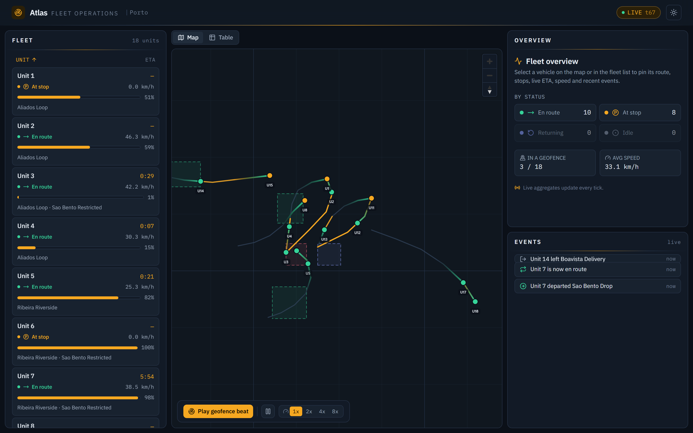
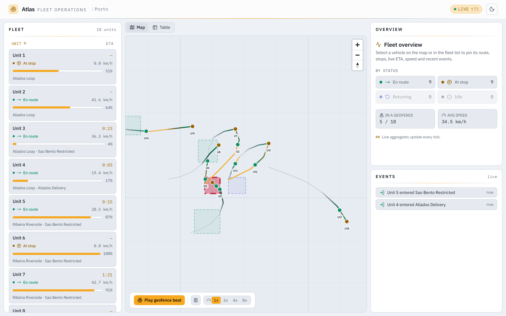
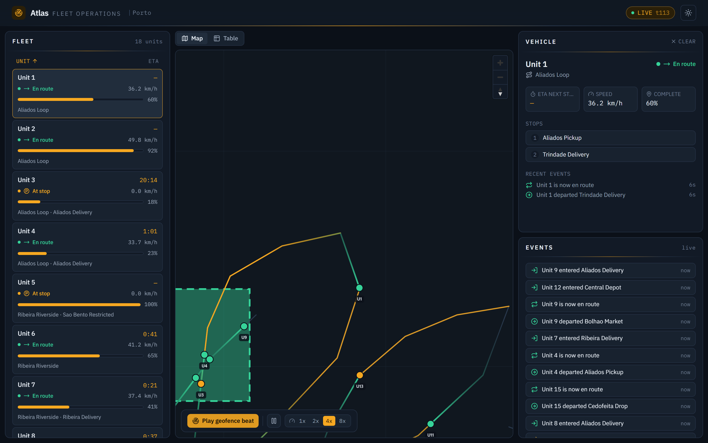
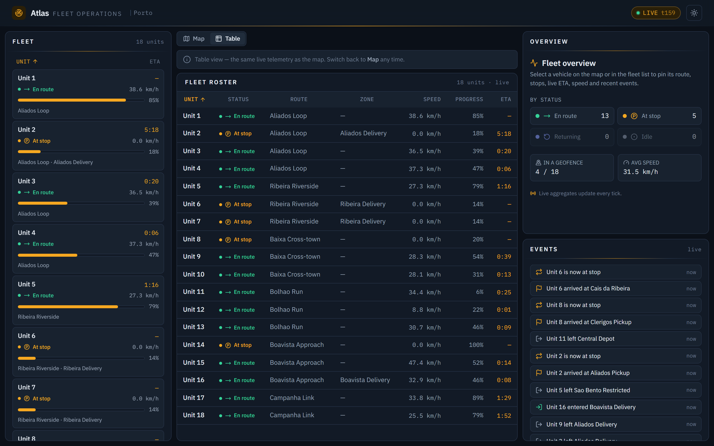
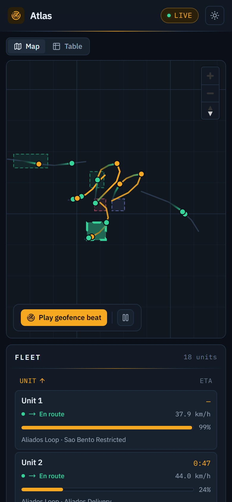

# Atlas

> Live geospatial fleet tracking: a server-side deterministic simulation moves a fleet along real Porto routes in real time, telemetry streams over one WebSocket, and a MapLibre control-room map glides the vehicles at 60 fps between 1 Hz authoritative ticks while geofence events fire live.

Atlas is a working live-operations console for a delivery fleet — not a static map with fake dots. A continuously-running, server-authoritative simulation engine advances eighteen vehicles along hand-authored Porto routes on a fixed 1 Hz tick; every position, heading, speed, ETA, route progress, and geofence transition is computed on the server from a seeded engine. Telemetry streams to the browser over a single `@fastify/websocket` connection, and the client interpolates between authoritative ticks with a hand-rolled `requestAnimationFrame` loop, so a vehicle does not jump once a second — it slides continuously along the road geometry at a smooth 60 fps. Route trails draw behind each vehicle, the remaining route draws ahead, ETAs tick down, and as a vehicle crosses a zone boundary the geofence enter / exit event fires live: the zone pulses, a row materialises in the events feed, and the vehicle's status flips.

Built for a senior fullstack / backend reviewer who can open the board, glance at DevTools, and read "this person can build real-time spatial systems — a simulation engine, a telemetry stream, server-side geo domain logic" in the first ten seconds, before reading a word of this README. The DevTools tell is the point: exactly one WebSocket carrying JSON telemetry frames at 1 Hz, no polling XHR loop — yet the map runs at 60 fps. That gap between 1 Hz data and 60 fps motion is the senior signal made visible.

> Brand display: **Atlas**. Repo directory: `atlas`. Portfolio slot 6 — api-heavy, Fastify (Node 22 LTS) — the fourth distinct backend across four api-heavy projects (Elysia/Bun, Hono/Node, NestJS, Fastify), completing the portfolio's backend-variance story.

## Demo

**Live:** **[atlas-ops.fly.dev](https://atlas-ops.fly.dev)** — deployed on Fly.io (Fly Postgres + a single warm Fastify machine running the gateway and the in-process engine + the Next web, per [ADR-007](./DECISIONS.md)). The fleet is already moving on first paint; open the Network tab to confirm the single WebSocket on `/ws` carrying telemetry. You can also run it locally (below) — the whole experience, including the live map and the geofence beat, runs against a local prod stack with no database required.

The wow is a five-second glance and a one-click beat. Open the board and the fleet is already moving — markers gliding along Porto's downtown roads, route trails fading behind them, ETAs counting down, the events feed scrolling. Click **Play geofence beat** and the deterministic engine drives a chosen vehicle toward a zone at higher speed: it crosses the boundary, the zone pulses, an "entered" row lands at the top of the feed, and the vehicle's status flips — all in real time, all from the real engine. Open the Network tab first and you see one WebSocket on `/ws` with telemetry frames, not a polling loop.

## Screenshots

The headline: the live operations dashboard — the fleet panel (left), the live MapLibre map with route trails, geofence zones, and heading-rotated vehicle markers (centre), and the fleet overview + live events feed (right). The fleet is already moving, the connection pill reads **Live**, and the **Play geofence beat** control sits over the map.

| Live dashboard (dark)                                              | Live dashboard (light)                                               |
| ------------------------------------------------------------------ | -------------------------------------------------------------------- |
|  |  |

The geofence beat caught mid-arc — a vehicle pinned in the detail panel (route, ordered stops, live ETA, recent events), a geofence zone highlighted as the vehicle crosses it, and the live events feed filling with enter / exit / status rows:

| Geofence beat: vehicle detail + zone pulse + events feed (dark)                                 |
| ----------------------------------------------------------------------------------------------- |
|  |

The no-WebGL fallback — the same live telemetry rendered as a first-class, keyboard-navigable, sortable fleet table (the accessible non-map alternative, and the default when WebGL is unavailable), updating from the same single WebSocket:

| No-WebGL fleet table (dark)                                           |
| --------------------------------------------------------------------- |
|  |

<p align="center">
  
</p>

All shots are captured at 1440 x 900 (desktop) and 390 x 844 (mobile) with deviceScaleFactor 2, driven headlessly against a local prod stack via [`docs/capture-screenshots.mjs`](./docs/capture-screenshots.mjs) — `next build && next start` behind the same-origin proxy (so the strict `connect-src 'self'` CSP covers the WebSocket exactly as it does in production), with the Fastify gateway running DB-less. The capture waits on the real **Live** state, and the geofence shot drives the deterministic "Play geofence beat" affordance and waits on a real events-feed row before shooting. The basemap is the painted keyless control-room graticule (the committed default — see the keyless-map note below); the Porto vector `.pmtiles` extract is an optional deploy enhancement.

## What it is

- **The simulation is real, server-authoritative, and deterministic.** A continuously-running engine advances eighteen vehicles along hand-authored Porto routes on a fixed 1 Hz tick. Positions, headings, speeds, ETAs, route progress, and geofence transitions are all computed server-side from a seeded engine. The engine core is a pure reducer (`tick(state, dt) -> { state, events }`, no wall-clock or IO inside), so the same seed plus the same tick count reproduces the same world exactly — which is what makes it unit-testable and seekable, and what makes the wow beats reproducible on demand.
- **The motion is honest interpolation, not faked.** The server emits an authoritative telemetry tick once a second; the client interpolates between the last and next authoritative positions along the road geometry with a `requestAnimationFrame` loop (lerp position, shortest-arc the heading), driving MapLibre's imperative API off the React render path at 60 fps. The smoothness is interpolation between real server ticks, never a client-side fiction. This boundary — 1 Hz authoritative data, 60 fps interpolated motion — is documented as the credibility line.
- **The live channel is genuinely pushed over one WebSocket.** One connection on `/ws`, no polling XHR loop. Snapshot-on-connect, then per-tick deltas, plus event frames and a 20 s heartbeat. The contract is a single tagged-union JSON envelope so the telemetry is legible in DevTools — the recruiter literally reads `{ lat, lng, heading, etaSeconds, status }`.
- **Geofence events fire live and correctly.** Depots and delivery zones are GeoJSON polygons. A per-(vehicle, zone) hysteresis state machine confirms a crossing over a small window, so a vehicle skimming a boundary does not flap — exactly one `enter` per genuine crossing and one `exit` later. The event pulses the zone, lands a row in the feed, and may flip the vehicle's status, live, within about a tick of the crossing.
- **It degrades gracefully, four ways.** No WebGL falls back to a first-class live fleet table (the same data, the same socket). `prefers-reduced-motion` snaps markers to ticks and cuts the camera instead of flying. No JavaScript still renders a meaningful SSR floor (the pitch, a static fleet snapshot table, the route / zone reference, and the full SEO surface) on `/about`. A dropped socket shows a reconnect indicator, freezes the markers, and reconciles from a fresh snapshot on reconnect — never stale-as-live.

## Seed vs live — the credibility boundary

The `faker.seed(n)` baseline (the frozen fleet, the hand-authored Porto routes, the zones) is the deterministic **world definition** — the same on every run. The **motion** is live forward ticks from that baseline, and seekable back to any tick by re-folding the pure reducer. Persistence (Postgres) stores the route / zone / stop definitions, a bounded telemetry snapshot, and the events feed history; it is **not** the engine's source of truth — the in-memory engine is. That is why the live map and the public read endpoints run with no database at all (the engine boots from the frozen baseline and the persistence sink swallows DB failures off the tick hot path). Postgres earns its place for the persisted events history and reconnect-from-persisted-snapshot, not for the live channel.

## Stack

**Frontend** (`web/`, package `atlas-web`)

- Next.js 15.5 (App Router) · React 19.2 · TypeScript strict
- Tailwind CSS v4 (CSS-first, sovereign operations / control-room palette — petrol-navy dark stage, cool-paper light, a single signal-amber accent, a dedicated fleet-status semantic palette; no `tailwind.config.js`, no token reuse from sibling projects)
- next-themes 0.4 (light / dark / system, dark canonical) · TanStack Query 5 · Zustand 5 · react-hook-form · Zod 4
- MapLibre GL JS 5 (the WebGL map — owned by a plain controller class off the React render path) + pmtiles 4 (the optional self-hosted keyless vector basemap protocol)
- Motion 12 (React-state UI / panel transitions only — detail-panel slide, events-feed `AnimatePresence`, map / table crossfade, theme. **The map motion is not Motion** — it is the hand-rolled rAF interpolation loop driving MapLibre imperatively)
- lucide-react · radix-ui primitives · IBM Plex Sans + IBM Plex Mono (the console register, tabular numerals for telemetry), self-hosted via `next/font`

**Backend** (`server/`, package `atlas-server`)

- Fastify 5 on Node 22 LTS — the WS gateway, the in-process simulation engine, the public read REST endpoints, and the geo services as clean Fastify-plugin units
- @fastify/websocket 11 (on `ws` 8) — the `/ws` telemetry gateway: snapshot-on-connect, per-tick fan-out, event frames, heartbeat, server-side subscription scoping, coalesce-to-latest backpressure
- Drizzle ORM 0.45 + postgres-js 3.4 against PostgreSQL (plain, GeoJSON in `jsonb`; PostGIS deferred to v2)
- fastify-type-provider-zod 6 · @fastify/cors · @fastify/rate-limit (connection rate + a per-connection token bucket on inbound WS frames) · Zod 4 (run jitless under the no-`unsafe-eval` CSP)

**Shared** (root, package `atlas-shared`)

- `src/lib/schemas/` — the Zod contract imported by both server and web (entities, the WS frame envelope + control frames, the REST read responses). The single FE/BE integration boundary
- `src/lib/geo/` — pure geo functions wrapping scoped `@turf/*` modules (route cumulative-length projection `s` to lat/lng/heading, route slice for trails / remaining route, rolling-average ETA, the geofence hysteresis state machine). Shared **implementation**, used by the engine (authoritative) and the client (interpolation geometry) — so it is a real workspace package, not types-only

**E2E** (`e2e/`, package `atlas-e2e`)

- Playwright 1.49 (chromium) — the live map (one WebSocket + fleet moving + no polling), ETA decrement, the geofence beat landing on the feed, the no-WebGL table fallback, reduced-motion, the keyboard focus flow, and socket-drop reconnect — all against the built + served prod stack behind a same-origin proxy
- Lighthouse CI (`@lhci/cli`) — `/about` >= 95 in all four categories

**Tooling**

- pnpm 11 (workspace) · Node 22 LTS
- ESLint 9 (root flat config, typescript-eslint strictTypeChecked + jsx-a11y) · Prettier 3 · Husky + lint-staged + commitlint
- Vitest (shared + server + web) · Playwright (E2E) · Lighthouse CI
- PostgreSQL (Docker image, optional for local — the live channel runs DB-less)

## Run locally

Prereqs:

- **Node 22 LTS** and **pnpm >= 11** (the repo pins both via `packageManager` and `.nvmrc`)
- **Docker** only if you want Postgres (the persisted events history + reconnect-from-snapshot). The live map, the moving fleet, and the public read endpoints all run **without** a database.

```sh
# 1. Install JS deps across the whole workspace.
pnpm install

# 2. Configure the server environment (gitignored; the example covers local dev).
cp projects/atlas/server/.env.example projects/atlas/server/.env
# Defaults: PORT=3092, DATABASE_URL points at :5438, CORS allows the web on :3093.

# 3. (Optional) Bring up Postgres on :5438 — only for the persisted events history.
#    Non-colliding with the other projects (Mila 5434, tape 5435, meld 5436,
#    pulse 5437).
docker compose -f projects/atlas/docker-compose.yml up -d
pnpm --filter atlas-server db:migrate
pnpm --filter atlas-server seed     # idempotent faker.seed baseline into Postgres

# 4. Start the two processes in two terminals.
pnpm --filter atlas-server dev      # Fastify gateway + in-process engine on :3092
pnpm --filter atlas-web dev         # Next on http://localhost:3093
```

Open `http://localhost:3093`. The fleet is already moving (the engine boots from the frozen Porto baseline whether or not Postgres is up). Click **Play geofence beat** to drive the cross-the-boundary-and-fire beat, switch between **Map** and **Table** views, click a vehicle row or marker to pin its detail panel, and toggle the theme to swap the basemap style.

| Command                           | Effect                                                           |
| --------------------------------- | ---------------------------------------------------------------- |
| `pnpm --filter atlas-web dev`     | Next dev server (`atlas-web`) on :3093                           |
| `pnpm --filter atlas-server dev`  | Fastify gateway + in-process engine (`atlas-server`) on :3092    |
| `pnpm --filter atlas-server seed` | Write the deterministic `faker.seed` baseline to Postgres        |
| `pnpm --filter atlas-shared test` | Vitest shared suites (geo + WS-frame schemas)                    |
| `pnpm --filter atlas-server test` | Vitest server suites (engine reducer, gateway, public read)      |
| `pnpm --filter atlas-web test`    | Vitest web suites (interpolation, WS client, stores)             |
| `pnpm --filter atlas-e2e test`    | Playwright E2E against the built + served stack (builds + boots) |
| `pnpm --filter atlas-e2e test:lh` | Lighthouse CI on `/about` (needs the stack serving on :3096)     |

The demo controls (pause / resume / speed / the geofence beat) act on the **single in-process engine**, so they change the world every connected client sees — there is one source of truth, not a per-connection view.

### Keyless map

The map renders with **no paid secret** — this is a hard constraint, and the committed repo honours it. With no environment configured, Atlas paints a keyless control-room graticule basemap over the Porto bounding box and draws the fleet, routes, and zones on top; the strict CSP stays `connect-src 'self'` with no third-party tile host. An optional self-hosted Porto vector basemap (a Protomaps `.pmtiles` extract of the demo-city bounding box, served same-origin) is a **deploy enhancement** — generate it from `DEMO_CITY_BBOX` into `web/public/map/porto.pmtiles` (gitignored; see [`web/public/map/README.md`](./web/public/map/README.md)) and it renders a richer keyless vector basemap with no secret. An optional `NEXT_PUBLIC_MAP_TILE_KEY` (plus `NEXT_PUBLIC_MAP_TILE_HOST`) is purely additive — supplied only at the owner's deploy, never committed, and it can only enrich the basemap, never gate it. The graticule keyless state is the committed default and the state the screenshots show.

## Architecture

```mermaid
flowchart LR
  subgraph browser["Browser · Next 15 + React 19"]
    UI["Control-room UI<br/>fleet panel · detail · events feed"]
    RAF["rAF interpolation loop<br/>(lerp position · shortest-arc heading)"]
    MAP["MapLibre GL<br/>(controller off the React render path)"]
    TBL["No-WebGL fleet table<br/>(same data · same socket)"]
  end

  subgraph server["Fastify control plane · Node 22 (single instance)"]
    WS["@fastify/websocket gateway<br/>/ws · snapshot + tick + event + heartbeat"]
    ENGINE["Simulation engine<br/>pure tick reducer + IO shell loop (1 Hz)"]
    GEO["Shared geo logic (turf)<br/>projection · ETA · geofence hysteresis"]
    REST["Public read REST<br/>/api/fleet/snapshot · /routes · /zones · /vehicles"]
    SINK["Persistence sink<br/>(queued · off the tick hot path)"]
  end

  PG[("PostgreSQL<br/>routes · zones · stops (jsonb GeoJSON)<br/>telemetry snapshot · events history")]
  TILES["Keyless basemap<br/>painted graticule (default)<br/>or self-hosted .pmtiles (optional)"]

  ENGINE -->|uses| GEO
  ENGINE -->|per-tick telemetry + events| WS
  ENGINE -->|telemetry snapshot + events| SINK --> PG
  WS <-->|one WebSocket · JSON frames| RAF
  RAF -->|setData per frame (imperative)| MAP
  WS -.->|subscribe · snapshot.request · sim.control| ENGINE
  REST -->|DB-less, from the live engine| ENGINE
  TBL -->|same single socket| WS
  UI --- RAF
  MAP -->|same-origin| TILES
```

The picture in one breath: the engine ticks at 1 Hz and fans authoritative telemetry to the WebSocket gateway over an in-memory emitter (no broker); the browser holds the last and next authoritative positions in an off-render store and a `requestAnimationFrame` loop interpolates between them at 60 fps, calling MapLibre's imperative `setData` once per frame. The same geo functions (turf, via the shared package) run on the server for the authoritative computation and on the client for the trail / remaining-route slices. Postgres sits to the side, fed by a queued sink off the tick hot path; it is never in the live loop.

## Architecture notes

**The simulation engine is a pure tick reducer; the topology is deliberately lean (ADR-002 + ADR-007).** `tick(state, dt) -> { state, events }` has no wall-clock and no IO inside — the IO shell owns the clock, the fixed-dt accumulator loop, and the seeded PRNG; the reducer is a pure function of `(state, dt, rng)`. That purity is load-bearing: it makes the world deterministic (same seed plus tick count yields the same world, asserted in tests without sleeps), seekable (re-fold from the baseline to reach any tick, so a geofence crossing is reproducible on demand), and topology-agnostic. The engine runs in-process in the single Fastify instance with no broker — the tick-to-broadcast path is an in-memory emitter call. A single live engine is a single source of truth by construction; every client sees the same fleet. The pure boundary keeps a split-worker / multi-instance move a clean v2 shell change, not a domain rewrite.

**The real-time contract is one tagged-union JSON envelope, scoped server-side, with honest backpressure (ADR-003).** Server-to-client frames are `snapshot` (the full world plus zones plus the server tick index), `tick` (the per-vehicle delta, with ETA and status folded in), `event` (a geofence / status SimEvent for the feed), and `heartbeat` (every 20 s, under the Fly edge idle timeout). Client-to-server frames are `subscribe` / `unsubscribe` (a focused vehicle or a viewport bbox), `snapshot.request`, and `sim.control` (pause / resume / setSpeed / seek). Encoding is JSON on purpose — at eighteen vehicles the wire saving of binary is nil, and JSON keeps the DevTools telemetry legible, which is the stronger signal. Subscriptions are enforced server-side (never trust the client to filter); the default is the whole fleet so first paint is populated. Backpressure coalesces to the latest tick per vehicle per connection — a slow consumer gets the newest authoritative position, never a replayed backlog of stale motion. Every inbound frame is Zod-validated at the boundary (jitless, under the no-`unsafe-eval` CSP) and the WS control channel is rate-limited with a per-connection token bucket.

**The geo math is one tested source of truth, shared front to back (ADR-004).** Route projection, the trail / remaining-route slices, ETA, and geofence detection are pure functions in `atlas-shared/geo`, wrapping scoped `@turf/*` modules (not the mega-bundle, to keep the web bundle within the Lighthouse budget). The engine imports them for the authoritative computation; the client imports the same implementation for the interpolation geometry — no server / client drift. Per-route cumulative-segment-length tables make per-tick projection O(log segments). Geofence detection is a per-(vehicle, zone) hysteresis state machine: a crossing must be confirmed over a small window or by a boundary margin, so a boundary-skimming vehicle never flaps — the no-flap invariant is a unit test. ETA is remaining-distance to the next stop divided by a rolling-average speed (instantaneous speed spikes the ETA toward infinity near the braking taper at stops), clamped at a floor, with dwell time folded in while at a stop. All turf units are pinned to metres.

**The map motion lives outside Motion, and that is a deliberate frame-budget decision (ADR-001 + ADR-006).** Per-marker per-frame animation through Motion / React state would be a frame-budget disaster, so the live map is driven imperatively: the rAF loop computes interpolated positions and calls one `GeoJSONSource.setData()` per frame on a single symbol layer (`icon-rotate` bound to a per-feature heading — GPU-rendered, native rotation, scales past the fleet). Trails and remaining routes are `line` layers, zones are `fill` + `line` layers, all updated off the React render path; the camera fly-to is MapLibre native. Motion is confined to React-state UI chrome — the detail-panel slide, the events-feed `AnimatePresence`, the map / table crossfade, the theme — and collapses to instant under `prefers-reduced-motion`. The strict CSP carries no `unsafe-eval`, verified against a production build (`next build && next start`, not `next dev`): `worker-src 'self' blob:` for MapLibre's tile-parse worker, `connect-src 'self'` for the same-origin WebSocket and basemap, with `script-src` locked against eval. faker is baked into the seed at build time and Zod runs jitless so neither sneaks an eval source past the policy.

**Persistence is plain Postgres with GeoJSON in `jsonb`; the engine is the live source of truth (ADR-005).** Surveying the actual data access — the snapshot read, the events feed, the definitions read — none of it is a spatial query; the authoritative spatial work happens in the engine every tick, where the DB cannot be. So PostGIS would be decorative for v1 and is deferred (the `jsonb` GeoJSON is PostGIS-indexable later, a clean v2 upgrade). The schema is six tables — vehicles, routes, route_stops, zones, telemetry_snapshots, events — with the feed / lookup indexes and enum types built from the shared Zod tuples so the DB enum cannot drift from the contract. Retention is bounded (a periodic snapshot upsert plus a capped events window, not the per-tick firehose), and engine writes go through a queued async sink so the tick loop never blocks on the DB.

## Key decisions

- **ADR-001** — `api-heavy` flavour (three of the five hard triggers fire: a long-lived high-frequency WebSocket, a continuously-running simulation loop, heavy geospatial domain logic); Fastify on Node 22 LTS; WebSocket (not SSE — the channel is high-frequency and genuinely bidirectional); MapLibre GL JS keyless-by-default; turf shared FE/BE; the pure deterministic tick reducer; hand-rolled rAF interpolation plus Motion (single library) for UI chrome; sovereign control-room tokens. Portfolio backend variance: Elysia/Bun (tape), Hono/Node (meld), NestJS/Node (pulse), Fastify (atlas) — four distinct backends, the variance story complete.
- **ADR-002** — Simulation engine: the pure tick reducer (no wall-clock / IO inside), two-phase determinism (`faker.seed` static baseline + a seeded mulberry32 PRNG carried in state), a fixed 1 Hz cadence driven by a fixed-dt accumulator, cumulative-length projection, the braking-taper + dwell speed model, loop / ping-pong route-end, and the in-process single-instance no-broker topology.
- **ADR-003** — Real-time WS contract: the single tagged-union JSON envelope, snapshot + coalesced-tick + event + heartbeat, server-side subscription scoping, the 20 s heartbeat, monotonic-`seq` gap detection with snapshot-resume, and coalesce-to-latest backpressure.
- **ADR-004** — Geo math + geofence detection: scoped `@turf/*` in `atlas-shared/geo`, the per-(vehicle, zone) hysteresis state machine (the no-flap invariant), rolling-average ETA with a floor and dwell folding, and units pinned to metres.
- **ADR-005** — Data model + persistence: plain Postgres + `jsonb` GeoJSON (PostGIS rejected for v1 as decorative, deferred to v2), the six-table Drizzle schema with the feed indexes and shared-tuple enums, hand-authored Porto routes / zones, bounded retention, and the queued async sink off the tick hot path.
- **ADR-006** — Map engine + tile source: the single GeoJSON symbol layer with `icon-rotate` (off the render path), the self-hosted Protomaps `.pmtiles` keyless default with the painted-graticule fallback and the additive optional key, the two intentional dark / light style JSONs, and the strict no-`unsafe-eval` CSP MapLibre needs.
- **ADR-007** — Deploy topology: Fly.io with a single warm Fastify machine (gateway + in-process engine + REST) + Postgres + Next web, the WS surviving the Fly edge via the heartbeat, the warm floor so the fleet is already moving on first paint, seed-vs-live coexistence, and the committed-keyless `.pmtiles` served same-origin with the optional key as a deploy-only secret.

Full ADR text in [`DECISIONS.md`](./DECISIONS.md). Spec and phased task list in [`PLAN.md`](./PLAN.md). Current state in [`PROGRESS.md`](./PROGRESS.md). Cross-agent context in [`AGENT_NOTES.md`](./AGENT_NOTES.md). Release history in [`CHANGELOG.md`](./CHANGELOG.md).

## Testing and quality

- **44 shared Vitest tests** — the geo module (route length and projection against a turf `along` oracle, the rolling-average ETA, the geofence hysteresis no-flap invariant) and the WS-frame Zod schemas (round-trip over the wire, plus rejection of malformed control frames — the over-cap seek, the inverted bbox, out-of-range coordinates, unknown discriminators, the wrong protocol version).
- **34 server Vitest tests** — the tick reducer (determinism: same baseline + N ticks yields an identical world and `seek == replay`; purity; valid Porto-bbox motion; geofence enter / exit with no duplicate consecutive enters), the engine shell (the bounded-seek clamp against an event-loop DoS, direction-aware ETA for backward ping-pong vehicles), the WS gateway (the frame builders against the shared contract, the token-bucket throttle, scope filtering, coalesce-to-latest backpressure, client-frame accept / reject), and the public read endpoints (the shared response contract, rate-limit headers, cache-control posture).
- **59 web Vitest tests** — the interpolation math (lerp / shortest-arc / tick-progress freeze), the rAF loop (moves between ticks, snaps under reduced-motion, emits trail / remaining), the WS client (one socket, dispatch, `seq`-gap snapshot request, heartbeat reconnect, freeze-on-drop), the telemetry and events stores, the view-mode resolution (capability always wins over user preference), the WebGL probe, and the static SSR snapshot.
- **7 Playwright E2E tests** — the live map (exactly one WebSocket, telemetry frames, the tick index climbing, no `/api/fleet/snapshot` polling), the ETA decrement, the geofence beat landing on the feed (driven by the deterministic affordance, never a sleep), the no-WebGL table fallback (same live data, one socket across the swap), reduced-motion (the map stays live), the keyboard focus flow (Tab to a row, Enter pins the detail), and socket-drop reconnect — all against the built + served prod stack behind a same-origin proxy so the strict CSP covers the WebSocket.
- **Lighthouse CI = 100 / 100 / 100 / 100** on the `/about` SEO surface (the >= 95 gate, median of five, desktop), Core Web Vitals green. The live map dashboard is documented exempt (client-only live-data first paint, no crawler value) but must still feel fast and never jank.
- designer-critic and reviewer passes landed with fixes applied — among them the map plate lifted off the app-background void, the theme-aware light basemap, the bounded WS `seek` (an event-loop DoS), and the direction-aware ETA for backward ping-pong vehicles.

## License

[MIT](../../LICENSE).

## Author

[Jan Antczak](mailto:janek.antczak@gmail.com). Portfolio root: [`../../README.md`](../../README.md).
