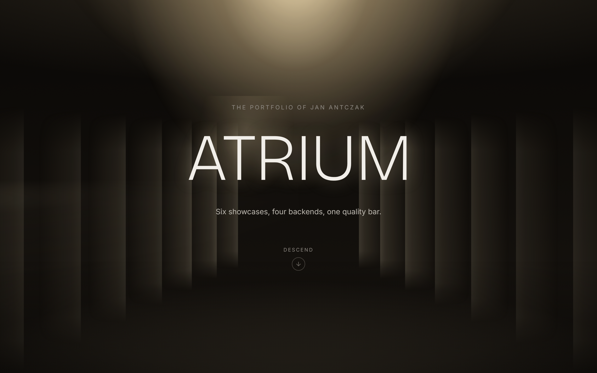
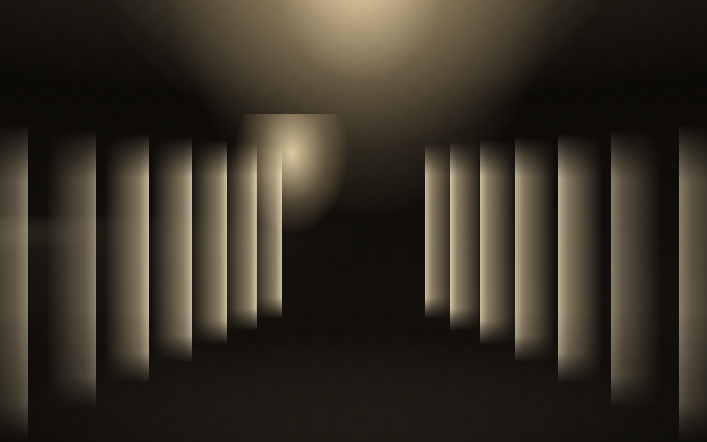
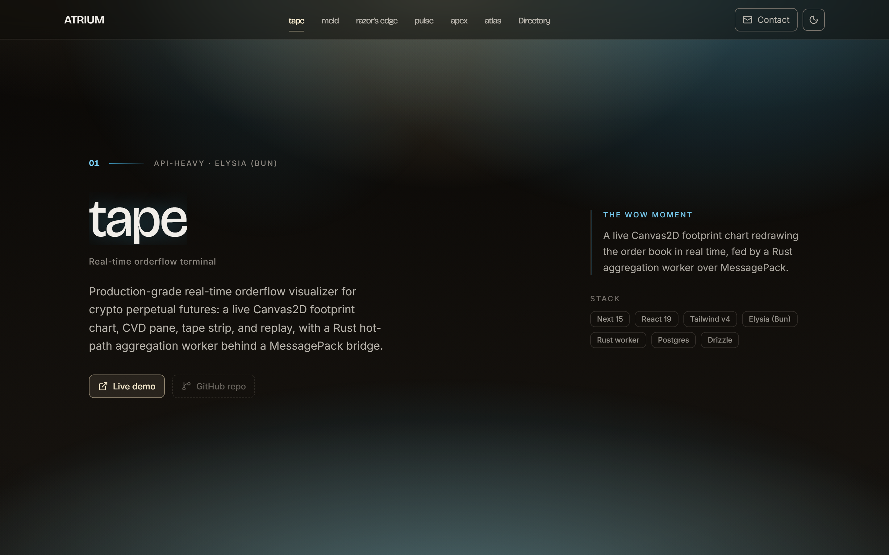
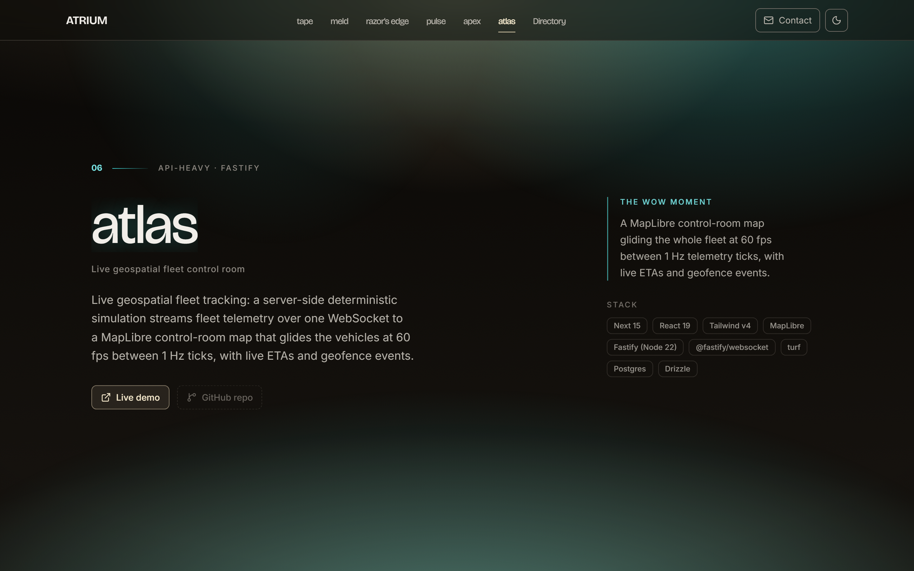
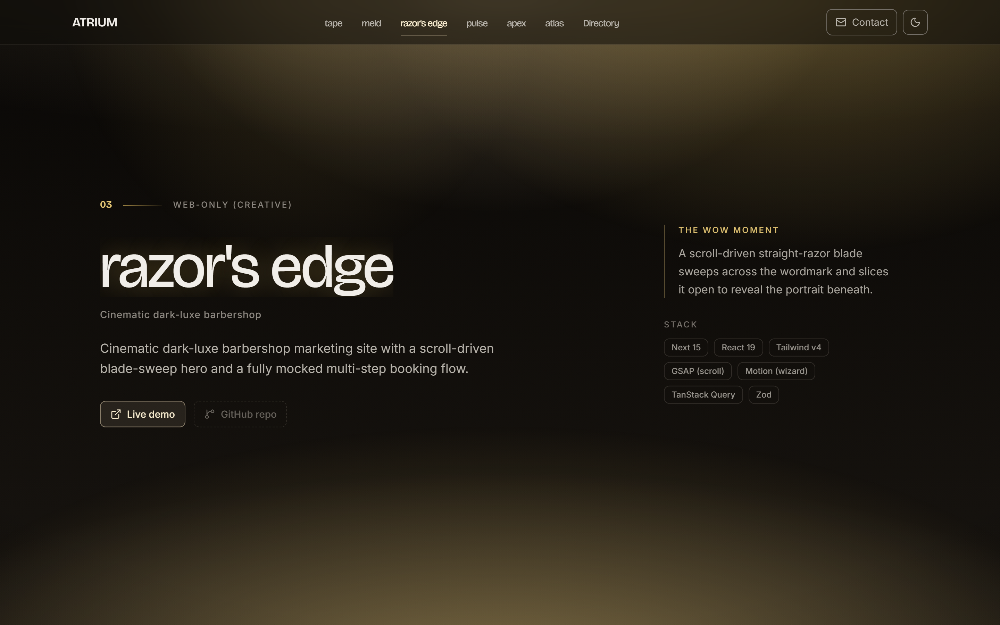
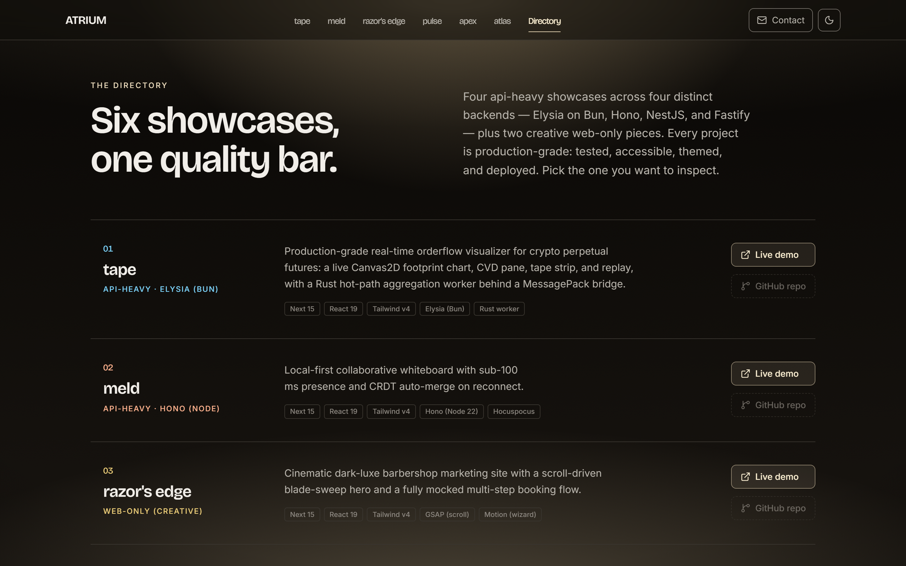
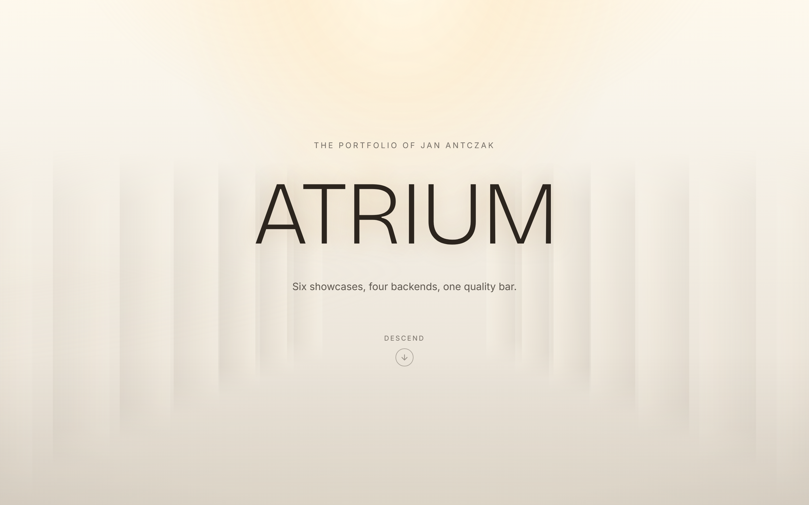
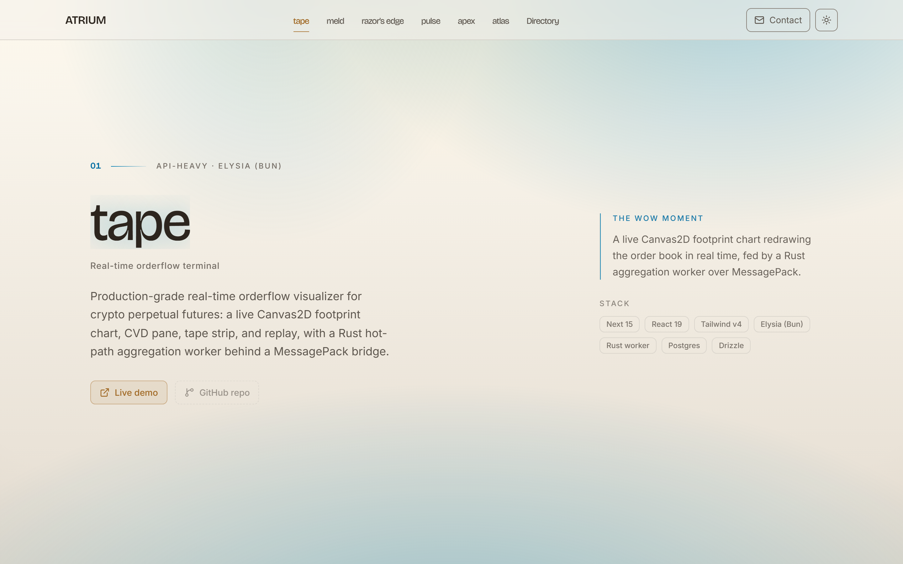
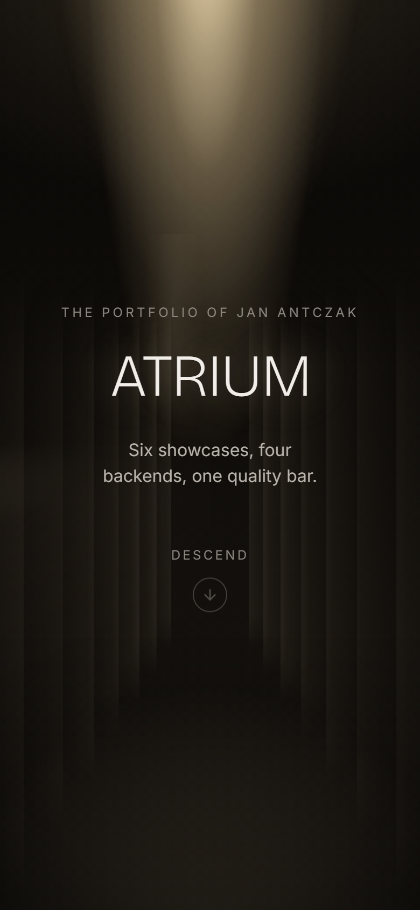
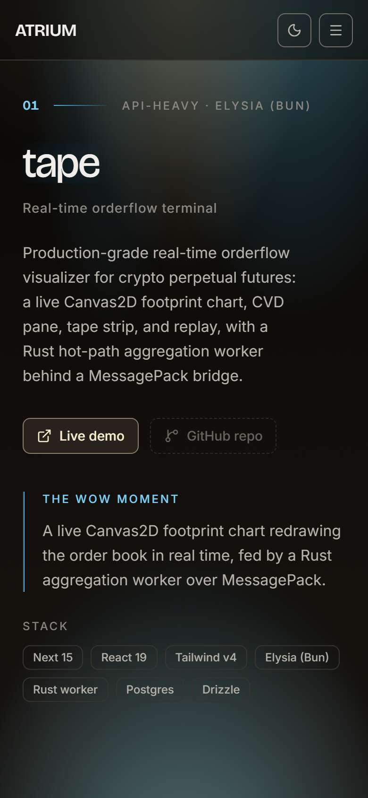

# Atrium

> The portfolio's front door: a single, scroll-driven cinematic landing page that presents the six showcase projects as the lobby of the whole portfolio.

The word `ATRIUM` stands in a warm shaft of light on a near-black field. Scroll, and the camera descends through the letterforms into a colonnade of light — and then glides through six pinned "gallery bays," one per project, each lit in that project's own signature hue, its name resolving from a coloured ghost into a legible title as the bay locks into frame. The descent resolves into a calm, fully-legible directory of all six projects, a range statement, and the author's contact — so a visitor who wants to skip the cinema can reach every link immediately. The cinema is additive over a directory that always works.

This is project number seven, and it is itself the strongest visual piece in the collection: the page a recruiter or senior engineer is most likely to open first and to judge hardest. It exists to prove the portfolio's range and craft in one scroll.

> Brand display: **Atrium**. Repo directory: `atrium`. Portfolio slot 7 — the landing page itself.

## Demo

**Live: [atrium-demo.fly.dev](https://atrium-demo.fly.dev)** (Fly.io, region `fra`, single-Machine Next.js 15 standalone — the razors-edge/apex web-only pattern; deployed 2026-06-10). The bare `atrium` Fly name was taken, so the app is `atrium-demo`. Atrium is intended as the eventual portfolio root (a root domain pointing at this page) and is built and measured against that ambition. The six projects it presents are each live too — their demo links resolve to their own deployments. To run locally instead, see [Run locally](#run-locally) — `pnpm -F atrium-web build` then `pnpm -F atrium-web start` on [http://localhost:3080](http://localhost:3080). The screenshots below are captured from the production build. Deploy runbook: [`DEPLOY.md`](./DEPLOY.md).

The canonical origin is wired through `NEXT_PUBLIC_SITE_URL` (it backs `metadataBase`, the canonical tag, the Open Graph image, `robots.txt`, `sitemap.xml`, and the JSON-LD), baked into the image at build time as `https://atrium-demo.fly.dev`; it falls back to a documented placeholder for local runs. See [`.env.example`](./web/.env.example).

## Screenshots

The headline is the hero wow moment: the `ATRIUM` wordmark lit in a warm volumetric shaft of light, centre-stage on a near-black field, the threshold of a building you are about to walk into. This is the whole pitch in one frame.



Scroll, and a pinned GSAP timeline scrubs the descent: the wordmark scales and thickens as the camera drops through it, and a real CSS-3D colonnade of light resolves into a receding lit hall — no WebGL, all CSS and SVG gradients on layered parallax planes:



The descent hands off into the six gallery bays, one per project, in the canonical portfolio order. Each bay carries the project's own signature hue, an `api-heavy · <backend>` or `web-only (creative)` badge, the recruiter-facing pitch, a one-line "wow moment" note, a stack ribbon, and the two unmissable outward links (live demo, and the GitHub repo — see [Architecture notes](#architecture-notes) for why the repo affordance is a disabled "coming soon" control until a remote exists):

| `tape` — slate/cyan, api-heavy · Elysia (Bun)               | `atlas` — control-room teal, api-heavy · Fastify              |
| ----------------------------------------------------------- | ------------------------------------------------------------- |
|  |  |

`razors-edge` carries its brass/amber signature and the `web-only (creative)` badge — the six hues are spaced around the wheel so the scroll reads as a tour of differently-lit rooms, not six identical cards:



The directory (arrival) is the calm, fully-legible index — a ruled list of all six projects with their pitch, category badge, stack chips, and both links, under the portfolio range statement. It is simultaneously the no-cinema reachable index, the reduced-motion render target, and the no-JS render target:



The light theme is an intentional "architectural daylight" register — a warm limestone field with a directional clerestory skylight — not an inverted dark site. The volumetric-light identity is re-composed for daylight, and the six signature hues are re-tuned to hold contrast on the light field:

| Hero, light theme                                       | tape bay, light theme                                           |
| ------------------------------------------------------- | --------------------------------------------------------------- |
|  |  |

And it holds on mobile (390 px), where the descent simplifies and the six bays collapse from pinned scenes to a clean vertical stack — legible and cheap on a phone, with zero horizontal overflow from 320 px up:

<p align="center">
  
  
</p>

Desktop shots are captured at 1440 x 900 with deviceScaleFactor 2, mobile at 390 x 844, all against the production build (`next build && next start` on :3080 — the same surface the E2E suite and the Lighthouse audit use) via [`e2e/capture-readme-screenshots.mjs`](./e2e/capture-readme-screenshots.mjs). A production build is required because the strict CSP forbids `unsafe-eval`, so `next dev` cannot run under it. Atrium has no runtime randomness (the data is six fixed entries with a fixed `year`), so every frame is reproducible across runs. The descent in motion is best seen by scrolling the page; an animated capture was not assembled in this docs pass (the bundled ffmpeg build lacks a PNG decoder), and the descent stills above are the artifact — re-run the capture script against a built-and-served app to regenerate them.

## What it is

- **A scroll-driven cinematic descent.** First paint is the `ATRIUM` wordmark in the warm shaft of light — real server-rendered DOM text, and the LCP element (type and CSS, never an image). One pinned GSAP ScrollTrigger timeline scrubs the descent: the wordmark scales, thickens via `font-variation-settings`, and fades as a CSS-3D colonnade of standing columns recedes to a vanishing point and a floor-light bloom carries the back half of the pin. The descent _is_ the transition into the gallery — the scroll never stalls on a finished animation.
- **Six kinetic gallery bays, the spine.** Each project is a pinned bay rendered from one typed data entry: the kinetic title resolves (two layered real-text copies — a signature-hue ghost wiped away by `clip-path` as the legible `<h2>` settles in), the pitch and a wow-moment note reveal, a stack ribbon and a category badge animate in, and the two outward links settle into a fixed, unmissable position. A recurring "shaft of light / threshold" motif is the connective tissue from one lit bay to the next.
- **A directory that always works.** A calm ruled index of all six projects with the portfolio range statement. This is the no-cinema floor, the reduced-motion render, and the no-JS render — built first to first-class quality, with all twelve outward links present and reachable without scrolling the cinema.
- **The range made visible.** Six atrium-local signature hues — one per project, evoking each (tape slate/cyan, atlas control-room teal, apex premium indigo, meld collaborative warm, pulse status green, razors-edge brass) — turn the scroll into a tour of differently-lit rooms. The single strongest way to _show_ the portfolio's range rather than tell it.

## Stack

Web-only (`web/`, package `atrium-web`). No backend service, no API, no database, no network at runtime — the only data is a typed, in-repo, Zod-validated module of six fixed project descriptors, read at build time. This is a deliberate, owner-confirmed call: none of the five api-heavy triggers fires, and the portfolio's api-heavy slots are already filled by `tape` (Elysia/Bun), `meld` (Hono/Node), `pulse` (NestJS), and `atlas` (Fastify). Forcing a backend onto a static landing page would be exactly the ceremony the operating manual forbids. See [DECISIONS.md](./DECISIONS.md) ADR-001.

**Frontend**

- Next.js 15.5 (App Router) · React 19.2 · TypeScript strict
- Tailwind CSS v4 (CSS-first, sovereign architectural near-black + volumetric-light OKLCH palette built from scratch, no `tailwind.config.js`)
- next-themes 0.4 (dark default, intentional light "architectural daylight" register) · Zod 4 (validating the typed project data at module load)
- shadcn/ui-style primitives over a sovereign token bridge · radix-ui (the mobile-nav dialog) · lucide-react

**Animation** (single-library — ADR-002)

- **GSAP 3.13 + ScrollTrigger** (via `@gsap/react` `useGSAP`) own 100% of scroll, pin, scrub, and timeline work: the hero descent and the six pinned bays, all choreographed through one refresh-coordinator that calls `ScrollTrigger.sort()` before `ScrollTrigger.refresh()` (load-bearing with seven pins).
- **Motion is not a dependency.** Atrium has no presence-heavy surface to justify a second animation library, so it ships at the single-library ideal: all hover, active, theme-crossfade, mobile-drawer, and toast micro-interaction is CSS (`transition`, `data-state`, `prefers-reduced-motion`). Binary scroll _state_ (the header backdrop flip, `aria-current` on the nav) is `IntersectionObserver`, not GSAP — state observation, not scroll animation.

**Type**

- **Bricolage Grotesque** (variable display, the wordmark and the per-bay kinetic titles — a structural architectural grotesque, deliberately not a serif, so atrium reads distinct from razors-edge) + **Inter** (variable sans, body and UI), both via `next/font` (self-hosted at build, CSP-clean) and both SIL OFL 1.1. The kinetic title resolves drive Bricolage's weight axis via `font-variation-settings` — no Club-GreenSock plugin, real DOM text throughout.

**Tooling**

- pnpm 11 (workspace) · Node 22 LTS
- ESLint 9 (flat config) · Prettier 3 · Husky + lint-staged + commitlint
- Vitest (unit) · Playwright (E2E in `e2e/`, package `atrium-e2e`) · Lighthouse CI
- `sharp` is a build-time devDependency only (Open Graph image generation); it does not reach the client bundle.

## Run locally

Prereqs: **Node 22 LTS** and **pnpm >= 11** (the repo pins both via `packageManager` and `.nvmrc`). No database, no Docker, no environment variables are required for local development.

```sh
# 1. Install JS deps across the whole workspace (run once at the repo root).
pnpm install

# 2. Start the dev server.
cd projects/atrium
pnpm dev            # Next dev server on http://localhost:3080
```

Open `http://localhost:3080` and scroll: the wordmark descends through the colonnade of light into the six gallery bays, then resolves into the directory.

The umbrella `package.json` delegates every script to the `atrium-web` workspace member:

| Command          | Effect                                     |
| ---------------- | ------------------------------------------ |
| `pnpm dev`       | Next dev server on :3080                   |
| `pnpm build`     | Production build                           |
| `pnpm start`     | Serve the production build on :3080        |
| `pnpm lint`      | ESLint (Next core-web-vitals + TypeScript) |
| `pnpm typecheck` | `tsc --noEmit`                             |
| `pnpm test`      | Vitest unit suite                          |

**For the production surface** (the only valid surface for the strict CSP, the E2E suite, Lighthouse, and screenshots — `next dev` cannot run under a CSP that forbids `unsafe-eval`):

```sh
pnpm -F atrium-web build
pnpm -F atrium-web start          # http://localhost:3080

# Then, against the served production app:
pnpm -F atrium-e2e test           # full Playwright suite (18 tests)
pnpm -F atrium lighthouse         # Lighthouse CI, >= 95 x4 + Core Web Vitals
```

No `.env` is needed to run. The two optional variables are both documented in [`web/.env.example`](./web/.env.example): `NEXT_PUBLIC_SITE_URL` (the canonical origin for the sitemap, canonical tags, OG image, and JSON-LD; falls back to a placeholder) and `NEXT_PUBLIC_GITHUB_BASE` (the base for the six per-project repo links — unset until a git remote exists; see [Architecture notes](#architecture-notes)).

## Architecture notes

**The cinema is additive over a directory that always works — a three-tier degradation contract.** Every word the page presents — the wordmark, all six bay titles, pitches, badges, wow-lines, and all twelve outward affordances — is real server-rendered DOM regardless of whether GSAP ever runs. Tier 1 is the full pinned descent and six-bay scrub (transform and opacity only, rAF-scrubbed, verified at ~60 fps across all seven pins, CLS ~0.01). Tier 2 (`prefers-reduced-motion`) creates no pin and no scrub via a `gsap.matchMedia()` branch: the hero shows its composed resting frame and each bay shows its resolved final composition in a clean vertical stack — nothing frozen mid-transition. Tier 3 (no-JS) renders server-side as the complete directory. The directory section is built first to first-class quality precisely because it is the Tier-2 and Tier-3 floor.

**One typed, Zod-validated data module is the single source of truth — and the GitHub links have exactly one seam to flip.** All six projects' presentation data lives in `src/data/projects.ts`, validated by a `Project` Zod schema at module load (a malformed entry fails the build, not the UI). Pitches and stacks are sourced from the root README so the portfolio has one source of truth. Each project's `demoUrl` is its real public deployment, linked normally. Each `repoUrl` is _derived_ from a single `GITHUB_BASE` constant — never hardcoded inline — as a monorepo deep-link (`${GITHUB_BASE}/tree/main/projects/<slug>`). Because the repo has no git remote yet, `GITHUB_BASE` is a documented placeholder and a `REPO_LINKS_LIVE` flag is false, so each repo affordance renders as a disabled, `aria-disabled` "coming soon" control (never a live link to a 404). The instant `NEXT_PUBLIC_GITHUB_BASE` is set to a real base, the flag flips true and every repo affordance becomes a live link with no other code change — the single seam.

**Sovereign design tokens, no reuse from any sibling.** The architectural near-black + volumetric-light identity and the six per-bay signature hues are built from scratch in `app/globals.css` (OKLCH), with no token import from `tape`, `meld`, `razors-edge`, `pulse`, `apex`, or `atlas`. A landing page that borrowed a sibling's palette would collapse the "variance is the point" thesis it exists to prove. The six hues _evoke_ each project but are atrium-local, hand-tuned, and re-spaced around the colour wheel so the bays read as visibly distinct rooms; every hue is verified to clear WCAG AA contrast as text (>= 4.5:1) and UI (>= 3:1) in both themes.

**Strict CSP, and GSAP runs under it.** The production CSP forbids `unsafe-eval`; GSAP core + ScrollTrigger + `@gsap/react` are clean under it. The one eval source that surfaced — Zod 4's JIT validator compiling with `new Function` in the client-reachable parse — was closed by opting out globally and early via `z.config({ jitless: true })` (the parse runs once over six fixed entries, so the JIT speedup is irrelevant). `style-src 'unsafe-inline'` is consciously accepted (Next/Tailwind inline styles plus GSAP's inline transforms, which cannot be nonced). The full security-header set (CSP, HSTS, `X-Content-Type-Options`, `Referrer-Policy`, `X-Frame-Options`) ships in `next.config.ts`.

**This is the portfolio's primary metadata.** Because atrium is intended as the eventual portfolio root, its SEO surface is authored as the portfolio's primary front page, not a sub-project's: per-page meta, Open Graph and Twitter cards, a designed OG image (`next/og`, the wordmark-in-light composition), `robots.txt`, `sitemap.xml`, and JSON-LD (a `Person` for the author plus an `ItemList` of the six projects with their live demo URLs).

### Key decisions

- **ADR-001** — Stack flavour `web-only` (no backend; the data is a typed in-repo module), primary animation library GSAP + ScrollTrigger, sovereign design tokens with the atrium-local six-signature-hue strategy, the typed project-data model, and the single `GITHUB_BASE` placeholder seam for repo links.
- **ADR-002** — The animation posture (single-library GSAP, Motion is not a dependency, CSS for all micro-interaction) and the GSAP / Next 15 App Router integration contract (`useGSAP`, low `'use client'` boundary, `gsap.matchMedia`, the `sort()`-before-`refresh()` refresh-coordinator for seven pins, transform/opacity only, CSP posture with no `unsafe-eval`, free-GSAP-core-only kinetic titles).
- **ADR-003** — The `Project` Zod schema and six-entry data module, the `GITHUB_BASE` monorepo-deep-link shape and the disabled-affordance-until-`REPO_LINKS_LIVE` presentation, the six `--bay-*` signature-hue tokens, the hero-descent → six-pinned-bays → directory scroll architecture, and the three-tier degradation contract.

Full ADR text in [`DECISIONS.md`](./DECISIONS.md). Spec, audience, and the phased task list in [`PLAN.md`](./PLAN.md). Current state in [`PROGRESS.md`](./PROGRESS.md). Release history in [`CHANGELOG.md`](./CHANGELOG.md).

## Quality

- **Tests.** 54 Vitest unit tests (the `Project` Zod schema guard rails plus the real `PROJECTS` config — all six present in canonical order, every demo URL the real deployment URL, every repo URL derived from `GITHUB_BASE`, the four-api-heavy / two-web-only split with correct backend badges, and the guard that `github.com` appears in exactly one source file) and 18 Playwright E2E tests, all passing against the production build: the twelve outward affordances (six live demo links plus six disabled repo controls that are correctly not links and not tab stops), the reduced-motion path (zero pin-spacers, every title resolved, nothing frozen), the theme toggle in both themes with no FOUC, full keyboard reachability, the no-JS directory render, and the SEO surface.
- **Lighthouse** (production build). Performance 99 · Accessibility 100 · Best Practices 96 · SEO 100, clearing the >= 95 gate in all four categories with no scoped exception. Core Web Vitals are green: LCP ~0.9 s (the type/CSS wordmark), CLS ~0.009 (transform-based pins with reserved layout), TBT ~10 ms. GSAP is code-split off the initial bundle and fetched after hydration, so the cinema does not cost the home-route budget.
- **Accessibility — WCAG 2.2 AA.** Every outward link is a real, focusable `<a>` with a disambiguated accessible name ("tape — live demo", not a bare "demo" repeated twelve times); the disabled repo control is announced and kept out of the tab order. A single brand focus ring clears AA in both themes. `prefers-reduced-motion` fully neutralises the scroll choreography to a static, readable page. All six signature hues are contrast-verified as text and UI in both themes.
- **SEO.** Per-page metadata with canonical tags, a designed Open Graph image (`next/og`), `Person` + `ItemList` JSON-LD over the six projects, `sitemap.xml`, and `robots.txt`.

## Not shipped in v1 (deferred)

- **Root-domain hosting.** Atrium is deployed (Fly single-Machine Next.js standalone — see [Demo](#demo) / [`DEPLOY.md`](./DEPLOY.md)), but the eventual decision to host it at the portfolio's conceptual root domain rather than at `atrium-demo.fly.dev` is still open. v1 ships as a self-contained `projects/atrium/` app consistent with every sibling; it does not restructure the monorepo.
- **Real GitHub links.** The repo has no remote, so `repoUrl` derives from a single `GITHUB_BASE` placeholder and the repo affordances render as disabled "coming soon" controls. Flipping `NEXT_PUBLIC_GITHUB_BASE` to a real base makes all six links live with no other change.
- **Per-bay preview stills.** Each bay reserves a no-reflow media slot and the schema carries an optional `previewImage`; sourcing six optimised AVIF preview stills of the showcases (captured, optimised, and never the LCP) is the v2 enrichment. The type-and-light composition is the v1 floor and reads complete without them.
- **Any real backend, database, or CMS.** The six entries are a typed `src/data/projects.ts` module; adding a seventh project is a one-line array edit. There is nothing to fetch and nothing to administer.
- **Internationalisation.** English only.

## License

[MIT](../../LICENSE).

## Author

[Jan Antczak](mailto:janek.antczak@gmail.com). Portfolio root: [`../../README.md`](../../README.md).
