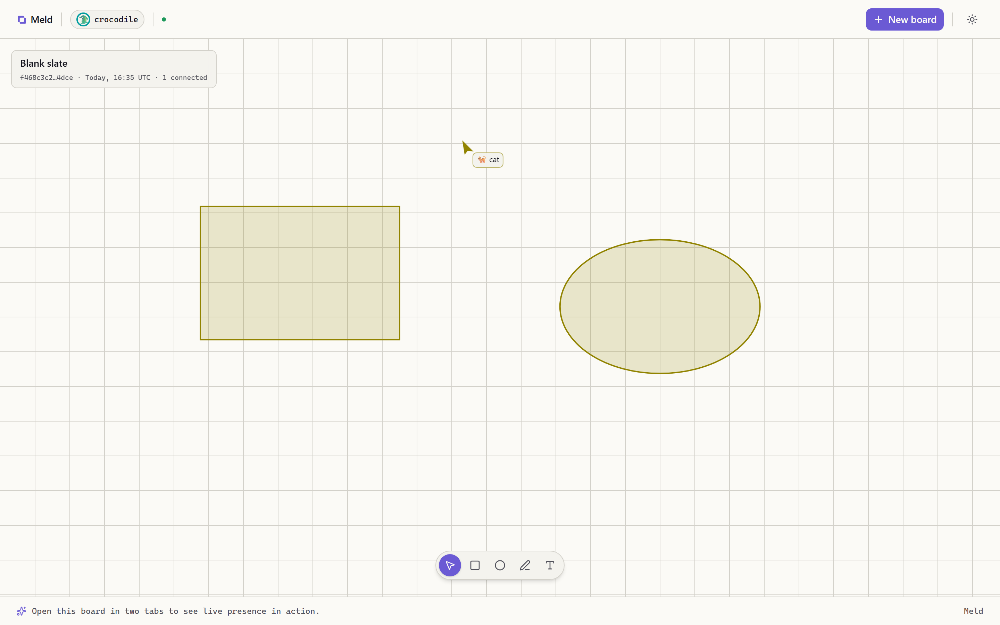
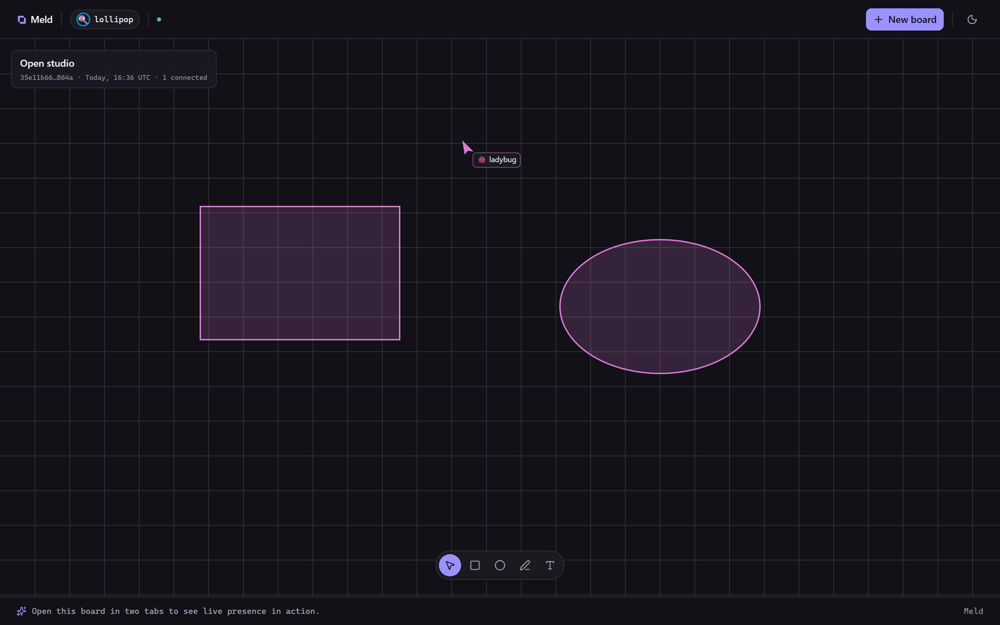
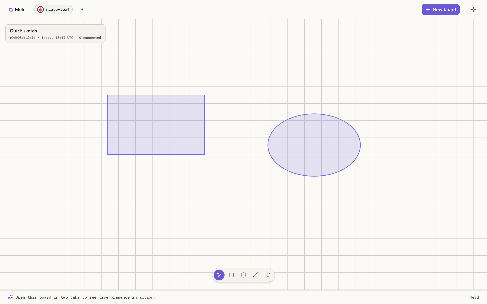
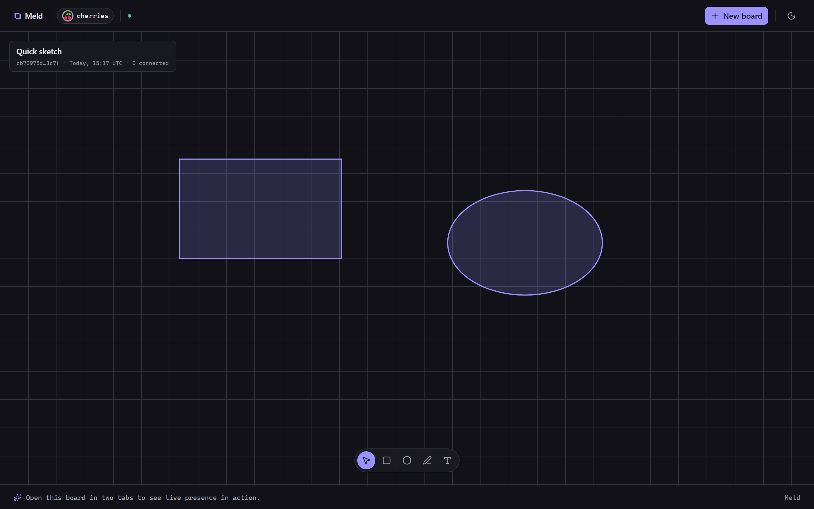
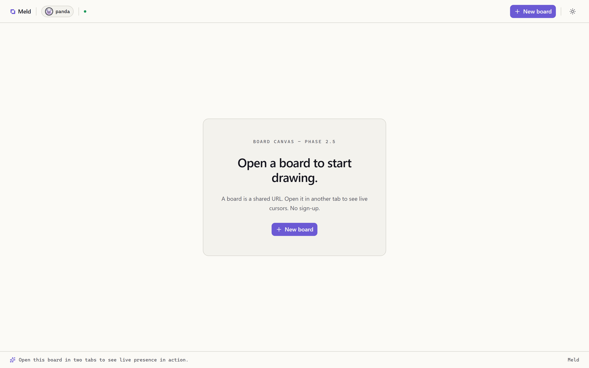
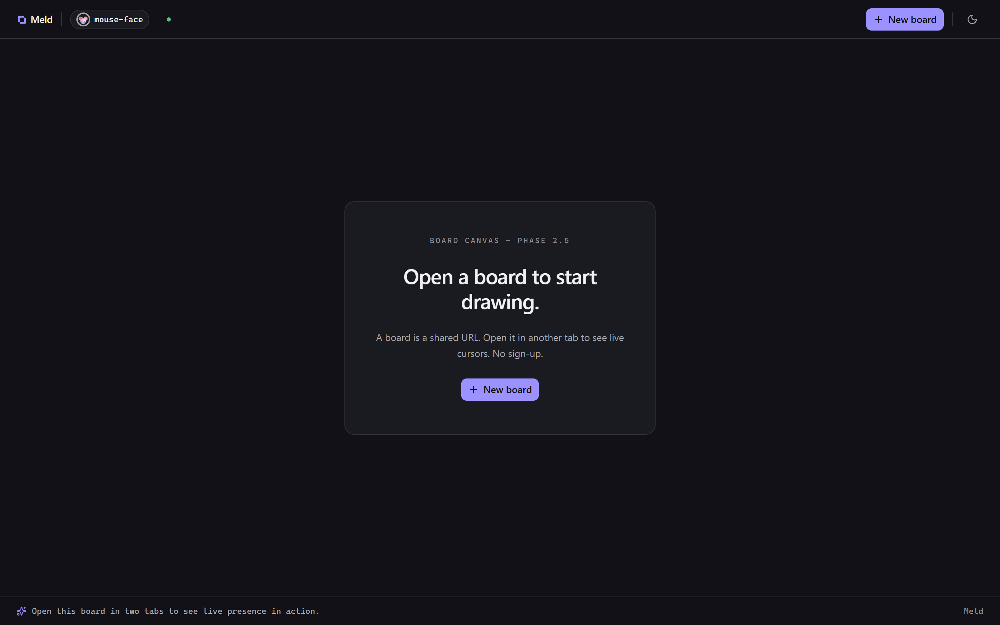
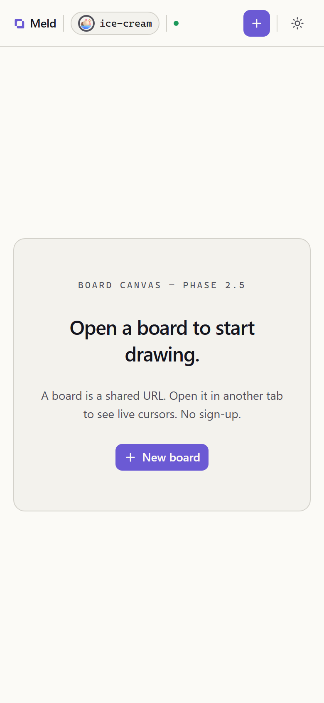

# Meld

> Local-first collaborative whiteboard with sub-100 ms presence and conflict-free auto-merge on reconnect.

Open a board, share its URL, and draw together in real time. Cursors appear within a tenth of a second. Go offline, keep drawing, come back — Yjs CRDTs merge every edit with no popup, no overwrite, no loss. The architecture is built to make that inevitable rather than impressive: the conflict resolution is a property of the data structure, not a feature bolted on top.

Built for a senior backend / fullstack reviewer who can click through in under ten seconds and see the local-first / CRDT story working end to end.

> Brand display: **Meld**. Repo directory: `meld`.

## Demo

**Live:** [https://meld-demo.fly.dev](https://meld-demo.fly.dev) — deployed on Fly.io (Frankfurt), single Machine, Hono + Hocuspocus and the Next.js standalone server behind one TLS terminator. `/health` returns a Zod-validated JSON envelope you can `curl` directly.

The wow moment is a thirty-second interaction: open the live URL, click **New board**, copy the `/board/<uuid>` URL into a second tab, and watch each tab's cursor render live in the other in its own color. Then open DevTools, throttle one tab to offline, keep drawing, and re-enable the network — the two boards reconcile automatically.

## Screenshots

The headline: two separate visitors on one board. Each tab renders the other's live cursor — arrow, emoji name, and a color that is the same hue the peer's shapes carry — while the board caption counts the room. This is the whole pitch in one frame.

| Two-tab presence, light                                                         | Two-tab presence, dark                                                        |
| ------------------------------------------------------------------------------- | ----------------------------------------------------------------------------- |
|  |  |

The board and landing surfaces, light and dark:

| Light                                                         | Dark                                                        |
| ------------------------------------------------------------- | ----------------------------------------------------------- |
|      |      |
|  |  |

<p align="center">
  
</p>

All shots are captured at 1440 x 900 (desktop) and 390 x 844 (mobile) with deviceScaleFactor 2. The landing and board shots run against the live demo via [`docs/capture-screenshots.mjs`](./docs/capture-screenshots.mjs). The two-tab presence hero is driven by two browser contexts against a local production-style stack via [`e2e/capture-hero-local.mjs`](./e2e/capture-hero-local.mjs) — a local stack is required because the strict CSP forbids `unsafe-eval` (so `next dev` cannot run; a production build is needed) and because presence is rock-solid on localhost but flaps under headless automation against the single-Machine Fly demo.

## What it is

- **Local-first.** Every edit lands in a local Yjs document first and syncs in the background. The board stays responsive while offline; reconnection replays the divergence with no user-visible merge step.
- **Sub-100 ms presence.** Remote cursors and the avatar identity are carried over `y-protocols/awareness` (ephemeral, not persisted). The cursor layer is its own Canvas2D surface with a critical-damped lerp (~120 ms perceptual settle, matching Figma's feel) so motion reads as fluid even when the awareness stream is throttled to ~33 fps on the wire.
- **Conflict-free by construction.** The shape store is a Yjs `Y.Map` of shapes. Concurrent edits from any number of tabs merge deterministically — the CRDT is the merge engine, so there is no last-write-wins data loss to reason about.
- **Anonymous identity, zero sign-up.** A JS-readable session cookie deterministically derives a per-session emoji name (otter, fox, peach...) and a per-board OKLCH color. Two tabs of one browser show as two cursors that share the same emoji and color — which is exactly the "you have two tabs open" read that sells the demo.

## Stack

**Frontend** (`web/`, package `meld-web`)

- Next.js 15.5 (App Router) · React 19.2 · TypeScript strict
- Tailwind CSS v4 (CSS-first, sovereign OKLCH palette, no `tailwind.config.js`)
- next-themes 0.4 (light / dark / system) · TanStack Query 5 · Zustand 5 · react-hook-form · Zod 4
- Motion 12 (React-shell chrome only) · lucide-react · radix-ui primitives (button, dialog, tooltip, popover, separator, command)
- `@hocuspocus/provider` 4 + Yjs 13 + `y-protocols/awareness` (CRDT + presence)
- Raw Canvas2D drawing surface (two layers: shapes + cursors), driven by Yjs observers and a dirty-flag-gated `requestAnimationFrame` loop — never by React re-render

**Backend** (`server/`, package `meld-server`)

- Hono 4.6 on Node 22 LTS
- `@hocuspocus/server` 4 mounted on the same `http.Server` as Hono; WebSocket upgrades for `/ws/board/:boardId` are routed at the Node `http.Server` `upgrade` event before any Hono code runs
- Drizzle ORM 0.45 + drizzle-zod · postgres-js 3.4 (driver)
- Yjs 13 + `y-protocols` (server-side document authority) · `ws` 8
- Zod 3 · types-only contract surface re-exported from `meld-server/src/app.ts` and consumed by `meld-web` via `import type`

**Tooling**

- pnpm 11 (workspace) · Node 22 LTS
- ESLint 9 (flat config) · Prettier 3 · Husky + lint-staged + commitlint
- Vitest (web) · `node --test` (server) · Playwright (E2E in `e2e/`, package `meld-e2e`)
- PostgreSQL 17 (Docker image `postgres:17-alpine`)

> better-auth is named in ADR-001 / PLAN.md as the v2 identity path (accounts, board ownership, paid tier). It is **not present in v1** — there is no better-auth dependency or active code. v1 identity is the anonymous session cookie only. Several v1.1 / v2 stub schemas (`heartbeat`, `settings.update`, `control.kicked-for-name-collision`) are intentional dead schema with documented reactivation paths; do not mistake them for shipped features.

## Run locally

Prereqs:

- **Node 22 LTS** and **pnpm >= 11** (the repo pins both via `packageManager` and `.nvmrc`)
- **Docker** for the Postgres dev container

```sh
# 1. Bring up Postgres on port 5436 (dodges system 5432, Mila on 5434, tape on 5435).
docker compose -f projects/meld/docker-compose.yml up -d

# 2. Install JS deps across the whole workspace.
pnpm install

# 3. Configure the server environment.
cp projects/meld/server/.env.example projects/meld/server/.env
# Defaults cover the local dev stack as-is. DATABASE_URL points at :5436.

# 4. Apply the database schema.
pnpm -F meld-server db:migrate

# 5. Start backend + frontend in two terminals.
pnpm -F meld dev:server     # Hono + Hocuspocus on http://localhost:3002
pnpm -F meld dev            # Next on http://localhost:3000
```

The umbrella `package.json` delegates to the two halves:

| Command                   | Effect                                        |
| ------------------------- | --------------------------------------------- |
| `pnpm -F meld dev`        | Next dev server (`meld-web`) on :3000         |
| `pnpm -F meld dev:server` | Hono + Hocuspocus (`meld-server`) on :3002    |
| `pnpm -F meld build`      | Build server then web                         |
| `pnpm -F meld lint`       | Lint both halves                              |
| `pnpm -F meld typecheck`  | Typecheck both halves                         |
| `pnpm -F meld test`       | Vitest (web) + `node --test` (server)         |
| `pnpm -F meld e2e`        | Playwright suite against the live demo URL    |
| `pnpm -F meld e2e:smoke`  | The `@smoke` E2E subset (deploy verification) |

Open `http://localhost:3000`, click **New board**, and copy the `/board/<uuid>` URL into a second window to see the two-tab presence demo.

The frontend reads `NEXT_PUBLIC_API_URL` and `NEXT_PUBLIC_WS_URL` (see `web/.env.example`); both default to the local dev hosts. Every server env var is documented per-variable in `server/.env.example`.

## Architecture notes

**One Node process, two protocols.** Hono owns the HTTP control plane (board create / fetch, `/health`, the anonymous-session cookie middleware). Hocuspocus owns the WebSocket room at `/ws/board/:boardId`. They share a single `http.Server`: the `upgrade` event is intercepted and routed to Hocuspocus before the Hono catch-all ever sees it, so the WS path and the HTTP path never collide. The room registry is Hocuspocus's own `Server.documents` map — there is no parallel registry to keep in sync. This is the v1 shape; ADR-001 names CF Workers Durable Objects (one Durable Object per board) as the v2 horizontal-scale path, with the extension-hook shape preserved so the migration is "swap the transport, keep the application code".

**Persistence is a hybrid ops-log plus debounced snapshot.** A custom Hocuspocus `Storage` adapter writes every edit to a `board_ops` table (`bytea` Yjs update payloads) for durability, and flushes a denormalised snapshot column on the `boards` row on a debounce (5 s idle, 30 s ceiling, or 100 ops, whichever fires first). On reconnect a board rehydrates from the snapshot plus the short ops tail. A daily 03:00 UTC sweep deletes boards inactive for 30 days (cascading to their ops); a rolling 6 h compaction sweep keeps the ops backlog bounded. The encoded-state math: a 200-shape board lands around 25 KB, so v1 needs no chunking — `bytea`'s 1 GB ceiling is a 40,000x margin (ADR-003).

**The drawing surface lives outside React.** Two stacked Canvas2D layers — shapes and cursors — each with an independent dirty flag and `requestAnimationFrame` loop. The shape engine subscribes once to the Yjs shape map; the cursor engine subscribes once to the awareness instance. Observer fires flip a boolean and return; the rAF loop coalesces multiple fires in a frame into one paint. Cursor motion at ~16 ms cadence never triggers a shape repaint. A `getComputedStyle` + `MutationObserver` theme bridge re-reads OKLCH tokens exactly once per `data-theme` flip — never per frame — and Canvas2D consumes the `oklch(...)` strings natively. Motion is reserved strictly for React-shell chrome (theme toggle, offline banner, identity badge beat); the canvas never touches the reconciler (ADR-008).

**The offline-merge UX is a deliberate non-event.** Disconnect shows a single calm banner; reconnect runs a 200 ms whole-canvas crossfade only when incoming shapes actually arrived, and an `aria-live` region announces the state change and the synced-shape count. Reduced-motion collapses all three motion sites to zero duration while keeping the announcement. The connection-state detector debounces a dropped socket by 1500 ms (above measured Fly/CF/Railway edge-failover windows) so a brief WS flap never flashes the banner, but `navigator.onLine === false` bypasses the debounce because the OS signal is authoritative (ADR-009).

## Key decisions

- **ADR-001** — `api-heavy` flavour, Hono on Node 22, Yjs as the CRDT. Portfolio backend variance: tape runs Elysia on Bun, meld runs Hono on Node 22.
- **ADR-002** — Hocuspocus on the same `http.Server` as Hono; backpressure via `maxRate` / `maxMessageSize` / `timeout` (close code `4290`); origin allowlist fails closed in production.
- **ADR-003** — Hybrid persistence (per-edit ops-log + debounced snapshot), 30-day retention, single-transaction compaction.
- **ADR-004** — WebSocket control frames are JSON TEXT frames over a Zod discriminated union, kept separate from the binary y-websocket protocol.
- **ADR-005** — Anonymous session = server-minted UUID in a JS-readable cookie; deterministic emoji name and per-board OKLCH color derived by FNV-1a.
- **ADR-006** — Single Fly Machine, single external port, WS upgrade routed at the `http.Server` level behind Fly edge TLS.
- **ADR-007** — Playwright deploy-verification harness asserting the two-tab presence proof against the live URL.
- **ADR-008** — Two-layer Canvas2D surface, Yjs-observer / rAF paint loop, dev-only conflict-viz overlay stripped from production builds.
- **ADR-009** — Offline-mode UX contract (banner, gated reconcile crossfade, aria-live announcement, reduced-motion degradation).

Full ADR text in [`DECISIONS.md`](./DECISIONS.md). Spec and phased task list in [`PLAN.md`](./PLAN.md). Current state in [`PROGRESS.md`](./PROGRESS.md). Production runbook in [`DEPLOY.md`](./DEPLOY.md). Release history in [`CHANGELOG.md`](./CHANGELOG.md).

## License

[MIT](../../LICENSE).

## Author

[Jan Antczak](mailto:janek.antczak@gmail.com). Portfolio root: [`../../README.md`](../../README.md).
