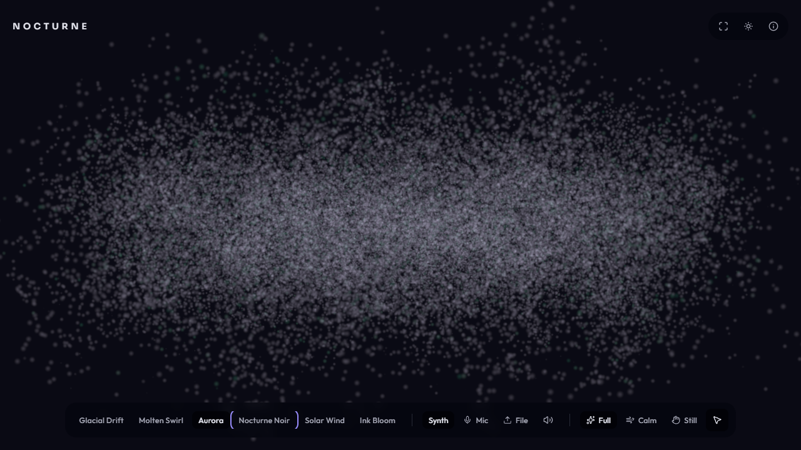
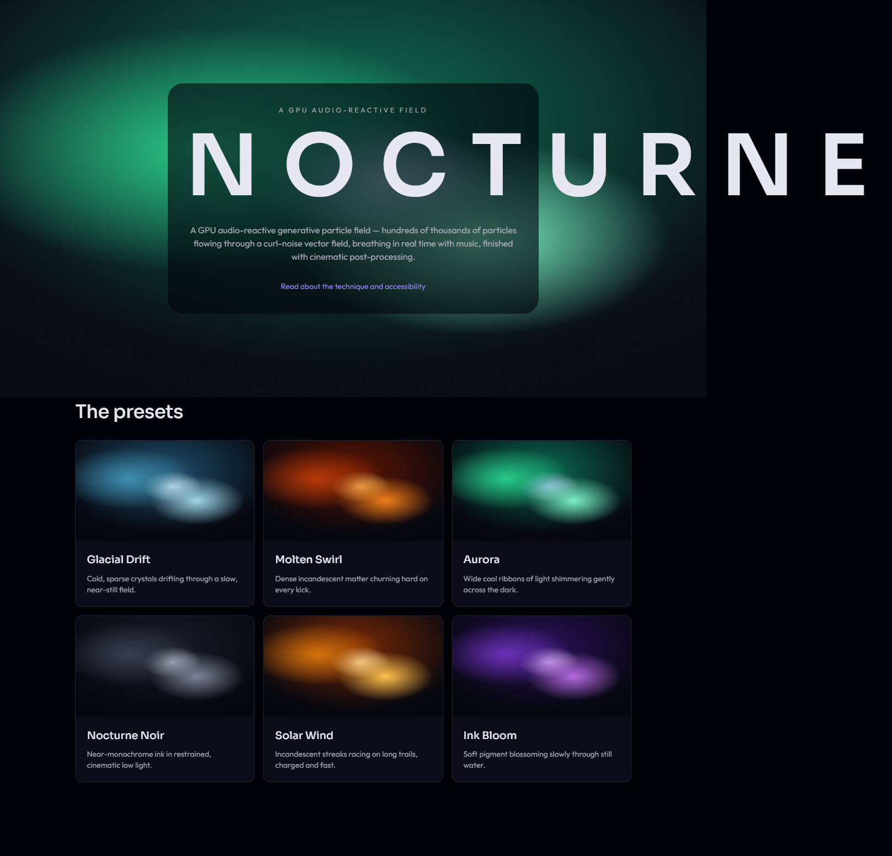
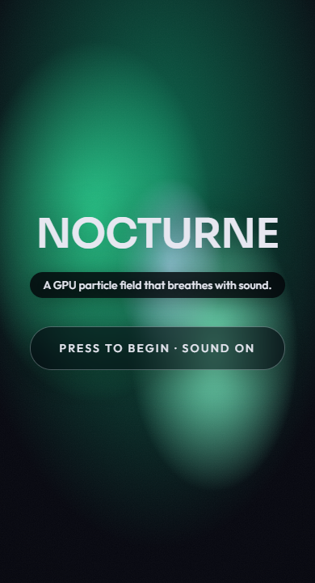
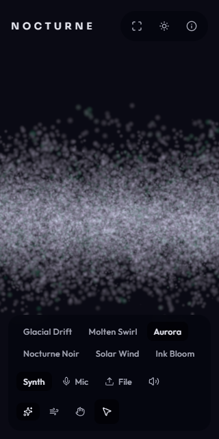
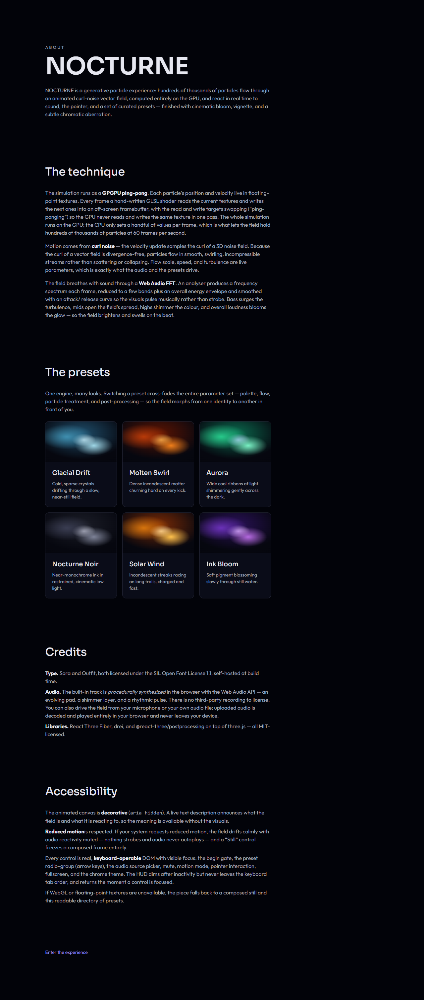
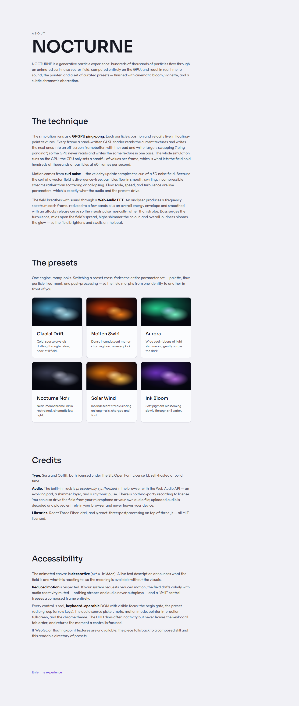
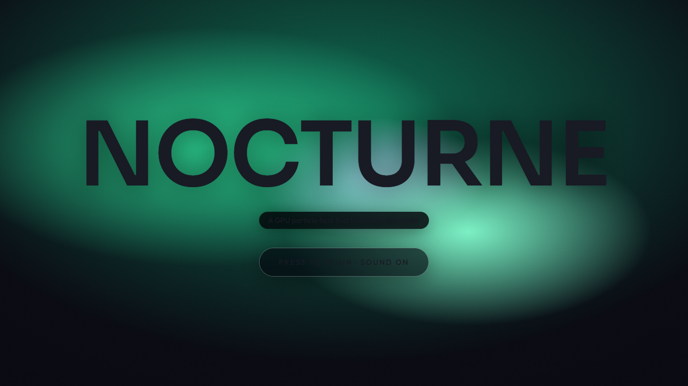
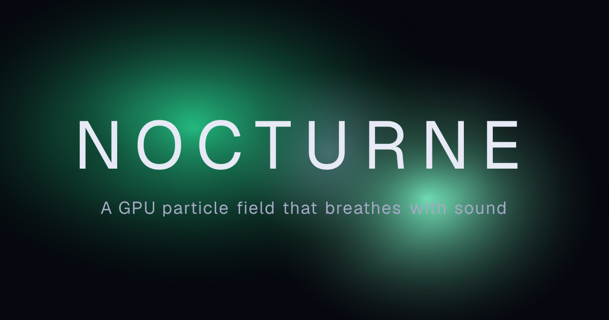

# NOCTURNE

> A web-only, GPU-accelerated, audio-reactive generative particle experience — a living field of hundreds of thousands of particles that breathes with the music.

Press to begin, and a field of ~262k particles surges alive: advected in real time through an animated curl-noise flow field, the whole simulation computed on the GPU, and driven by a Web Audio FFT so the field _pulses to the sound_ — the bass swells the turbulence, the highs shimmer the color, the overall loudness blooms the glow on the beat. The pointer bends a local region of the field and leaves a wake. Switching presets cross-fades the entire look from a cold glacial drift to a hot molten swirl in front of you. It is fullscreen, sovereign-dark, and finished like a film frame with bloom, vignette, and a subtle chromatic aberration.

Built to be judged in the first five seconds by the person who will open DevTools to check whether the "particles" are a genuine GPGPU simulation (they are — an FBO ping-pong curl-noise advection sim in custom GLSL, with zero per-particle CPU work per frame) or a canned video. It is the most visually arresting piece in the portfolio by design, and the proof that the author can write the shaders and the simulation, wire a real-time audio analysis pipeline into them, and still ship the surrounding product — the chrome, the accessibility, the SEO, the no-WebGL floor — to the portfolio's production bar.

> Brand display: **NOCTURNE**. Repo directory: `nocturne`. Portfolio slot 8 (web-only, generative GPGPU art — the second R3F project, distinct from `apex`: generative compute, not a product configurator). Dev port **3100**.

## Demo

**Demo: deploy pending.** Once deployed it will live at `https://nocturne-demo.fly.dev` (Fly.io, single Machine, Next.js standalone, region `fra`, no backend, no secrets, warm floor — the `atrium`/`apex` web-only standalone pattern; see [DECISIONS.md](./DECISIONS.md) ADR-005). The canonical origin is wired through `NEXT_PUBLIC_SITE_URL`, baked at build time, and backs the sitemap, canonical tags, the Open Graph image, and the JSON-LD. You can run the whole thing locally per [Run locally](#run-locally).

**On the GPU vs the captures — read this first (the honest posture, the same one `apex` took for its WebGL section).** nocturne is a continuously-animating, audio-reactive WebGL field. It is at its best on a real discrete or modern integrated **GPU**, with sound on: the full ~262k-particle field, the full-saturation preset palettes, the audio-pulsed bloom, and a locked 60 fps. The screenshots below — and any frame captured in CI — are taken in **headless Chromium on software-GL (SwiftShader)**, which has no GPU: it renders the field slowly and with the color muted toward grey, and cannot hit 60 fps. That is an artifact of the capture environment, not the product. The field's correctness (a genuine GPGPU sim, the band-to-uniform mapping moving frame-to-frame, leak-free teardown) is verified headless; the true color, bloom, and frame rate show on real hardware. Where a still is software-GL it is labelled as such below.

## Screenshots

The headline is the armed experience: the auto-dimming minimal HUD over the live field — the NOCTURNE wordmark top-left, the chrome cluster top-right, and one consolidated control bar at the bottom (preset picker, audio source, mute, motion mode, pointer toggle). This is the whole pitch in one frame. (Captured on software-GL — the field reads sparse and grey here; on a real GPU it is dense, saturated, and blooming.)



The Tier-4 poster frame and preset directory — the statically composed, server-rendered floor shown when WebGL2 or float render targets are unavailable, or when JavaScript is off. It is a first-class deliverable, not a stub: a designed luminous-field poster (the LCP-grade hero), the wordmark, the positioning, and the six presets each as a labelled glow card. It is also the SEO, social, and screen-reader surface, and — fittingly — it reads as the most confident type composition in the project:



The cinematic intro is also the audio gesture gate: browser autoplay policy means audio cannot start without a user gesture, so the "Press to begin · sound on" button doubles as the threshold of the experience. On the gesture it resumes the `AudioContext`, starts the procedural track, and arms the field. Here on mobile (390 px), the wordmark sits inside a viewport-bounded clamp and the gate is fully thumb-reachable and keyboard-operable:

<p align="center">
  
  
</p>

The `/about` route is the clean, light-readable non-canvas surface: what nocturne is, the technique in plain language (GPGPU ping-pong, curl-noise, the Web Audio FFT), the preset directory, the credits, and the accessibility statement. It ships in both chrome themes (dark is canonical; light is an intentional reading mode), and it is the surface Lighthouse is measured on:

| `/about`, dark (canonical)                               | `/about`, light reading mode                               |
| -------------------------------------------------------- | ---------------------------------------------------------- |
|  |  |

The chrome themes light and dark, but the **canvas stage stays dark in both** — you do not "light-mode" a field of additive glowing particles; it needs the black to glow. Here is the wordmark over the always-dark stage rendered under **light** chrome (a light-OS visitor gets light chrome on first load, respecting `prefers-color-scheme`; the stage tokens are theme-invariant). And the designed Open Graph / social card:

| Wordmark over the always-dark stage, light chrome (software-GL)                              | The Open Graph image                                |
| -------------------------------------------------------------------------------------------- | --------------------------------------------------- |
|  |  |

**No GIF is shipped — deliberately.** A GIF of the live field captured on software-GL would be grey, sparse, and slow, which would actively misrepresent the piece (the colour, the bloom, and the 60 fps are exactly what software-GL cannot produce). Shipping a misleading hero asset is worse than shipping none, so the designed poster and the HUD/field stills are the artifact here — the same call `apex` made when its orbit GIF could not be assembled faithfully. The real motion is the live experience on a GPU.

Desktop shots are captured against the production build (`next build --webpack && next start` on port 3100 — the same surface the E2E suite and the Lighthouse audit use). A production build is required because the strict CSP forbids `unsafe-eval`, so `next dev` cannot run under it. nocturne has no runtime randomness in its chrome (the presets are six fixed typed entries; the synth detune is seeded), so the static surfaces are reproducible across runs.

## What it is

- **A genuine GPGPU particle field that breathes with the music.** ~262k particles (the default desktop tier) are advected through an animated curl-noise vector field, the whole simulation run on the GPU via FBO ping-pong, and driven by a Web Audio `AnalyserNode` FFT: bass swells the turbulence and flow energy, mids open the spread, highs shift the color ramp and sparkle the points, and overall loudness blooms the glow and breathes the vignette. The field surges alive on the first beat — that is the five-second hold.
- **Three audio sources, one analysis pipeline.** A built-in **procedurally synthesized** track (oscillators, an LFO-swept filter, a rhythmic kick — no third-party file, see [Credits](#credits)), live **microphone** input (the field reacts to the room, gated behind explicit permission and a secure context), and local **file upload** (drop your own track — decoded entirely in the browser, never uploaded anywhere). All three switch into the same shared analyser without rebuilding the graph.
- **Curated presets that re-skin the whole field.** Six dramatically distinct looks — Glacial Drift, Molten Swirl, Aurora, Nocturne Noir, Solar Wind, Ink Bloom — each defining its own palette ramp, flow (noise scale, speed, turbulence), particle treatment, post-processing mix, and audio gains. Switching a preset cross-fades the entire uniform set on an eased curve, so the field morphs from one identity to another in front of you.
- **A minimal cinematic HUD that gets out of the way.** A fullscreen canvas with an auto-dimming HUD overlay — wordmark, preset picker, audio-source picker, a few controls (motion mode, pointer toggle, mute, theme), and an about link. It recedes after inactivity and returns on pointer move or focus, but it is always keyboard-reachable and never hidden from assistive tech (the dimming is opacity-only).
- **A four-tier degradation contract, with a poster→live hand-off.** The piece always works: full cinema on a capable GPU, a reduced-capability tier on mobile and weaker GPUs, a calm-drift reduced-motion tier, and a statically composed poster + preset-directory floor for no-WebGL and no-JS. On first paint the route renders the designed poster (the LCP); the live canvas mounts behind it and cross-fades in only once it has rendered its first frame, so the viewer never sees an empty canvas and there is no layout shift.

## Stack

Web-only (`web/`, package `nocturne-web`). No backend service, no API, no database, no network at runtime — the only "data" is a typed, in-repo set of preset definitions and credits the app serves to itself. This is a deliberate, owner-confirmed call: none of the five api-heavy triggers fires, and the portfolio's api-heavy slots are already filled across four distinct backends by `tape` (Elysia/Bun), `meld` (Hono/Node), `pulse` (NestJS), and `atlas` (Fastify). The GPGPU simulation and the Web Audio pipeline are **client** concerns; they do not make this api-heavy — exactly the principle `apex` established for its WebGL configurator. See [DECISIONS.md](./DECISIONS.md) ADR-001.

**Frontend**

- Next.js 16 (App Router) · React 19.2 · TypeScript strict
- Tailwind CSS v4 (CSS-first, sovereign dark-cinematic OKLCH palette built from scratch, no `tailwind.config.js`)
- next-themes 0.4 (dark canonical default, light an intentional chrome-only reading mode) · Zustand 5 (the preset + audio-source + HUD state machine) · Zod 4 (validating the typed preset data at module load)
- shadcn/ui-style primitives over a sovereign token bridge · lucide-react

**3D, animation, and the engine** (a single R3F animation-library family — ADR-001/002; no GSAP, no Motion)

- **React Three Fiber 9 + drei 10 + three.js 0.184** own everything inside the WebGL canvas: the GPGPU compute pass, the render particle system, the camera, the per-frame uniform orchestration, and the `PerformanceMonitor`/`AdaptiveDpr` adaptation.
- **@react-three/postprocessing 3 + postprocessing 6** provide the `EffectComposer` for the cinematic finish (bloom, vignette, chromatic aberration). This is the post stack of the same R3F family, not a second animation library.
- **Custom GLSL** is the heart: the simulation shaders (curl-noise advection of the position/velocity textures, in-shader respawn), the render particle shader (additive soft sprites, palette-ramp color from the audio-mapped energy), and the noise/curl utilities are all hand-written. The preset cross-fades, audio envelopes, and pointer wake are uniform interpolations inside the R3F render loop — not a DOM animation library's job — and the HUD micro-transitions are CSS.
- **Web Audio API** (`AudioContext` + a shared `AnalyserNode` behind a master `GainNode`) — the analysis pipeline driving the field. AnalyserNode was chosen over an AudioWorklet to keep the CSP free of worklet `blob:` script.

**Type**

- **Sora** (variable, the NOCTURNE wordmark and preset/source labels) + **Outfit** (variable, body and UI), both via `next/font` (self-hosted at build, CSP-clean) and both SIL OFL 1.1 — chosen distinct from every sibling (see [Credits](#credits)).

**Tooling**

- pnpm 11 (workspace) · Node 22 LTS
- ESLint 9 (flat config) · Prettier 3 · Husky + lint-staged + commitlint
- Vitest (unit) · Playwright (E2E in the `nocturne-e2e` workspace package) · Lighthouse CI
- `sharp` and `@faker-js/faker` are build-time devDependencies only; they do not reach the client bundle. There is **no WASM** in the bundle at all (the sim is pure GLSL — nothing to decompress), which makes the CSP even tighter than `apex`'s.

## Run locally

Prereqs: **Node 22 LTS** and **pnpm >= 11** (the repo pins both via `packageManager` and `.nvmrc`). No database, no Docker, no environment variables are required for local development. A capable GPU and sound on are recommended — that is the experience the piece is tuned for.

```sh
# 1. Install JS deps across the whole workspace (run once at the repo root).
pnpm install

# 2. Start the dev server.
pnpm -F nocturne-web dev      # Next dev server on http://localhost:3100
```

Open `http://localhost:3100`, press **Press to begin · sound on**, and the field arms with the procedural track. Move the pointer to bend the field; switch presets in the bottom bar to morph the look; switch the audio source to the microphone or a local file; or toggle the motion mode to Calm or Still.

The umbrella `package.json` delegates every script to the `nocturne-web` workspace member:

| Command          | Effect                                     |
| ---------------- | ------------------------------------------ |
| `pnpm dev`       | Next dev server on :3100                   |
| `pnpm build`     | Production build (`next build --webpack`)  |
| `pnpm start`     | Serve the production build on :3100        |
| `pnpm lint`      | ESLint (Next core-web-vitals + TypeScript) |
| `pnpm typecheck` | `tsc --noEmit`                             |
| `pnpm test`      | Vitest unit suite                          |

**For the production surface** (the only valid surface for the strict CSP, the E2E suite, Lighthouse, and screenshots — `next dev` cannot run under a CSP that forbids `unsafe-eval`):

```sh
pnpm -F nocturne-web build
pnpm -F nocturne-web start            # http://localhost:3100

# Then, against the served production app — the three test entrypoints:
pnpm -F nocturne-web test             # Vitest unit suite (123 tests, the pure logic)
pnpm -F nocturne-e2e test             # full Playwright suite (29 tests, on :3100)
pnpm -F nocturne lighthouse           # Lighthouse CI on /about, >= 95 x4 + Core Web Vitals
```

No `.env` is needed to run. The single optional variable is `NEXT_PUBLIC_SITE_URL` — the canonical origin for the sitemap, canonical tags, OG image, and JSON-LD; it falls back to the `https://nocturne-demo.fly.dev` placeholder when unset.

## Architecture notes

**The simulation runs entirely on the GPU — that is the load-bearing reason 262k particles hold 60 fps.** Particle position (xyz + age) and velocity (xyz + a per-particle seed) are stored in N×N half-float textures (`RGBA16F`, with a full-float fallback) and ping-ponged each frame by three.js `GPUComputationRenderer`: a simulation fragment shader reads the current textures and writes the next, with read and write targets swapping so the GPU never reads and writes the same texture in a pass. The velocity shader samples the **curl of a 3D simplex-noise field** (divergence-free, so particles flow in smooth incompressible swirls rather than scattering), adds the pointer attractor and the audio turbulence, and the position shader integrates and respawns particles on their age channel — all in-shader. The single per-particle CPU artifact is a static `reference` attribute mapping each vertex to its texel UV, built **once** at init. Per frame, the CPU only reads the analyser once, reduces it to bands with a pure function, and writes about twenty scalar/vector uniforms — there is no per-particle JS loop anywhere. The default desktop tier is `high` (512² ≈ 262k); `ultra` (1024² ≈ 1M) is reached only by runtime adaptation on proven headroom, because a smooth 262k field beats a stuttering 1M one for the five-second wow.

**The audio reactivity is a small pure pipeline feeding the render loop.** Three sources (the procedural `<audio>` track, an uploaded file's object URL, and the mic `MediaStream`) switch into one shared `AnalyserNode` behind a master `GainNode`. Each frame the loop reads `getByteFrequencyData` once, runs the pure `reduceBands` (FFT bins → sub-bass / bass / mid / high / RMS, by frequency-defined bin ranges) and `applyEnvelope` (per-band attack/release smoothing so the field breathes rather than strobes), and maps the smoothed bands onto the engine uniforms (bass → turbulence and flow energy, mid → spread, high → color shift and sparkle, RMS → bloom and vignette). The audio modulates _around_ the preset's cross-faded base. An idle floor keeps the field gently drifting under silence, so it is never a dead canvas — and that same idle path is what reduced-motion's calm drift reuses. The pure functions hold no Web Audio or React state, so they are fully Vitest-tested without an audio device. Teardown is leak-free: one `AudioContext` closed on unmount, mic tracks stopped on switch-away, object URLs revoked.

**Four-tier degradation with a poster→live hand-off, inherited from `apex` and re-pinned for a generative piece.** A synchronous capability probe runs before the canvas mounts: no JS, no WebGL2 context, or no `EXT_color_buffer_float` (the GPGPU float hard gate) routes to the Tier-4 poster; `prefers-reduced-motion` routes to a calm-drift tier with audio reactivity muted, bloom pulsing off, and an accessible "Still" toggle to the poster; reduced-data and mobile cap the particle count and DPR; otherwise a cores/memory heuristic picks low/mid/high, and a runtime `PerformanceMonitor` adapts DPR and post quality (then count) before it janks. The poster is the LCP (a designed luminous-field still, not a captured frame — software-GL cannot capture a faithful one); the live canvas mounts behind it in a reserved box and cross-fades in on first-frame-ready, so the LCP is provably the poster, there is no empty-canvas flash, and CLS stays near zero. The canvas is `aria-hidden`; a real-DOM `aria-live` text alternative announces what is playing and which preset is active, so a screen-reader user gets the meaning without the scene.

**Strict, eval-free CSP — tighter than `apex`'s.** three.js, R3F, drei, and the post stack compile GLSL through the WebGL driver, not JS `eval`, so the shipped CSP carries **no `unsafe-eval` and no `wasm-unsafe-eval`** — and because nocturne ships no GLB and no WASM at all (the sim is pure GLSL), it is even cleaner than `apex`. The only addition over a non-audio site is `media-src 'self' blob:` (the bundled track served same-origin, the uploaded file's object URL); `connect-src` stays `'self'`. The full security-header set ships in `next.config.ts`, with a dev-only `unsafe-eval` + `ws:` relaxation for HMR that never reaches the production build. Zod 4's JIT was opted out globally (`z.config({ jitless: true })`) to close its one eval probe under the CSP.

**Sovereign design tokens, no reuse from any sibling.** The dark-cinematic OKLCH identity is built from scratch in `app/globals.css`, with two deliberately separate token families: theme-**invariant** stage tokens (the fixed dark canvas ground, the HUD scrim, the over-stage ink) versus theme-**variant** chrome tokens (the `/about` and credits surfaces, light + dark). That split is what lets the chrome theme respond to `prefers-color-scheme` while the canvas stage stays dark in both. The six preset palette ramps _are_ the accent system — the identity is luminous and shifting, not a single fixed brand hue. All chrome-text contrast pairs are verified to WCAG 2.2 AA in both themes.

### Key decisions

- **ADR-001** — Stack flavour `web-only` (no backend), the R3F single-family animation posture (no GSAP, no Motion; custom GLSL is the heart), sovereign dark-canonical tokens, the portfolio-composition rationale (the backend axis is complete, so slot 8 is a deliberate web-only creative piece), and the **§ 14 no-sibling-re-skin justification vs `apex`** (different motif, GLSL, audio, palette, interaction, and post — generative GPGPU art, not a product configurator).
- **ADR-002** — The GPGPU engine (`GPUComputationRenderer`, two half-float variables, curl-noise advection, the zero-per-particle-CPU-work invariant, index→UV `reference` attribute), the performance-tier table (count × DPR × post per tier, `high` default), the R3F/Next integration (single client island, `next/dynamic ssr:false`, the continuous `frameloop="always"` paused when hidden/unarmed, one `useFrame` owning sim→render→post), and the exact eval-free CSP.
- **ADR-003** — The Web Audio pipeline (three sources into one shared analyser behind a master gain), the autoplay gesture-gate contract (the cinematic intro is the gate; no autoplay ever, including under reduced-motion), the pure `reduceBands` + `applyEnvelope` band reduction and envelope, the exact band→uniform mapping, the idle drift, and the leak-free teardown contract.
- **ADR-004** — The capability decision tree, the four tiers (full / reduced-capability / reduced-motion calm-drift + "Still" / no-WebGL poster + directory), the poster→live reveal-when-ready hand-off (LCP is the poster, no flash, no CLS), the chrome-themes-light/dark-but-stage-stays-dark token split, and the decorative-canvas + `aria-live` text-alternative + keyboard-operable-HUD accessibility contract.
- **ADR-005** — The deploy posture (Fly.io single Machine, Next standalone, web-only, no secrets, `NEXT_PUBLIC_SITE_URL` baked at build, the bundled track within `media-src 'self'`). Pending until deploy.

Full ADR text in [`DECISIONS.md`](./DECISIONS.md). Spec, audience, and the phased task list in [`PLAN.md`](./PLAN.md). Current state in [`PROGRESS.md`](./PROGRESS.md). Release history in [`CHANGELOG.md`](./CHANGELOG.md).

## Quality

- **Tests.** 123 Vitest unit tests (the pure `reduceBands` and `applyEnvelope` across silence, clipping, single-band spikes, fold-in, empty bins, and attack/release determinism; the preset cross-fade and ramp interpolation at the 0/1 endpoints; the reduced-motion branch selector and the capability-gate routing decision; the easing curves; the particle-seed and palette-data builders; the auto-dim and the `aria-live` describe-state logic; the poster gradient) and 29 Playwright E2E tests across 8 files, all green against the production build on :3100: the intro gesture gate (no autoplay), full HUD keyboard reachability and the WAI-ARIA preset radiogroup, the theme toggle in both chrome themes with the stage staying dark, the reduced-motion calm/Still path, the Tier-4 no-WebGL and no-JS poster + directory floor, mute, the canvas a11y and `aria-live` alternative, the SEO surface, and 320 px no-overflow.
- **Lighthouse** (production build, median of 5, desktop). On `/about` — the clean non-canvas surface, which is also the SEO and screen-reader view — Performance 100, Accessibility 100, Best Practices 96, SEO 100, all clearing the >= 95 gate, with Core Web Vitals green (LCP 590 ms, CLS 0.007, FCP 351 ms, TBT 28 ms). The canvas route `/` is **deliberately not** a Lighthouse subject: a continuously-animating, audio-reactive WebGL field on headless software-GL is a confounded TBT/CPU measurement (it measures SwiftShader, not the product), so its 60 fps and the four perf tiers are measured separately and documented — the same honest stance `apex` took for its configurator and `tape` for its live route.
- **Accessibility — WCAG 2.2 AA.** The canvas is `aria-hidden` decorative with a real-DOM `aria-live` text alternative; every HUD control is real keyboard-operable DOM (the preset picker is a roving-tabindex radiogroup; the auto-dim is opacity-only so controls never leave the tab order). A single brand focus ring clears AA in both chrome themes. `prefers-reduced-motion` is a first-class path (calm drift, no autoplay, a "Still" escape).
- **SEO.** Per-route metadata with canonical tags, a designed Open Graph image (`next/og`), `Person` + `WebSite` + `CreativeWork` JSON-LD, `sitemap.xml`, and `robots.txt`. The Tier-4 poster + directory DOM makes the piece crawlable and legible despite the WebGL.

## Credits

This is a portfolio showcase, and it is honest about its assets. Full provenance is recorded here and in [`AGENT_NOTES.md`](./AGENT_NOTES.md).

- **The built-in audio is procedurally synthesized — no third-party track is shipped, so no audio licensing is required.** The default source is generated in real time with the Web Audio API (oscillators forming an ambient pad, an LFO-swept lowpass filter, a shimmer layer, and a rhythmic kick pulse), not a recorded file. This satisfies the same provenance requirement `apex` met with its CC0 models — there is simply nothing to license, because nothing third-party is bundled. The microphone and file-upload sources play **your** audio, decoded entirely in your browser; nothing is ever uploaded anywhere.
- **Fonts** — **Sora** (display, the wordmark and labels) and **Outfit** (body and UI), both SIL OFL 1.1, self-hosted via `next/font`.
- **Libraries** — React Three Fiber, drei, three.js, `postprocessing`, `@react-three/postprocessing`, and `next-themes` are all MIT.

## Not shipped in v1 (deferred)

- **A real CC0 / royalty-free track option.** v1 ships the procedural synth as the always-on default (no licensing, autonomous-friendly); offering a curated, credited real track alongside it is a v2 path.
- **Recording / export.** Capturing the canvas to a video, GIF, or image sequence in-app ("export your moment") is a strong v2 feature, out of v1 to protect the budget.
- **MIDI / external control.** Driving presets and parameters from a Web MIDI controller is a v2 path.
- **`PerformanceMonitor` adapt-up-to-`ultra` tuning.** The boot default is conservatively `high`; tuning the runtime headroom rule that promotes a capable desktop toward the ~1M `ultra` tier against the deployed profile is a post-deploy step.
- **Streaming-service integration, a larger preset library, a second simulation engine, WebXR, and internationalisation.** All out of v1 scope; English only.

## License

[MIT](../../LICENSE).

## Author

[Jan Antczak](mailto:janek.antczak@gmail.com). Portfolio root: [`../../README.md`](../../README.md).
