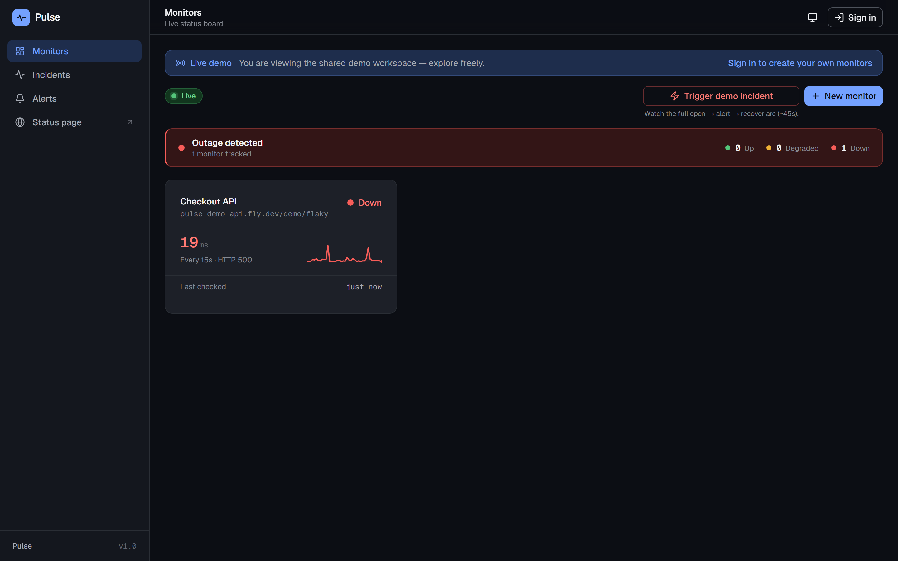
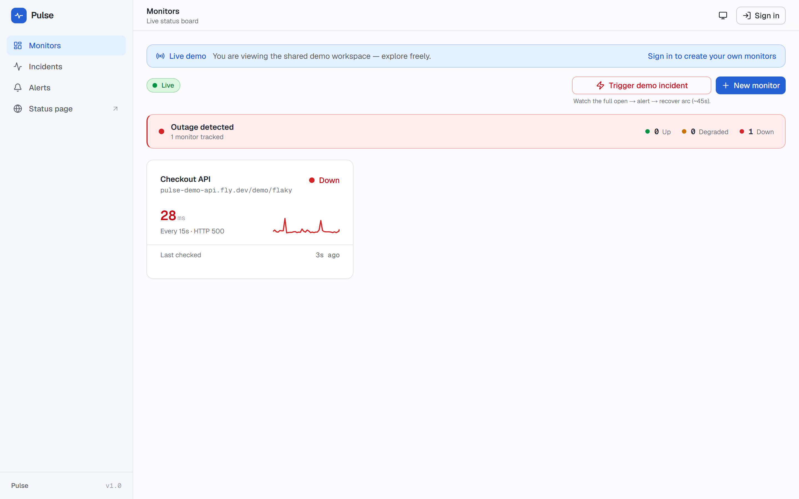
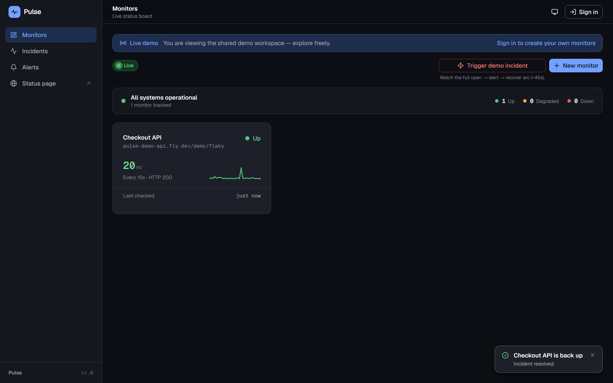
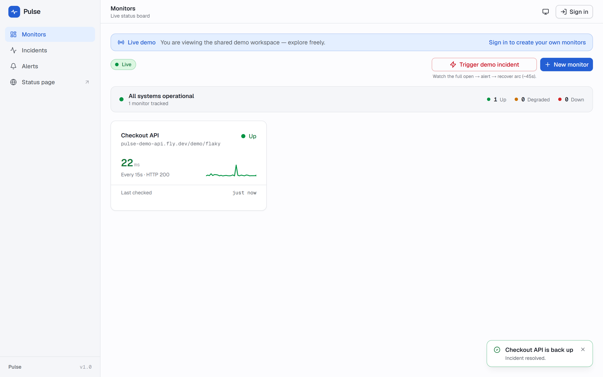
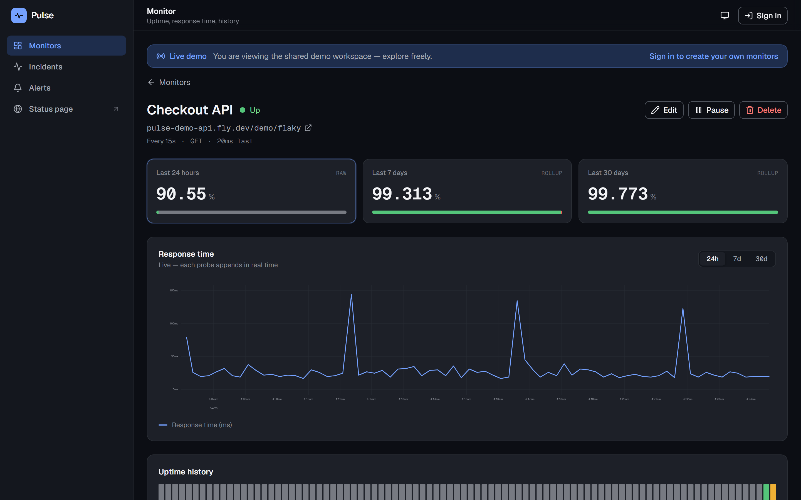
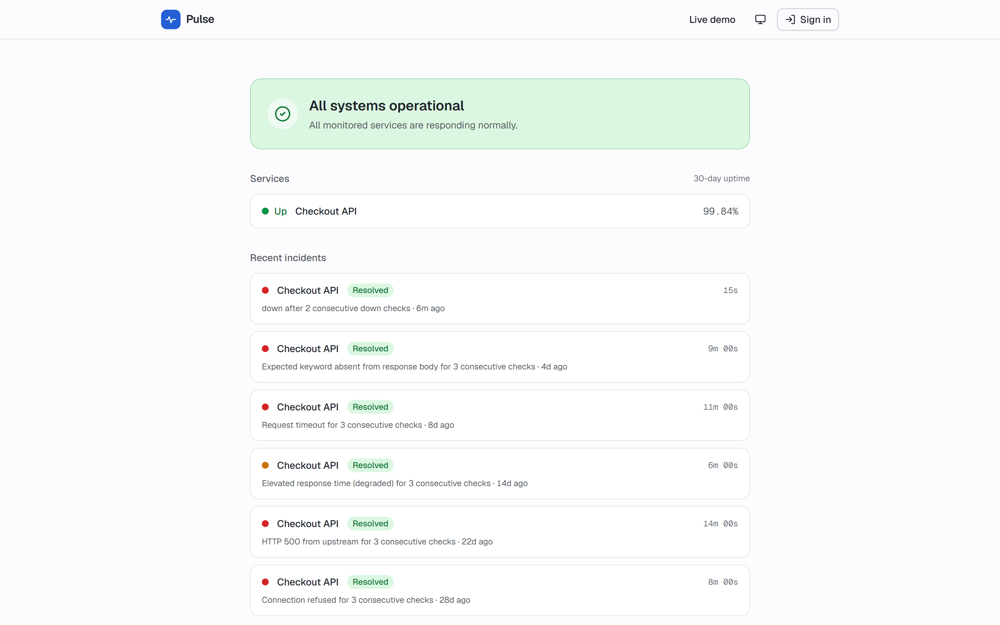
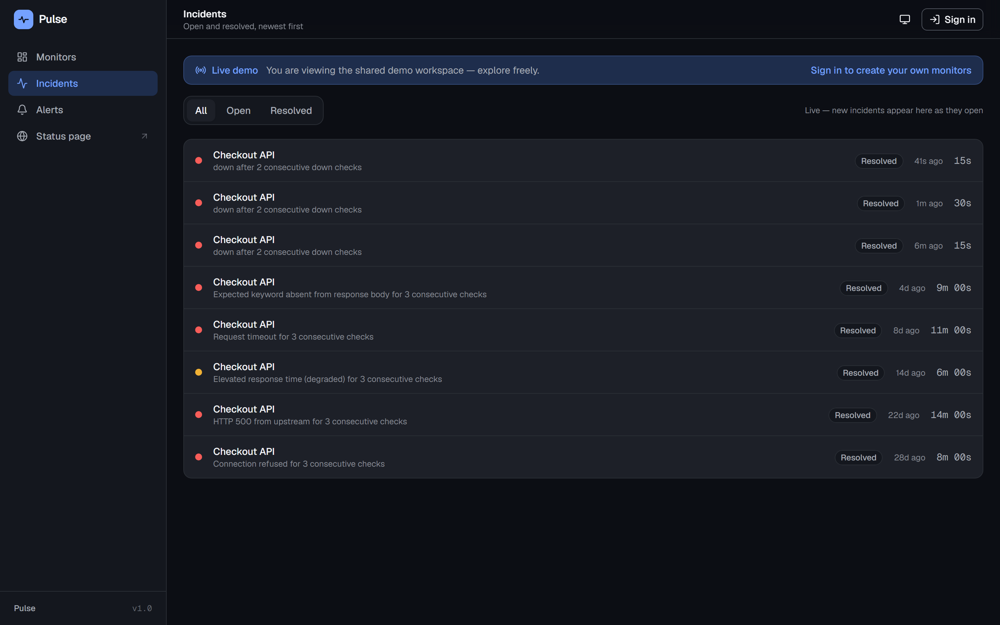
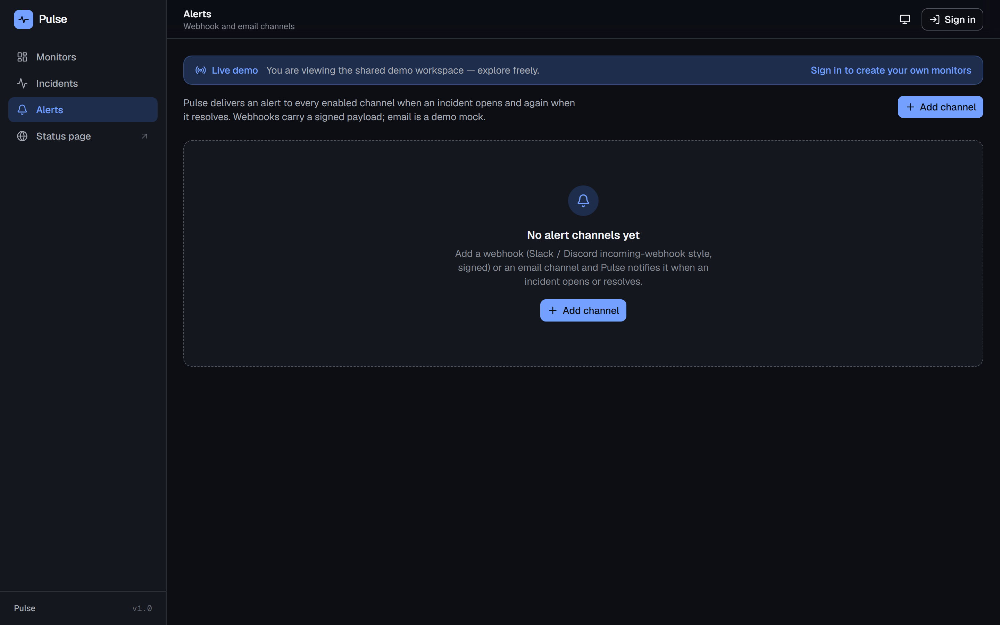
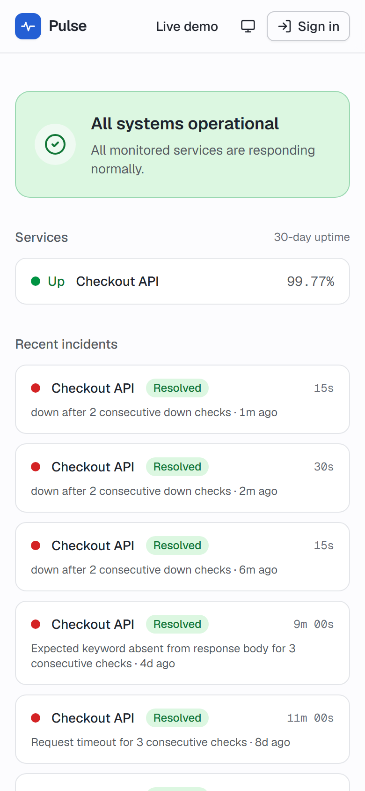

# Pulse

> Real uptime monitor: scheduled probes actually hit endpoints, results stream to a live status board over SSE, incidents open and close themselves, and a public status page ships the artifact a real product ships.

Pulse is a working uptime / status monitor — not a CRUD dashboard with fake data. A BullMQ scheduler runs each monitor's HTTP check on its interval, a separate worker process executes the probes behind an airtight SSRF guard, an incident state machine turns the raw result stream into a human-meaningful timeline, real signed webhooks fire on incident open / close, and an unauthenticated public status page exposes a redacted view. Everything moving forward from "now" on the live demo is a real scheduled probe; the seeded history is clearly separated and documented as seed.

Built for a senior backend / fullstack reviewer who can open the live board and read "this person can build real systems — queues, scheduling, real-time, incident logic" in the first ten seconds, before reading a word of this README.

> Brand display: **Pulse**. Repo directory: `pulse`. Portfolio slot 4 — api-heavy, NestJS (the third distinct backend after Elysia/Bun and Hono/Node).

## Demo

**Live:** [https://pulse-demo-web.fly.dev](https://pulse-demo-web.fly.dev) — deployed on Fly.io (Frankfurt). One NestJS image runs as two processes (web + worker), behind a single-origin Next 15 proxy, with Upstash Redis and Fly Postgres. The API lives at `pulse-demo-api.fly.dev` behind the web proxy, so the browser only ever sees the web origin (which is what makes the `EventSource` cookie-auth first-party).

The demo is **open** (ADR-007): an unauthenticated visitor reads the shared seeded demo workspace — the board, the monitor detail, the incidents, and the demo-incident trigger all work — while every mutation (create / edit / delete a monitor, configure an alert) prompts a tasteful "Sign in to create your own monitors" rather than a raw 401. Sign up and you get your own private, empty workspace.

The wow moment is a thirty-second interaction: open the live board, click **Trigger demo incident**, and watch the full real arc play out in front of you — the demo card flips red, an outage banner and a live incident strip materialise, an "alert sent" toast fires (a genuinely signed webhook went out), and on recovery (~45 s open to close) the incident auto-closes and the dot returns to green. Open DevTools first and you see exactly one `text/event-stream` connection on `/api/stream` — one long-lived SSE channel, not a polling loop. That detail is the point: the board is genuinely pushed, not faked.

## Screenshots

The headline: the live status board reacting to a real probe-driven outage. The card reads **Down** with a red response-time sparkline (HTTP 500) and the summary bar flips to **Outage detected** — the wow moment caught mid-arc, the board pushed live over SSE by a genuine failing probe.

| Demo incident, board down (dark)                                                         | Demo incident, board down (light)                                                          |
| ---------------------------------------------------------------------------------------- | ------------------------------------------------------------------------------------------ |
|  |  |

The live status board at rest, all systems operational — the green resting state the outage above interrupts:

| Live board, dark                                               | Live board, light                                                |
| -------------------------------------------------------------- | ---------------------------------------------------------------- |
|  |  |

The monitor detail (uPlot response-time chart, 24h / 7d / 30d uptime, history bar), the public status page (redacted, with the varied-cause incident history), and the alerts and incidents views:

| Monitor detail, dark                                                      | Public status page, light                                                      |
| ------------------------------------------------------------------------- | ------------------------------------------------------------------------------ |
|  |  |

| Incidents view, dark                                                 | Alerts view, dark                                              |
| -------------------------------------------------------------------- | -------------------------------------------------------------- |
|  |  |

<p align="center">
  
</p>

All shots are captured at 1440 x 900 (desktop) and 390 x 844 (mobile) with deviceScaleFactor 2, driven headlessly against the live demo via [`docs/capture-screenshots.mjs`](./docs/capture-screenshots.mjs). The two demo-incident shots are captured during the real down window — the script triggers the arc (`POST /demo/trigger`) and waits on the card's real `data-status=down` before shooting, never a fixed sleep.

## What it is

- **The probes are real.** Add a monitor pointing at any public URL and real check results accrue on its real interval — status code, response time, up / down / degraded. The credibility of the showcase is that nothing about the live data is faked. Seed data makes the board rich on first load (a believable 30-day history with varied-cause closed incidents), but it is cleanly separated and documented as seed; live probes run forward from `now`.
- **The live board is genuinely pushed.** One `EventSource` on `/api/stream`, no polling XHR loop. As real probes complete, a card's "last checked" ticker resets, a fresh point slides into its sparkline, and the status dot pulses — without a reload.
- **Incidents open and close themselves.** A pure-reducer state machine consumes the check-result stream: three consecutive bad checks open exactly one incident, two consecutive good checks close it, degraded escalates to down on the open incident, and the N/M debounce is the flap suppression. Uptime % over 24h / 7d / 30d is computed correctly from the raw stream.
- **Alerts fire for real.** On incident open / close, a genuinely-sent outbound webhook carries an HMAC-SHA256 signature a receiver can verify. The email channel satisfies the same dispatch interface but is **mocked** — it records a delivery and logs the rendered message, no SMTP. This is documented honestly, never presented as live.
- **A public, redacted status page.** SSR-first for SEO, live-updating off a separate public SSE stream that exposes strictly less — current status + 30-day uptime % + incident timeline, never raw response times, private monitors, or alert data.

## Stack

**Frontend** (`web/`, package `pulse-web`)

- Next.js 15.5 (App Router) · React 19.2 · TypeScript strict
- Tailwind CSS v4 (CSS-first, sovereign clean-SaaS OKLCH palette, no `tailwind.config.js`)
- next-themes 0.4 (light / dark / system) · TanStack Query 5 · Zustand 5 · react-hook-form · Zod 4
- Motion 12 (React-state micro-interactions only — status-dot pulse, incident-row `AnimatePresence`, toast)
- uPlot 1.6 (the live-updating response-time chart — imperative canvas, fed off the React render path)
- lucide-react · radix-ui primitives (button, card, input, badge, dialog, dropdown-menu, tooltip)
- Hand-rolled SVG / CSS for the sparklines, the uptime history bar, and the status dots

**Backend** (`server/`, package `pulse-server`)

- NestJS 11 on Node 22 LTS — modular DI: config, db, redis, queues, health, monitors, probe, checks, incidents, alerts, stream, auth, public
- BullMQ 5 (`@nestjs/bullmq`) + ioredis 5 (pinned to BullMQ's dep) — the repeatable-job probe scheduler, the rollup + GC sweeps, and the `pulse:events` pub/sub bridge
- Drizzle ORM 0.45 + drizzle-zod · postgres-js 3.4 (driver) against PostgreSQL 17
- better-auth 1.6 (session auth, the demo-open posture) · Zod 3 (shared FE/BE contract via `pulse-server/events`)
- undici 6 (the probe HTTP client with a custom `connect.lookup` for the anti-rebinding IP pin)
- RxJS 7 (the two `@Sse()` routes)

**E2E** (`e2e/`, package `pulse-e2e`)

- Playwright 1.49 (chromium) — landing smoke, the live board (one SSE connection assertion), the demo-incident arc, the auth boundary, incidents, the redacted public page, keyboard + reduced-motion

**Tooling**

- pnpm 11 (workspace) · Node 22 LTS
- ESLint 9 (flat config) · Prettier 3 · Husky + lint-staged + commitlint
- Vitest (server + web) · Playwright (E2E) · Lighthouse CI
- PostgreSQL 17 + Redis 7 (Docker images `postgres:17-alpine` / `redis:7-alpine`)

## Run locally

Prereqs:

- **Node 22 LTS** and **pnpm >= 11** (the repo pins both via `packageManager` and `.nvmrc`)
- **Docker** for the Postgres + Redis dev containers

```sh
# 1. Bring up Postgres (:5437) and Redis (:6381) — non-colliding with the other
#    projects (Mila 5434, tape 5435, meld 5436; system Redis 6379).
docker compose -f projects/pulse/docker-compose.yml up -d

# 2. Install JS deps across the whole workspace.
pnpm install

# 3. Configure the server environment.
cp projects/pulse/server/.env.example projects/pulse/server/.env
# Defaults cover the local dev stack as-is: DATABASE_URL points at :5437,
# REDIS_URL at :6381.

# 4. Apply the database schema.
pnpm -F pulse-server db:migrate

# 5. Start the THREE processes in three terminals.
pnpm -F pulse-server start:web      # NestJS HTTP + SSE on http://localhost:3080
pnpm -F pulse-server start:worker   # the BullMQ probe + rollup + GC worker
pnpm -F pulse-web dev               # Next on http://localhost:3081
```

The backend is two processes by design (ADR-006): `start:web` serves the HTTP control plane, the two `@Sse()` routes, and better-auth; `start:worker` runs the BullMQ probe scheduler, the probe runner, and the rollup / GC sweeps. They share an event spine over Redis pub/sub — `start:web` alone serves the API but the board will not go live without the worker, because the worker is what publishes probe events.

| Command                                   | Effect                                               |
| ----------------------------------------- | ---------------------------------------------------- |
| `pnpm -F pulse-web dev`                   | Next dev server (`pulse-web`) on :3081               |
| `pnpm -F pulse-server start:web`          | NestJS HTTP + SSE (`pulse-server` web role) on :3080 |
| `pnpm -F pulse-server start:worker`       | The BullMQ worker (probe + rollup + GC)              |
| `pnpm -F pulse-server dev` / `dev:worker` | `tsx watch` variants of the two roles                |
| `pnpm -F pulse-server test`               | Vitest server suites                                 |
| `pnpm -F pulse-web test`                  | Vitest web suites                                    |
| `pnpm -F pulse-e2e test`                  | Playwright E2E against the built + served stack      |
| `pnpm -F pulse-e2e test:smoke`            | The `@smoke` E2E subset (deploy verification)        |

Open `http://localhost:3081`, follow the landing into the open demo board, then click **Trigger demo incident** to watch the arc. Note: the demo-incident **recovery** only completes against a public host inside the SSRF allowlist (the deployed demo points at the API's own public host); on local loopback the demo target records `ssrf_blocked` and the arc only opens. The deployed demo plays the full open-to-close arc.

The frontend reads `NEXT_PUBLIC_API_URL` and `NEXT_PUBLIC_SSE_URL` in split-origin dev (see `web/.env.example`); in the deployed topology these collapse to the single web origin behind the Next proxy. Every server env var is documented per-variable in `server/.env.example`.

## Architecture notes

**The probe scheduler is the spine — one repeatable job per monitor, self-healing across restarts (ADR-002).** Each monitor maps to exactly one BullMQ repeatable job with a stable scheduler id `probe:<monitorId>`; create / edit / pause / delete reconciles that job by deterministic id (remove-then-add), and an `OnModuleInit` boot reconciliation treats the DB as the source of truth — adding missing schedules, sweeping orphaned ones — so a restart never loses or duplicates a schedule and an interval change never leaks a stale repeatable. The job payload is only `{ monitorId }`; the worker re-reads the row at run time. A failing endpoint is a **successful** BullMQ job that records a `down` result — `attempts` / `backoff` are reserved for infrastructure faults (the worker cannot reach Postgres), never for "the target was down", so a down endpoint is never retried-as-if-broken and never inflates the result count.

**The SSRF guard is resolve-then-pin, run twice (ADR-002).** The prober never does a naive `fetch(url)`. It allows only `http` / `https`, rejects credentialed URLs, DNS-resolves and validates **every** resolved A/AAAA record against a full denylist (RFC 1918 private, loopback, link-local including `169.254.169.254` cloud metadata, CGNAT, ULA, IPv4-mapped IPv6 decoded and re-checked), then pins the connection to the validated IP via an undici custom `connect.lookup` to defeat DNS rebinding. Redirects are followed manually, up to 5 hops, re-running the guard on each hop's resolved IP. The guard runs at both monitor-create validation (UX) and probe execution (the authoritative check — DNS rebinds between the two). It is a pure function with 39 unit tests covering every blocked range.

**The worker and the SSE server are separate processes, bridged over Redis pub/sub (ADR-003 + ADR-006).** Because the BullMQ worker runs in its own process, it cannot push into the API's in-memory event subject directly. The worker publishes every domain event as JSON to the Redis channel `pulse:events`; each API replica runs a bridge holding a **dedicated** ioredis subscriber connection (a subscriber connection cannot issue normal commands — reusing the shared client would break every other command), validates each message against the shared `sseEventSchema`, and relays it into an in-process RxJS subject that the two `@Sse()` routes filter by scope. The authenticated dashboard stream (`/api/stream`, cookie-auth) emits only the session user's monitor events; the public stream exposes strictly less (status changes and incidents, never raw results or alerts). A 256-event per-scope ring buffer serves `Last-Event-ID` resume; a longer gap reconciles via a REST refetch on reconnect, because pub/sub is fire-and-forget and Postgres is the source of truth.

**The incident engine is a pure reducer; two correctness invariants live in the database (ADR-004 + ADR-005).** `reduce(state, checkResult) -> { state, effects }` does no IO — the engine persists rows and emits `incident.*` events from the returned effects, which makes every invariant unit-testable against status sequences. The single-open-incident-per-monitor invariant is enforced by a partial unique index `incidents(monitor_id) WHERE status='open'`, and alert de-duplication by a unique constraint on `alert_deliveries(incident_id, alert_channel_id, transition)` — so an app bug cannot violate either. The high-volume `check_results` table is bounded: 35-day raw retention plus an hourly rollup table feeds the 7d / 30d uptime and chart queries cheaply (a 30-day read touches ~720 rollup rows, not tens of thousands of raw rows), maintained by a 5-minute rollup job and an hourly GC sweep.

**The streaming surfaces are not Motion.** uPlot owns its own canvas repaint, fed by imperative `setData` off the React render path; the SVG sparklines use a CSS transition on the `<path>`. Motion is reserved for React-state micro-interactions — the status-dot crossfade / pulse, the incident-row `AnimatePresence`, the fresh-result card pulse, the alert toast, the theme crossfade — and collapses to instant state changes under `prefers-reduced-motion`. The strict CSP carries no `unsafe-eval`, verified against a production build (`next build && next start`, not `next dev`); faker is baked into the seed at build time and Zod runs jitless so neither sneaks an `eval` source past the policy.

## Key decisions

- **ADR-001** — `api-heavy` flavour, NestJS on Node 22 LTS, SSE (not WebSocket) for the strictly server-to-client live channel, uPlot for live time series, Motion as the single animation library, sovereign clean-SaaS tokens. Portfolio backend variance: tape runs Elysia on Bun, meld runs Hono on Node, pulse runs NestJS on Node, atlas runs Fastify on Node — four distinct backends across four api-heavy projects.
- **ADR-002** — Probe scheduler: one BullMQ repeatable job per monitor with a stable id, remove-then-add reconciliation, boot reconciliation against the DB, the "down endpoint is a successful job" rule, and the resolve-then-pin SSRF guard.
- **ADR-003** — Real-time contract: the named-event SSE vocabulary with Zod payloads, the two channel scopes (authenticated dashboard / redacted public), cookie auth on the `EventSource`, and the worker-to-SSE Redis pub/sub bridge with a `Last-Event-ID` ring buffer.
- **ADR-004** — Incident state machine (N=3 fail opens exactly one, M=2 success closes, degraded escalates to down) and the hybrid uptime computation (24h from raw, 7d/30d from rollups, degraded counts 50%, unknown gaps excluded).
- **ADR-005** — Drizzle data model, the `(monitor_id, checked_at DESC)` hot-path index, the two DB-level correctness constraints, 35-day raw retention + hourly rollups, and the one-interface / webhook-real / email-mocked alert dispatch split.
- **ADR-006** — Fly deploy topology: one NestJS image as two processes (web + worker), a separate Next app proxying the API single-origin, Upstash Redis + Fly Postgres, warm floors so the wow moment never cold-starts, and the owned `/demo/flaky` + Redis-flag demo-incident mechanism.
- **ADR-007** — The demo-open auth posture: better-auth is fully wired, but the deployed demo never hits a login wall; an unauthenticated visitor reads the shared demo workspace while mutations require a real session.

Full ADR text in [`DECISIONS.md`](./DECISIONS.md). Spec and phased task list in [`PLAN.md`](./PLAN.md). Current state in [`PROGRESS.md`](./PROGRESS.md). Production runbook in [`DEPLOY.md`](./DEPLOY.md). Release history in [`CHANGELOG.md`](./CHANGELOG.md).

## Testing and quality

- **~190 server Vitest tests** — the incident-state-machine invariants (22 reducer cases), the uptime computation against known-percentage fixtures, the probe-runner classification (up / down / degraded / keyword / timeout), the SSRF guard against every blocked range (39 cases), HMAC webhook signing, alert de-dup, the SSE bridge validation, and the owner / redaction seams.
- **~131 web Vitest tests** — the chart data adapters (raw-vs-rollup `setData` mapping + live append), the SVG history-bar bucketing, the sparkline path, the status tokens (AA contrast in both themes), the form-to-API mapping, the incident store reducer, the SSE event schema, and the production CSP header assertion.
- **14 Playwright E2E tests** — landing smoke under the production CSP, the live board (exactly one `/api/stream` connection, real probe state, no polling), the demo-incident arc (the synchronized down beat + recovery), the ADR-007 auth boundary, the incidents view, the redacted public page (end-to-end redaction), and keyboard + reduced-motion smoke.
- **Lighthouse CI >= 95 in all four categories** on both public surfaces — the landing (`/`) and the public status page (`/status/demo`), Core Web Vitals green. The authenticated dashboard is documented exempt (app-behind-auth, client-only live-data first paint, no crawler value).
- designer-critic and reviewer passes landed with fixes applied (the CSP-jitless regression, the public-page hydration mismatch, the post-sign-up cache invalidation, and the synchronized down beat among them).

## License

[MIT](../../LICENSE).

## Author

[Jan Antczak](mailto:janek.antczak@gmail.com). Portfolio root: [`../../README.md`](../../README.md).
