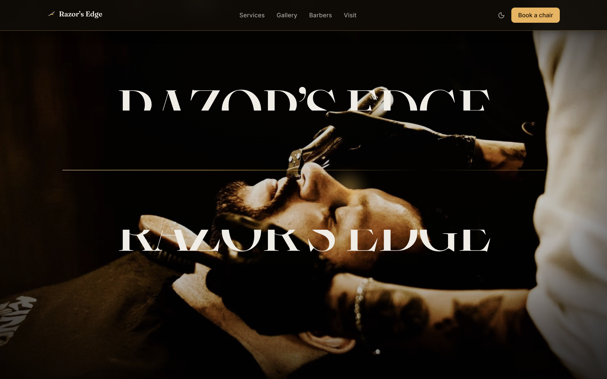
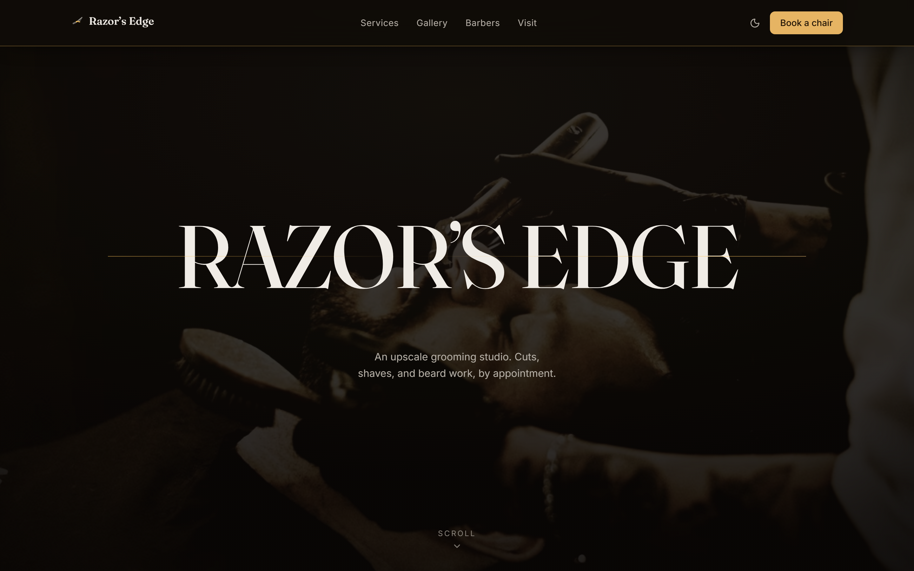
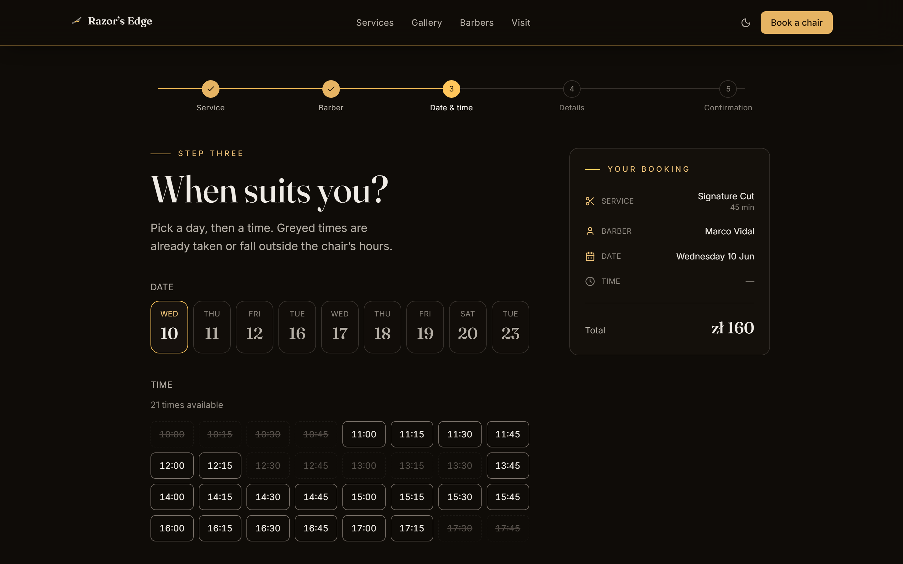
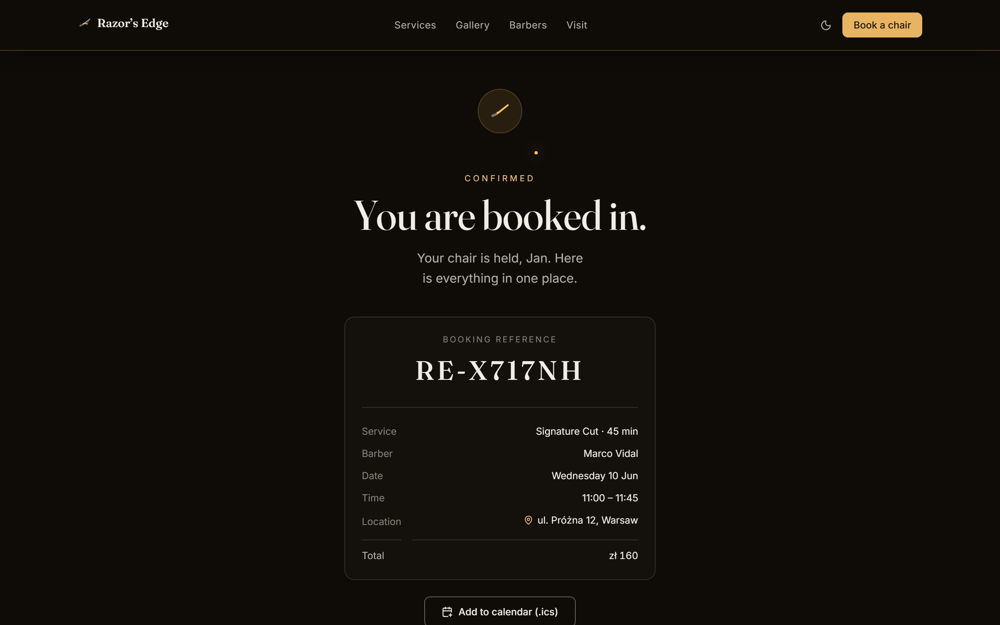
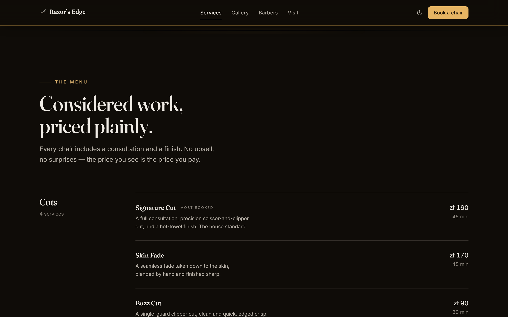
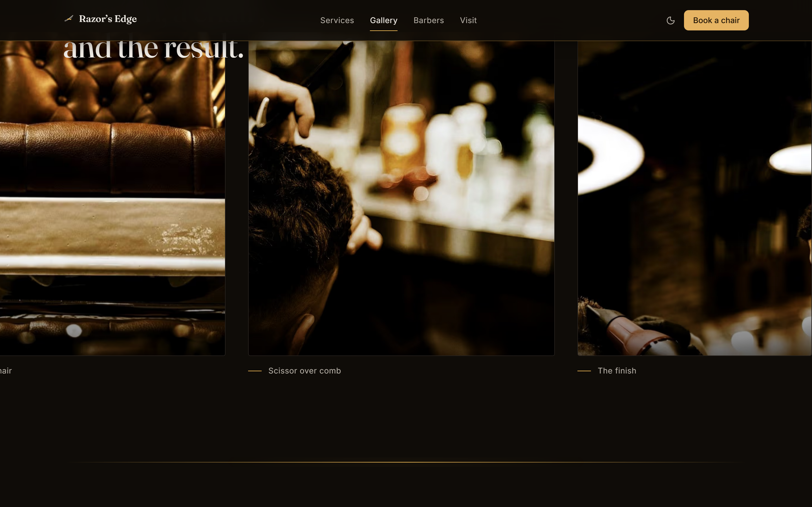
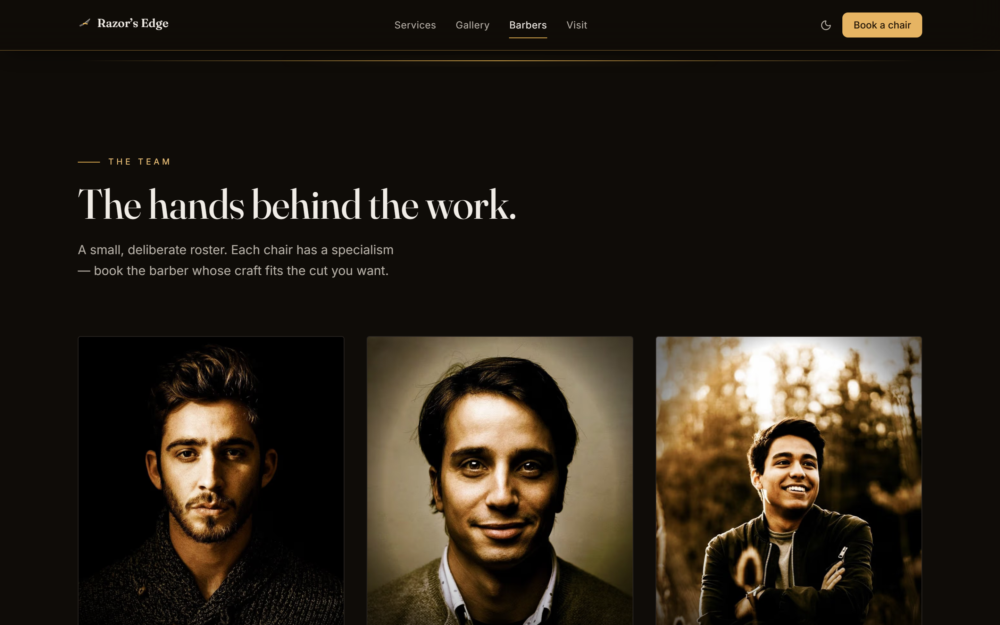
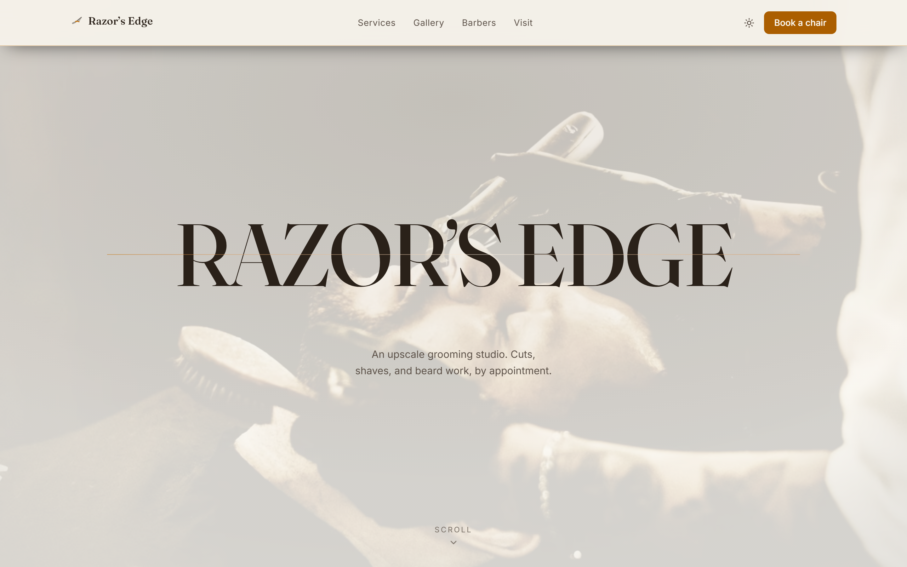
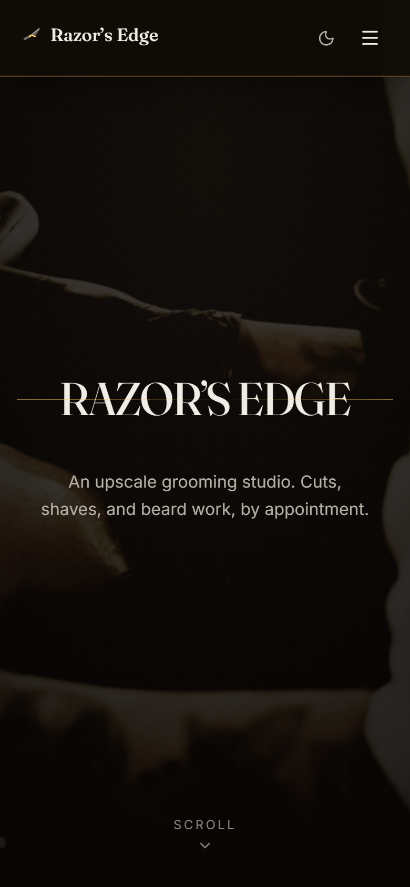
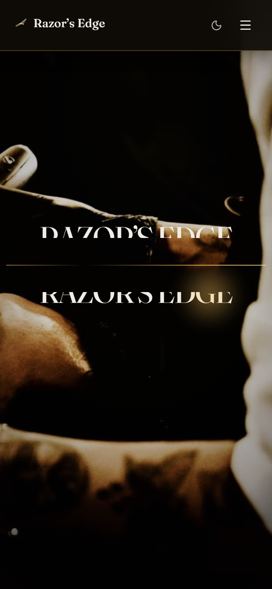

# Razor's Edge

> A cinematic dark-luxe marketing site for an upscale barbershop, with a fully mocked but production-grade multi-step booking flow.

Scroll the hero and a straight razor sweeps across the wordmark, cuts it open, and reveals the work beneath. Below it sits a complete editorial homepage — services and pricing, a pinned horizontal gallery, the team, testimonials, hours and location — and a five-step booking wizard that feels like a real product even though nothing is persisted and no server is involved. The cut is the brand: the same brass lit-edge motif runs from the hero through the section dividers to the confirmation seal.

Built to be judged on two fronts in the same five seconds: a recruiter or peer judging art direction and motion craft, and the plausible real client of an upscale grooming studio deciding whether to book — on mobile as often as desktop.

> Brand display: **Razor's Edge**. Repo directory: `razors-edge`. Portfolio slot 3 (web-only).

## Demo

**Not yet deployed.** Razor's Edge is a local showcase; there is no live URL at this time. The canonical origin is wired through `NEXT_PUBLIC_SITE_URL` (it backs the sitemap, the canonical tags, the Open Graph image, and the `HairSalon` JSON-LD), with a documented placeholder (`https://razors-edge-demo.vercel.app`) until a real deploy lands. To see it, run it locally per [Run locally](#run-locally) — the screenshots below are captured from the production build on `http://localhost:3070`.

## Screenshots

The headline is the hero wow moment: the wordmark "RAZOR'S EDGE" sliced open by a sweeping straight razor, the two halves parting against a near-black grain-textured field while the cinematic portrait is revealed in the gap. This is the whole pitch in one frame.



At rest the wordmark composes as one sharp specimen over the portrait, with the brass lit edge along the cut line:



The booking wizard is the centerpiece interaction — here the date-and-time step with its keyboard-navigable availability grid (unavailable slots struck through, never hidden) and the running summary rail:



The confirmation lands with the deterministic booking reference, the full summary, an add-to-calendar `.ics` download, and the "clean edge" brass seal — gracefully honest that it is a demo:



The editorial homepage sections — the services price list, the pinned horizontal gallery, and the team:

| Services and pricing                                         | Gallery (pinned horizontal scroll)                    | The team                                        |
| ------------------------------------------------------------ | ----------------------------------------------------- | ----------------------------------------------- |
|  |  |  |

The light theme is an intentional "daytime editorial print" register, not an inverted dark theme:



And the hero holds on mobile (390 px), where the pin length and parallax reduce so the cut stays legible and cheap:

<p align="center">
  
  
</p>

Desktop shots are captured at 1440 x 900 with deviceScaleFactor 2, mobile at 390 x 844, all against the production build (`next build && next start` on :3070, the same surface the E2E suite and Lighthouse audit) via [`e2e/capture-readme-screenshots.mjs`](./e2e/capture-readme-screenshots.mjs). A production build is required because the strict CSP forbids `unsafe-eval`, so `next dev` cannot run under it. The frozen clock and seeded mocks make every frame — the date strip, the availability grid, the booking reference `RE-X717NH` — reproducible across runs.

## What it is

- **A scroll-driven cinematic hero.** The wordmark is real DOM text rendered as two `clip-path`-clipped halves; GSAP ScrollTrigger pins the hero and scrubs a single timeline that sweeps the blade, parts the halves, reveals the portrait through the gap with a slow Ken-Burns push, and hands off into the first content section. The cut is the transition into the site, not a decoration.
- **A complete editorial marketing page.** Positioning, an 11-item services menu (including combos) with brass edge-reveal hovers, a pinned horizontal-scroll gallery on desktop that collapses to a vertical snap stack on mobile, a five-barber team grid, editorial testimonials, an opening-hours table with today highlighted, and a CSP-clean inline-SVG map.
- **A booking wizard that feels real.** Five steps — service, barber, date and time, details, confirmation — over a Zustand machine persisted to `localStorage`, with TanStack Query data ergonomics, react-hook-form + Zod forms, a deterministic availability grid, an `.ics` download, and a graceful demo disclaimer. Nothing is persisted server-side; a reload starts a fresh booking.
- **The booking is a deterministic mock — and the site says so.** There is no backend, no database, no real availability, no PII transmitted, no appointment scheduled. Availability is computed by a pure function over seeded working hours, days off, lunch breaks, and pre-bookings against a frozen reference time. The confirmation copy is honest about the demo without breaking the luxe tone. The "wire a real booking API" path is the explicit v2 (see [Architecture notes](#architecture-notes)).

## Stack

Web-only (`web/`, package `razors-edge-web`). No backend service — the only server surface is one Next.js server action for the mocked submit. This is a deliberate, owner-confirmed call: none of the five api-heavy triggers fires, and the portfolio's api-heavy slots are already satisfied by `tape` (Elysia/Bun) and `meld` (Hono/Node). See [DECISIONS.md](./DECISIONS.md) ADR-001.

**Frontend**

- Next.js 15.5 (App Router) · React 19.2 · TypeScript strict
- Tailwind CSS v4 (CSS-first, sovereign brass-on-near-black OKLCH palette, no `tailwind.config.js`)
- next-themes 0.4 (dark default, intentional light register) · TanStack Query 5 · Zustand 5 (with `persist`) · react-hook-form 7 + Zod 4
- shadcn/ui new-york primitives (button, dialog, tooltip, sheet) over a sovereign token bridge · radix-ui · lucide-react

**Animation** (a deliberate, bounded two-library posture — ADR-002)

- **GSAP 3.13 + ScrollTrigger** (via `@gsap/react` `useGSAP`) owns 100% of scroll, pin, scrub, timeline, and SVG work: the hero, the gallery pin, the section dividers, the section reveals.
- **Motion 12** is scoped to exactly one place — the wizard step enter/exit transitions (`AnimatePresence`). No scroll work is authored in Motion (`useScroll` / `useTransform` are banned); no React-state transition is authored in GSAP; hover and theme crossfades are CSS.

**Type**

- **Fraunces** (variable display serif, the wordmark and headers) + **Inter** (variable sans, body and UI), both via `next/font` (self-hosted at build, CSP-clean) and both SIL OFL 1.1.

**Tooling**

- pnpm 11 (workspace) · Node 22 LTS
- ESLint 9 (flat config) · Prettier 3 · Husky + lint-staged + commitlint
- Vitest (unit) · Playwright (E2E in `e2e/`, package `razors-edge-e2e`) · Lighthouse CI
- `@faker-js/faker` and `sharp` are build-time devDependencies only — the seeded mock data and the graded photography ship as static output, so neither faker nor sharp reaches the client bundle.

## Run locally

Prereqs: **Node 22 LTS** and **pnpm >= 11** (the repo pins both via `packageManager` and `.nvmrc`). No database, no Docker, no environment variables are required for local development.

```sh
# 1. Install JS deps across the whole workspace (run once at the repo root).
pnpm install

# 2. Start the dev server.
cd projects/razors-edge
pnpm dev            # Next dev server on http://localhost:3070
```

Open `http://localhost:3070`, scroll the hero to trigger the blade sweep, and click **Book a chair** (or any service / barber card) to enter the wizard.

The umbrella `package.json` delegates every script to the `razors-edge-web` workspace member:

| Command          | Effect                                     |
| ---------------- | ------------------------------------------ |
| `pnpm dev`       | Next dev server on :3070                   |
| `pnpm build`     | Production build                           |
| `pnpm start`     | Serve the production build on :3070        |
| `pnpm lint`      | ESLint (Next core-web-vitals + TypeScript) |
| `pnpm typecheck` | `tsc --noEmit`                             |
| `pnpm test`      | Vitest unit suite                          |

**For the production surface** (the only valid surface for the strict CSP, the E2E suite, Lighthouse, and screenshots — `next dev` cannot run under a CSP that forbids `unsafe-eval`):

```sh
pnpm -F razors-edge-web build
pnpm -F razors-edge-web start          # http://localhost:3070

# Then, against the served prod app:
pnpm -F razors-edge-e2e test           # full Playwright suite (18 tests)
pnpm -F razors-edge-e2e test:smoke     # the @smoke deploy subset (5 tests)
```

No `.env` is needed to run. The single optional variable is `NEXT_PUBLIC_SITE_URL` — the canonical origin for the sitemap, canonical tags, OG image, and JSON-LD; it falls back to a documented placeholder when unset. (`NEXT_PUBLIC_RAZORS_NOW` is a documented escape hatch to advance the otherwise-frozen demo clock; leave it unset for the deterministic default.)

## Architecture notes

**The hero is real content with the wow added on top.** The wordmark text and the portrait `alt` are real server-rendered DOM, so the headline reads to crawlers, screen readers, and a no-JS visitor regardless of whether GSAP ever runs. The blade-sweep is a three-tier contract (ADR-004): the full pinned scrub when motion is allowed; a static composed reveal (no pin, no parallax, static brass seam) under `prefers-reduced-motion`; and a legible composed final frame with no JS at all. The portrait is the LCP element — `priority` AVIF, sized, with a blur placeholder — and the pin is CLS-safe (transform-based, layout reserved), so the cinema does not cost the performance budget. The wordmark split uses two real-DOM copies clipped to complementary halves of a horizontal cut and parted by equal-and-opposite translation, so a glyph can never be bisected into garbage and no Club-GreenSock plugin is needed.

**The booking flow is a believable product over zero backend.** Availability is a single pure function, `getAvailability`, that composes a barber's working hours minus days off, lunch breaks, and seeded pre-bookings into a 15-minute slot grid against a frozen reference time (`2026-06-10 11:00 Europe/Warsaw`). Combos are not a special case — a combo is just a service with a longer `durationMin`, so the same function finds a longer contiguous free block. Colliding candidates are emitted as disabled slots (with an accessible reason), never hidden. The wizard machine is split into a pure, fully unit-tested core (step guards, deep-link seeding, any-barber resolution, the rehydrate reconciliation rule) and a thin Zustand `persist` store (key `razors-edge:booking-draft`, version 1, 24-hour TTL). On rehydrate it re-validates the held slot and, if it is stale, keeps the service/barber/date, clears the time, drops back to the date-time step, and shows a non-blocking notice — it never silently confirms a stale slot. The mocked submit is a Next.js server action that re-validates the same shared Zod schema the form steps use, returns a deterministic confirmation reference, and triggers a hand-rolled RFC-5545 `.ics` download. The whole data layer runs through TanStack Query against an in-memory seeded source (no network) so the loading and query ergonomics are real.

**Strict CSP, and GSAP runs under it.** The production CSP forbids `unsafe-eval`; GSAP core + ScrollTrigger + `@gsap/react` are clean under it. Two eval sources were found and closed rather than papered over: faker was baked out of the client bundle into static seed data (build-time only), and Zod 4's JIT eval-probe was opted out globally and early via `z.config({ jitless: true })`. `style-src 'unsafe-inline'` is consciously accepted (Next/Tailwind inline styles plus GSAP's inline transforms, which cannot be nonced). The full security-header set (CSP, HSTS, `X-Content-Type-Options`, `Referrer-Policy`, `X-Frame-Options`) ships in `next.config.ts`.

**Sovereign design tokens.** The brass-on-near-black dark theme and the warm bone/ivory light theme are built from scratch in `app/globals.css` (OKLCH), with no token reuse from `tape` or `meld` — each project keeps its own visual personality. All key contrast pairs are verified to WCAG AA in both themes.

**Photography.** Seven royalty-clear cinematic photographs (Unsplash License, no attribution required) are downloaded same-origin and run through a single `sharp` grading pass into one cohesive dark-luxe brass-on-near-black treatment, so the mixed set reads as one cinematic frame. Provenance and the swap-for-real path are in [`web/public/images/CREDITS.md`](./web/public/images/CREDITS.md).

### Key decisions

- **ADR-001** — Stack flavour `web-only` (no backend), primary animation library GSAP + ScrollTrigger, sovereign design tokens, and the fully client-side mocked booking architecture.
- **ADR-002** — The animation boundary (GSAP owns scroll, Motion owns React-state component transitions, CSS owns hover/theme) and the GSAP / Next 15 App Router integration contract (`useGSAP`, low `'use client'` boundary, `gsap.matchMedia`, transform/opacity only, CSP posture with no `unsafe-eval`).
- **ADR-003** — The booking-mock architecture: the domain model and shared Zod schemas, the pure deterministic `getAvailability`, the Zustand `persist` wizard machine with TTL and stale-slot reconciliation, the TanStack Query mock-fetch layer, the server-action submit, and the hand-rolled `.ics`.
- **ADR-004** — The hero technical contract: the layer model, the no-plugin wordmark split, the LCP/CLS-safe approach, and the three-tier degradation (full scrub / reduced-motion crossfade / no-JS static frame).

Full ADR text in [`DECISIONS.md`](./DECISIONS.md). Spec, audience, and the phased task list in [`PLAN.md`](./PLAN.md). Current state in [`PROGRESS.md`](./PROGRESS.md). Release history in [`CHANGELOG.md`](./CHANGELOG.md).

## Quality

- **Tests.** 53 Vitest unit tests (the pure `getAvailability` generator — closed days, days off, lunch holes, pre-booking gaps, combo long-block sizing, frozen-clock determinism — plus the wizard machine, the `.ics` builder, and the security headers) and 18 Playwright E2E tests across 9 specs, all passing against the production build: the booking happy path to confirmation with the `.ics` download, deep-link preselect, form validation, the availability grid, full keyboard operation of the radiogroups, the reduced-motion hero path, and the theme toggle under the strict CSP.
- **Lighthouse** (production build). Accessibility, Best Practices, and SEO score 100 on both `/` and `/book`. `/book` Performance is 94 to 98. The home route's hero carries genuine GSAP main-thread cost; its Core Web Vitals are green (LCP ~1.3 s, CLS ~0.01, TBT ~100 ms) and its Performance lands around 94 on desktop after the perf pass (GSAP deferral, a static home route, code-splitting, and a JS trim).
- **Accessibility — WCAG 2.2 AA.** Full keyboard operability of the booking flow (the service / barber / date / time selectors are proper WAI-ARIA roving-tabindex radiogroups; disabled slots stay discoverable with accessible reasons; focus moves to the step heading on every advance). A single global brass focus ring clears AA in both themes. `prefers-reduced-motion` is a first-class path at every animated site.
- **SEO.** Per-route metadata with canonical tags, a designed Open Graph image (`next/og`), `HairSalon` / `LocalBusiness` JSON-LD built from the live menu and shop data, `sitemap.xml`, and `robots.txt`.

## Not shipped in v1 (deferred)

- **Any real backend, database, or persistence.** The booking is mocked end to end; a reload starts fresh. Wiring a real booking API (the reserved NestJS api-heavy slot) is the explicit v2 path.
- **Real authentication, payments, or email / SMS confirmations.** None in v1 — the price is displayed but nothing is charged, and the confirmation is on-screen plus an `.ics` download only.
- **A live interactive map embed.** v1 uses a styled inline-SVG map plus a maps click-through to protect the performance budget; a lazy live embed is a v2 candidate.
- **Multi-barber combos.** A combo is one service with a longer duration; it cannot split a cut and a beard across two barbers in v1.
- **CMS-managed content and internationalisation.** Services, barbers, and testimonials are seeded mock data; the site is English-only.

## License

[MIT](../../LICENSE).

## Author

[Jan Antczak](mailto:janek.antczak@gmail.com). Portfolio root: [`../../README.md`](../../README.md).
