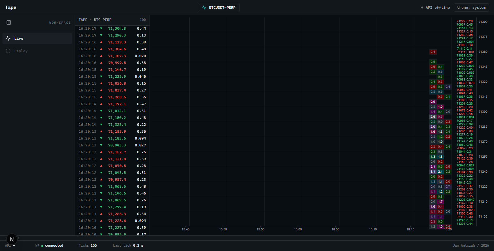
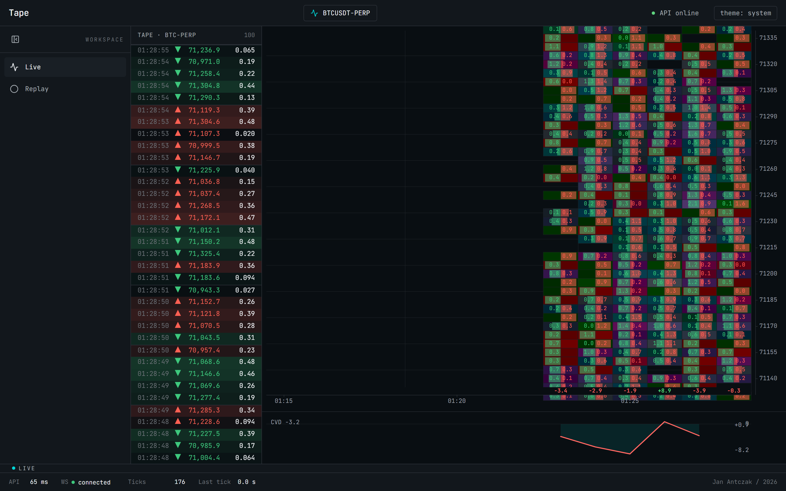
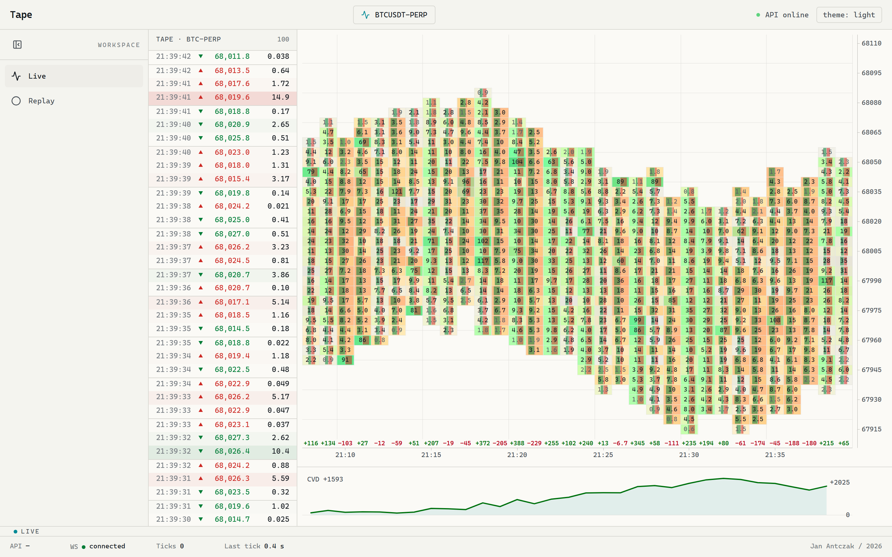
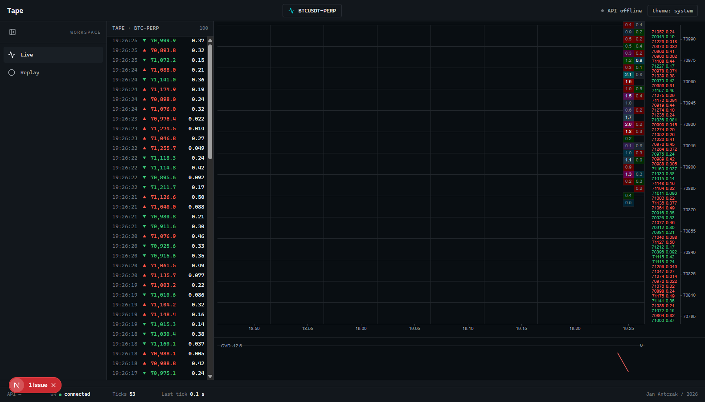
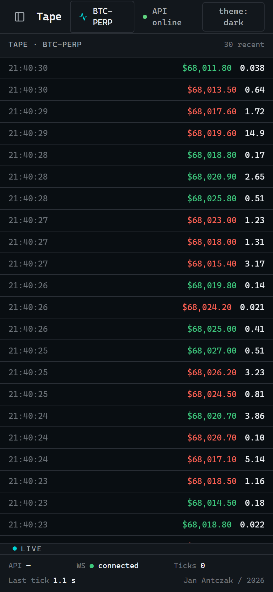
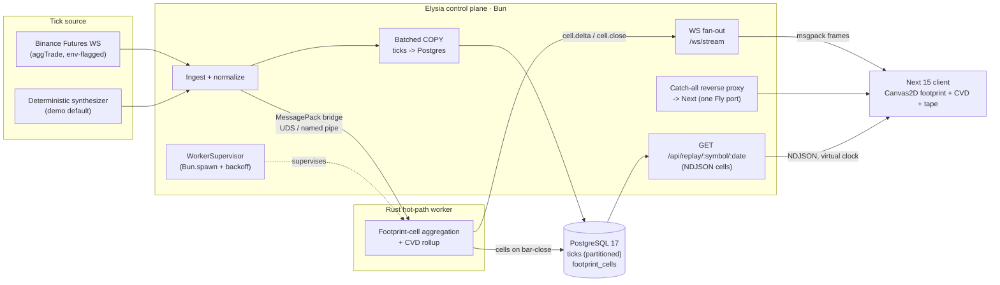

# Tape

> Production-grade real-time orderflow visualizer for crypto perpetual futures.

Open the demo and you see a live BTC-PERP footprint chart: bid and ask volume split per price level per one-minute bar, a per-bar delta print, a CVD sub-pane tracking net flow, and a tape strip scrolling every trade as it lands. Hover a cell for its aggregated bid / ask / delta / imbalance readout. Hit replay and the same surface scrubs a recorded session forward on a virtual clock at 1x, 5x, or 30x.

The point is not the chart alone — it is the architecture behind it. A Bun + Elysia edge ingests the tick stream and fans out frames; a **Rust hot-path worker** does the footprint-cell aggregation off the event loop; the two processes talk over a length-prefixed **MessagePack bridge** with a crash-recovering supervisor; Postgres backs the replay. All of it ships in one Docker image on a single Fly port. This is the api-heavy systems showcase of the portfolio — built for a senior backend / staff-level reviewer who opens the demo, opens DevTools to watch the WebSocket frames, and then reads the repo.

> Brand display: **Tape**. Repo directory: `tape`.

## Demo

**Live:** [https://tape-demo.fly.dev](https://tape-demo.fly.dev) — deployed on Fly.io (Frankfurt), single Machine, kept warm so the WebSocket stream is live on load. `/health` returns a Zod-validated JSON envelope you can `curl` directly — it reports the database connection, the worker state (`cellsOpen` / `ticksProcessed` climbing), and the live WS frame rate.

```sh
curl https://tape-demo.fly.dev/health
# { "status": "ok",
#   "db":     { "connected": true, ... },
#   "worker": { "state": "connected", "cellsOpen": 82, "ticksProcessed": 1320, ... },
#   "ws":     { "framesPerSecOut": 10, "connectedClients": 0, ... },
#   "binance":{ "connected": false, ... } }
```

A note on the tick source, stated plainly: on the demo the Binance Futures feed is **off** (`binance.connected: false` above). Binance's public WebSocket is geo-restricted from the Fly deploy region, so the demo runs a deterministic in-process **synthesizer** that feeds the Rust worker over the same bridge the real feed would. The worker still produces real footprint cells, the CVD still tracks net flow, the tape still scrolls, and the cells still persist to Postgres so replay has data — the entire architecture is exercised end to end without the upstream exchange. The Binance client is built, unit-tested, and env-flagged (`BINANCE_WS_ENABLED`); flip it on from a network that can reach `fstream.binance.com` and the same pipeline carries real trades.

### The wow moment

The chart fills from the right as one-minute bars close — live data forward from now — so a freshly-warmed machine accumulates a full board over ~25–30 minutes and then stays full. The five-second hold is the footprint reacting to the stream in real time: cells materialise per bar, the CVD line bends with net flow, the tape rolls. The replay scrub is the second beat — rewind a stored session and watch the cells re-materialise at 30x.

## Screenshots

The hero: a full footprint board in dark mode — bid/ask volume split inside each one-minute cell across the price ladder, per-bar delta row beneath, the live tape strip on the left with timestamp / price / size, and the CVD sub-pane tracking net flow at the bottom.



Captured live from the deployed demo at [tape-demo.fly.dev](https://tape-demo.fly.dev) — the board fills from the right as bars close, so this shot shows real cells, a populated tape, the CVD pane, and `API online / WS connected` in the status bar:



The same surface in light theme, and replay mode scrubbing a recorded session:

| Light theme                                                          | Replay mode                                        |
| -------------------------------------------------------------------- | -------------------------------------------------- |
|  |  |

Below the 768 px breakpoint the footprint chart hides and the layout collapses to a tape-only single column:

<p align="center">
  
</p>

The dark and light board shots are driven against a local production-style synth stack (deterministic data, JetBrains Mono numerics). The `deploy-live-board.png` shot is captured headlessly against the live URL via [`e2e/capture-live.mjs`](./e2e/capture-live.mjs); see [`docs/CAPTURE.md`](./docs/CAPTURE.md) for the local-capture runbook.

## Architecture

The senior-engineering signal lives here. Three runtimes, one host, one Docker image, one external port.



**One Elysia edge, three responsibilities.** The Bun + Elysia process is the only thing bound to the external Fly port (3001). It serves `/health` and the `/ws/stream` WebSocket natively, and a **catch-all reverse proxy** forwards everything else to the Next.js standalone server on `localhost:3000`. That collapses the frontend and the API onto one TLS terminator and one port — it sidesteps the dual-service collision Fly's edge hits when two services share 443. The proxy strips transport-encoding headers so the upstream Next responses pass through cleanly.

**The Rust worker is the hot path.** Footprint-cell aggregation and CVD rollups run in a separate Rust process (`worker/`, crate `tape-worker`), not on Bun's event loop — the architecture mirrors NautilusTrader's Rust-core / scripting-control-plane split. The worker owns the aggregation math: it folds each tick into the current one-minute bar's price cells, emits `cell.delta` frames mid-bar and `cell.close` totals on bar-close, and computes per-bar delta and running CVD. Keeping it out-of-process means a tape spike that pegs the aggregator never stalls the WebSocket fan-out, and the worker can be restarted independently of the edge.

**The bridge: MessagePack over local IPC.** The two processes talk over a Unix domain socket on Linux (a named pipe on Windows for owner-machine dev parity), length-prefixed binary framing (`u32` LE length + payload). Payloads are MessagePack via `rmp-serde` on the Rust side and `msgpackr` on the Bun side, configured `useRecords: false` so the wire stays spec-compatible across decoders. Frames are self-describing — a captured stream pipes straight into `msgpack2json` with no schema file. The schema source of truth is the Rust structs: `#[derive(Serialize, Deserialize, TS)]` and `ts-rs` emits the TypeScript counterparts into `server/src/lib/schemas/bridge/generated/`, committed and CI-gated by `bridge:check` (regenerate + `git diff --exit-code`), so a Rust struct change without its TS mirror fails the build. ADR-002 and ADR-003 own the trade-offs (UDS over Bun FFI for debuggability and an independent restart story; MessagePack over Protobuf / Cap'n Proto on the five-minute-pcap-to-readable-JSON bar).

**Supervision and crash recovery.** The worker is a `Bun.spawn` child of Elysia (ADR-004). On worker death the edge sees EPIPE and respawns with backoff — 250 ms initial, capped at 5 s, ±20 % jitter, reset after 60 s healthy. A 10-crashes-in-60-s circuit breaker stops the respawn loop on a poisonous binary; the public WebSocket stays up and emits a `control.worker_unavailable` frame so the browser renders a calm "cells paused — worker restarting" state instead of going dark. The in-flight bar is allowed to drop on restart (the next tick re-enters it); closed-bar history in Postgres is the durable source of truth.

**Persistence and replay.** Vanilla PostgreSQL 17 via Drizzle (ADR-005). `ticks` is partitioned with native declarative `PARTITION BY RANGE (ts_ms)` on a monthly cadence, 30-day retention, lifecycle managed by an in-process scheduler that re-arms daily at 03:00 UTC. Ticks are written by Elysia directly via batched `COPY ticks FROM STDIN` on a 50 ms coalescing window — decoupled from the worker so a worker crash-loop never blocks tick archival. `footprint_cells` is a plain table written by the Rust worker on bar-close, one transaction per minute. Replay reads from Postgres only: `GET /api/replay/:symbol/:date` streams the day's closed cells as NDJSON from a server-side cursor (never buffered), and the client drives the chart's rAF loop from a virtual clock at the selected speed.

**WebSocket fan-out.** Single endpoint `/ws/stream`, topic-multiplexed envelope (`{ topic, kind, payload }`), discriminated union over `kind: 'tick' | 'cell.delta' | 'cell.close' | 'snapshot' | 'control.*'` — the schema mechanically enforces the mid-bar-deltas-vs-bar-close-totals invariant. New clients get a `snapshot` frame on connect. Backpressure is drop-oldest tick frames plus server-side cell-delta coalescing as the primary policy; a 256 KB / 2 s per-client circuit breaker emits `control.overrun` and closes with `CloseEvent.code = 4290` as second-line defence. A per-IP connection cap is enforced (ADR-006).

**The frontend is Canvas2D, not React-per-frame.** Next.js 15 App Router + React 19 + Tailwind v4 (CSS-first `@theme`, OKLCH palette). The footprint chart, the CVD sub-pane, and the tape strip are hand-rolled Canvas2D on a single dirty-flag-gated `requestAnimationFrame` loop with a subscribe-once contract — React never re-renders per frame. A `useSyncExternalStore`-backed theme bridge lets the canvas read CSS variables so a theme flip re-paints without a React render. WebSocket frames decode via `msgpackr` (the same codec as the wire) and validate against Zod schemas re-exported from `tape-server` over a types-only Eden Treaty surface. Motion handles only chrome (rail collapse, replay-bar height); the data surfaces never touch the reconciler. The render loop is self-idling — a quiet market burns zero frames and zero main-thread time.

## Stack

**Frontend** (`web/`, package `tape-web`)

- Next.js 15.5 (App Router) · React 19.2 · TypeScript strict
- Tailwind CSS v4 (CSS-first, OKLCH palette, no `tailwind.config.js`)
- next-themes 0.4 · TanStack Query 5 · Zustand 5 · Zod
- Motion 12 (chrome only) · lucide-react · shadcn/ui primitives
- `msgpackr` (binary WS frame decode) · `next/font` (Inter + JetBrains Mono, self-hosted)
- Hand-rolled Canvas2D footprint + CVD + tape engine, single rAF loop, theme-token bridge

**Backend** (`server/`, package `tape-server`)

- Elysia 1.x on Bun 1.3 · Eden Treaty (types-only contract surface)
- Drizzle ORM + drizzle-zod · postgres-js (driver)
- Zod · `msgpackr` (same codec as the frontend)
- Catch-all reverse proxy to the Next standalone server (single Fly port)

**Worker** (`worker/`, crate `tape-worker`)

- Rust 2024 edition (toolchain >= 1.80, built on 1.96)
- tokio 1 (`rt-multi-thread`, `net`, `io-util`, `signal`, `time`)
- `rmp-serde` (MessagePack) · serde · `ts-rs` (Rust struct -> TypeScript codegen)
- Cross-platform UDS / named-pipe IPC bridge

**Tooling**

- pnpm 11 (workspace) · Node 22 LTS
- ESLint 9 (flat config) · Prettier 3 · Husky + lint-staged + commitlint
- Vitest (web) · `bun test` (server) · `cargo test` (worker) · Playwright (E2E, `e2e/`)
- PostgreSQL 17 (Docker image `postgres:17-alpine`)
- One four-stage Dockerfile (rust-builder, web-builder, server-builder, runtime)

## Run locally

Prereqs:

- **Bun >= 1.3** ([bun.sh](https://bun.sh))
- **Rust >= 1.80** ([rustup.rs](https://rustup.rs)), `cargo` on `PATH`
- **Docker** for the Postgres dev container
- **pnpm >= 11** and **Node 22 LTS** (pinned via `packageManager` and `.nvmrc`)

```sh
# 1. Bring up Postgres on port 5435 (dodges system 5432 and Mila on 5434).
docker compose -f projects/tape/docker-compose.yml up -d

# 2. Install JS deps across the workspace.
pnpm install

# 3. Build the Rust worker binaries.
cd projects/tape/worker
cargo build --bin worker --bin echo --bin gen-fixtures
cd ../../..

# 4. Provision the schema (creates the rolling ticks partitions).
pnpm -F tape-server db:migrate

# 5. Configure the server environment.
cp projects/tape/server/.env.example projects/tape/server/.env
# Defaults cover the local dev stack as-is; DATABASE_URL points at :5435.

# 6. Start backend + frontend in two terminals.
pnpm -F tape-server dev    # Elysia on http://localhost:3001 (Bun --watch)
pnpm -F tape-web dev       # Next on  http://localhost:3000
```

Open the URL the Next dev server prints (`http://localhost:3000`, or a fallback port if it is occupied). The chart fills from the right as bars close — give it a couple of minutes on the synth to see the first closed bars.

### Choosing the tick source

Three env knobs decide which producer feeds the WebSocket (precedence documented in `server/.env.example`):

| Goal                                                                    | Env                                                              |
| ----------------------------------------------------------------------- | ---------------------------------------------------------------- |
| **Offline full pipeline** (synth -> worker -> cells; the demo's config) | `WORKER_PIPELINE_ENABLED=1 WS_SYNTHESIZE=1 BINANCE_WS_ENABLED=0` |
| **Real feed, full pipeline**                                            | `BINANCE_WS_ENABLED=1 WORKER_PIPELINE_ENABLED=1`                 |
| **Real feed, tape only** (no aggregation)                               | `BINANCE_WS_ENABLED=1 WORKER_PIPELINE_ENABLED=0`                 |

The offline recipe is the one to start with — it exercises the worker, the bridge, persistence, and replay with no reachable exchange. If `BINANCE_WS_ENABLED=1` and `WS_SYNTHESIZE=1` are both set, the real feed wins and the synth is silently disabled. The Binance public WebSocket is geo-restricted from some networks (including the Fly deploy region); if `bun projects/tape/server/scripts/binance-smoke.ts` connects but no frames arrive within 30 s, use the offline recipe.

| Command                     | Effect                                       |
| --------------------------- | -------------------------------------------- |
| `pnpm -F tape-web dev`      | Next dev server on :3000                     |
| `pnpm -F tape-server dev`   | Elysia + worker supervisor on :3001          |
| `pnpm -F tape build`        | Build server then web                        |
| `pnpm -F tape lint`         | Lint both halves                             |
| `pnpm -F tape typecheck`    | Typecheck both halves                        |
| `pnpm -F tape test`         | `bun test` (server) + Vitest (web)           |
| `pnpm -F tape-e2e test`     | Playwright suite (deterministic, no backend) |
| `cargo test` (in `worker/`) | Rust unit + Rust<->TS conformance suite      |

## Testing and quality

The critical paths are covered across all three runtimes:

- **~314 server tests** (`bun test`) — WS frame schemas, the tick batch writer, partition lifecycle, the bridge transport + framing, supervisor backoff, the Binance client against recorded frames, replay query + NDJSON serialization.
- **195 web tests** (Vitest, 18 files) — the footprint / CVD engine, painters, theme-token bridge, the Zustand stream store and its ring buffers, reserved-dimension CLS guards, the worker-offline indicator.
- **~49 Rust tests** (`cargo test`) — the aggregator invariants and CVD rollup, plus the **Rust <-> TypeScript bridge conformance** suite that decodes committed MessagePack byte oracles on both sides so the wire contract cannot drift.
- **15 Playwright E2E** — live-footprint render, replay control wiring, theme toggle, keyboard a11y, and a client-side frame-budget load test driving ~200 ticks/sec through the store. Deterministic in CI via a dev-only store-injection hook and a mocked WebSocket; one `@live` spec hits the real `/ws/stream` behind a flag.

**Lighthouse — an honest number.** On the live deploy (mobile): **CLS 0**, **Accessibility 96**, **Best Practices 96**, **SEO 100**, **Performance 77**. The performance score is a **deliberate, documented trade-off** recorded in [ADR-009](./DECISIONS.md). Every performance metric except Total Blocking Time is green; TBT is the sole cap, and it is the irreducible cost of a continuously rendering real-time chart fed a live WebSocket — Lighthouse's TBT model assumes a page that loads and then goes idle, which a live orderflow surface is not. CLS was driven from 0.337 to 0, and TBT was cut from ~930 ms to ~260–630 ms (deferred connect past the interactive window, self-idling rAF loop) without gating the chart behind a click or throttling it below 60 fps — both of which would destroy the wow moment. The continuous render _is_ the product. CLS, Accessibility, Best Practices, and SEO remain hard-gated at >= 95; the other three portfolio projects hold the full >= 95 bar on performance too. This one real-time route is the scoped exception.

## Key decisions

Full ADR text in [`DECISIONS.md`](./DECISIONS.md).

- **ADR-001** — `api-heavy` flavour; Elysia on Bun plus a Rust hot-path worker. Portfolio backend variance: tape runs Elysia/Bun, meld runs Hono/Node, pulse runs NestJS, atlas runs Fastify — four distinct backends across four api-heavy projects.
- **ADR-002** — Bridge transport: UDS (Linux) / named pipe (Windows), length-prefixed binary framing. Won against Bun FFI on debuggability and independent-restart story.
- **ADR-003** — Bridge payload: MessagePack (`rmp-serde` <-> `msgpackr`, `useRecords: false`); schema source of truth = Rust structs via `ts-rs`, CI-gated by `bridge:check`. Won against Protobuf on the pcap-to-readable-JSON bar.
- **ADR-004** — Worker supervision: Elysia-as-supervisor via `Bun.spawn`; backoff 250 ms -> 5 s with jitter; 10-crashes-in-60-s circuit breaker; `control.worker_unavailable` to the browser.
- **ADR-005** — Persistence: partitioned `ticks` (monthly, 30-day retention) + plain `footprint_cells`; Elysia-direct `COPY` tick writes, worker-on-bar-close cell writes; live-from-worker-memory vs replay-from-Postgres read split.
- **ADR-006** — WS frame contract: single `/ws/stream`, topic-multiplexed envelope, discriminated union over `kind`, drop-oldest + coalescing backpressure, 256 KB / 2 s circuit breaker.
- **ADR-007** — Footprint bucketing grid: 1-minute time buckets + $5 BTC-PERP price buckets, single source of truth via a "these files must match" conformance assertion.
- **ADR-008** — CVD lives in the pure aggregator on both sides (Rust authoritative, conformance-covered); the live CVD line derives client-side from `cell.close` data the browser already parses.
- **ADR-009** — Accept Lighthouse Performance < 95 on the live orderflow route as a scoped, documented trade-off; CLS / A11y / BP / SEO stay >= 95.

Spec and phased task list in [`PLAN.md`](./PLAN.md). Current state in [`PROGRESS.md`](./PROGRESS.md). Production runbook in [`DEPLOY.md`](./DEPLOY.md). Release history in [`CHANGELOG.md`](./CHANGELOG.md).

## License

[MIT](../../LICENSE).

## Author

[Jan Antczak](mailto:janek.antczak@gmail.com). Portfolio root: [`../../README.md`](../../README.md).
